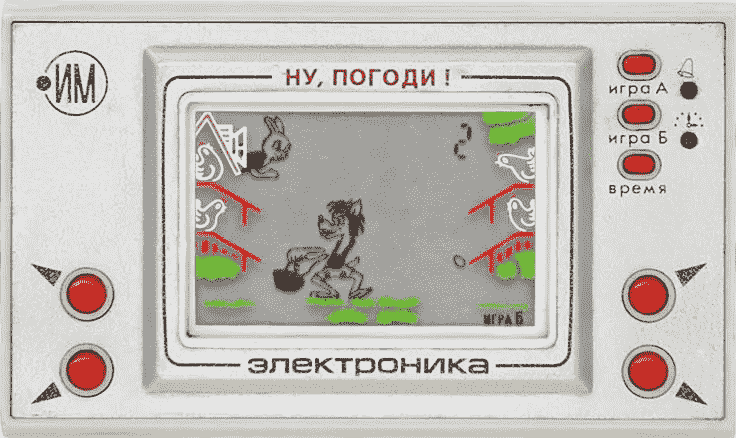
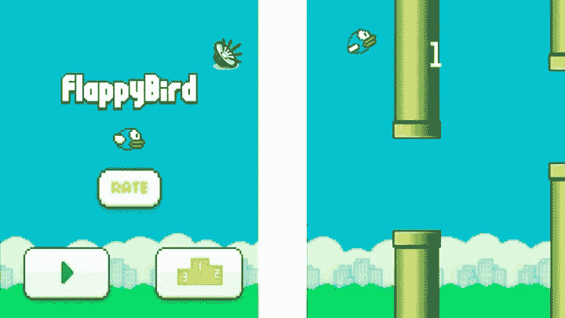
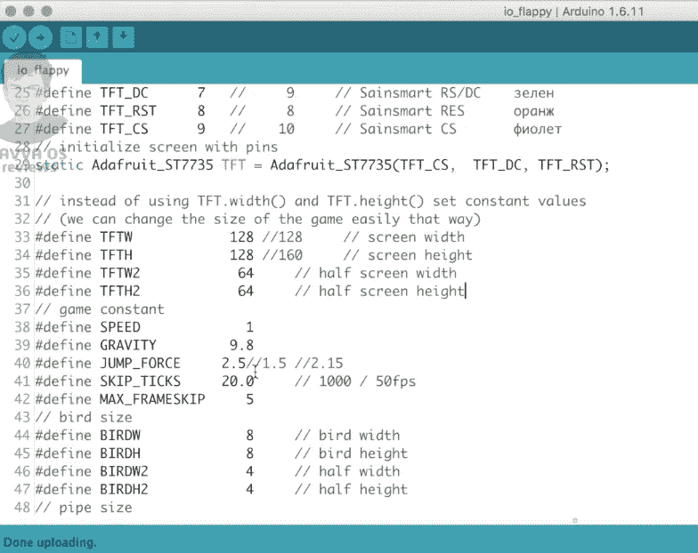
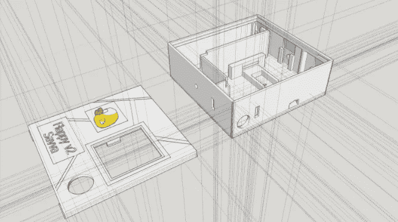
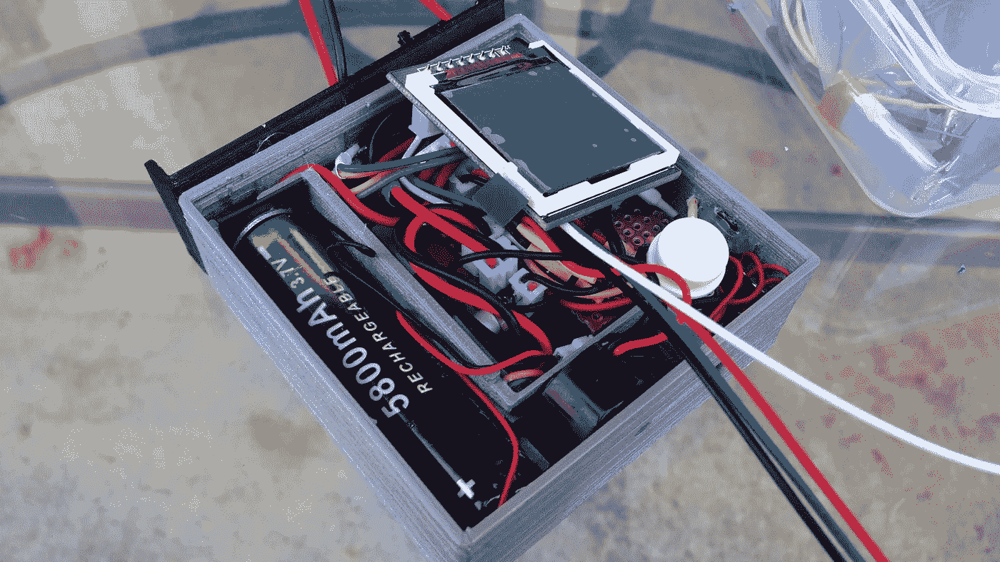

# DIY 项目:制作 3D 打印的 Flappy Bird 控制台

> 原文：<https://medium.com/hackernoon/diy-project-making-a-3d-printed-flappy-bird-console-a2929b4d8eee>

大家好！我的名字是 Savva Osipov，我是一个 12 岁的制造商和黑客:)我今天与你分享的故事是我第一次创建自己的游戏小工具的经历。我自己完成了所有的 3D 打印、组装，甚至焊接。

我的灵感来自我们家里一个简单的复古游戏机。它早在 1984 年就在苏联上市了，幸运的是，我父亲为他的孩子留了一台，有一天可以一起玩。爸爸出生在苏联时期，他经常分享我从未见过的关于这个国家的激动人心的故事。当然，我最感兴趣的是关于苏联小玩意的故事。

这个小玩意是一款便携式视频游戏，名为“Nu，pogodi！”(标题从俄语翻译成英语为“等等！我来抓你！”).80 年代的每个苏联青少年都想拥有一台这样的游戏设备。(如果你有兴趣[了解](https://hackernoon.com/tagged/learning)更多关于这个小工具的信息，你可以在[俄语维基百科](https://ru.wikipedia.org/wiki/Ну,_погоди!_(электронная_игра))上阅读。

Nu, pogodi! Soviet retro game console

后来，当我爸爸长大了一些，他知道这个设备实际上是一个 100%的任天堂 EG-26 蛋的复制品。但在那个时候，没有人知道那个小玩意，人们生活在“铁幕”后面，很多人不知道这个信息。

这款设备的游戏手柄给了我很大的灵感，所以我决定问我爸爸我们是否可以自己做一个类似的东西。在 2016 年的那个时候，我已经玩了一段时间基于 [Arduino](https://hackernoon.com/tagged/arduino) 的小工具，所以它是我们未来自制游戏主机的一个显而易见的选择。

## 第一步。找到将成为游戏小工具核心的游戏

项目最重要的当然是游戏了！爸爸帮我找了一个游戏爱好者 Themistokle Benetatos 开发的 Flappy Bird 源代码。如果你感兴趣，这里有 GitHub 上的[源代码。](http://github.com/mrt-prodz/ATmega328-Flappy-Bird-Clone)

Flappy Bird screen game play

当我们测试它的时候，我们发现我们必须对源代码做一些修改，以使游戏适合我们的屏幕尺寸。我们还需要重写影响游戏渲染时间的部分。

## 第二步。原型和打印出身体

对于这个项目，我使用了 SketchUp 程序，这是一个免费的 3D 建模软件，让我为 3D 打印机创建和起草项目。我擅长使用这个软件，但在这种情况下，我不得不使用卡尺来测量所有组件的外部尺寸:Arduino Nano、屏幕、电池、充电板、输入和两个开关。这个项目变得越来越复杂，但是我们继续进行。最后，在犯了几个错误后，我爸爸帮我打印出了游戏设备的机身。这里有一个[。身体原型](https://www.dropbox.com/s/r8m5r7at9i1vt8y/flappy4.1.skp?dl=0)的 SKP 文件。

Future Flappy Bird body

## 第三步。把所有的都集中在一起！

我组装了这个装置，甚至焊接了这个装置的电子部件。我非常感谢我的父亲，他让我自己完成非常复杂的任务，这真的有助于亲自参与一个项目，并让你更好地理解这个过程。

Inside of a future Flappy Bird game console

这个装置起作用了！

## 第四步。市场发布:)

我把新组装的游戏板带到了学校。孩子们对此非常兴奋，甚至有人从我这里偷走了它。说真的。我非常沮丧，但这种情况促使我创造了一个更好的 Flappy Bird 小工具版本。版本 2 有一个扬声器，我们改变了按钮在机身上的位置，并改变了机身颜色。

我为这个项目感到非常自豪，我决定制作一个视频，让你看看它的实际效果。请，如果你喜欢这个和视频，在 YouTube 上竖起大拇指会很棒:)

**希望你喜欢这个故事！给我一些掌声！**

*关于我！我是 Cubios Inc .的创始人，我和我爸爸正在为计划于 1 月份推出的项目进行 Kickstarter 活动。如果你有兴趣跟随，请务必关注我的* [*脸书页面*](http://facebook.com/SavvaOsipov) *。而我有* [*一个 YouTube 频道*](https://www.youtube.com/channel/UCYYrDALfWM7hvB3fNglSNMA) *，请考虑喜欢和订阅！*