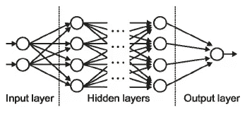
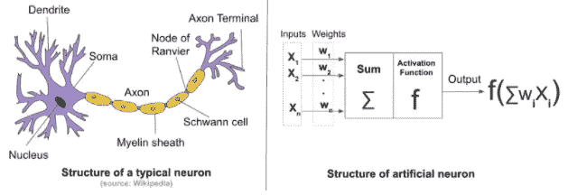

# DL01:神经网络理论

> 原文：<https://medium.com/hackernoon/dl01-writing-a-neural-network-from-scratch-theory-c02ccc897864>

你好，黑客们！是喝咖啡休息的时间了。

这是我将实现各种深度学习算法和研究论文的一系列博客帖子中的第一篇。在实现任何新的东西之前，我将解释其背后的基本概念。python 和 numpy 的知识是这个职位的先决条件。

> 附带的代码可以在[这里](https://github.com/thesemicolonguy/neural-network-from-scratch)找到。在下一篇文章中，我将对代码进行逐行解释。这篇文章涵盖了基本神经网络的理论。

# **大脑和人工神经网络**

## **生物神经元**

大脑由许多首尾相连的脑细胞(神经元)组成。一个神经元([图 2](https://www.wikiwand.com/en/Neuron#/media/File:Blausen_0657_MultipolarNeuron.png) )把电脉冲作为信号，对信息做一些处理，发送给另一个神经元。所以，一个脑细胞主要由四部分组成:

1.树突:接受输入(电脉冲)

2.索玛:处理输入

3.轴突:将处理过的输入转化为下一个神经元可以接受的形式，即将处理过的输入转化为输出。

4.突触:神经元之间的电化学接触。使用突触，神经元可以将该神经元的输出转移到下一个神经元的输入。

**人工神经元**

为了试图模仿大脑，“人造神经元”被创造出来，具有类似的结构。

人工神经元是生物神经元的极度简化版本。输入由 xi 代表。每个输入被“处理”，即乘以某个权重 wi，并且所有 wixi 乘积被相加。之后，经过处理的输入通过一个被称为“激活函数”的函数传递，该函数将经过处理的输入转换为输出。人工神经元输出的值称为“激活”值。最后是输出路径。

Figure 1: Architecture of ANN

这些人工神经元可以以多种方式连接起来，形成“人工神经网络”。上面显示的例子是一个浅层神经网络。可以增加更多层的神经元，使网络变得“深”。添加更多图层(通常)会提高网络的精度。在这样的网络中，有一个输入层，一个或多个隐藏层，一个输出层，如图[图 1](http://cs231n.stanford.edu/) 所示。中间的层被称为隐藏层，因为它们对用户是隐藏的。图 2 显示了人工神经元和生物神经元之间的相似之处。

Figure 2: Similarity between artificial and biological neurons

# **神经网络的工作**

## **组件**

神经网络可以在接收到一些输入后(准确地)预测输出。本节将探讨如何做到这一点。

概括地说，神经网络由四个部分组成:

1.人工神经元

2.拓扑——神经元是如何连接的

3.砝码

4.学习算法

## **向前传球**

在神经网络能够准确预测输出之前，需要对一些数据进行训练。数据通常由输入输出对组成。该数据集中的输出被称为“标签”或“目标”。

“训练”阶段从随机初始化所有权重(即与每个人工神经元相关联的权重)开始。然后，将输入馈送到网络，计算隐藏层中所有节点的激活，最后，我们得到输出层的激活(这是实际输出)。上述过程被称为“正向传递”。最初，由于权重的随机初始化，输出极不准确。这里的目标是最终达到权重的最优值，使得神经网络能够以合理的精度预测输出(给定一些输入)。用于实现这一点的算法被称为“反向传播”。

## **反向传播**

在向前传递之后，我们在输出层有一些激活。理想情况下，输出应该等于标签。然而，开始时情况并非如此，因为权重是随机初始化的。因此，计算误差，并通过网络“反向传播”。测量误差的函数被称为“成本函数”。目的是调整权重以最小化该成本函数。用于最小化成本函数的技术被称为“梯度下降”。

## 梯度下降

成本函数对权重的曲线或多或少是凸的，看起来有点像[图 3](https://www.youtube.com/watch?v=5u4G23_OohI) :

Figure 3: Gradient Descent

这个想法是，我们在梯度的方向上一小步一小步地前进，我们希望最终，我们会到达全局最小值。然而，只有当图是凸的时，才会出现这种情况。通常，图不是完全凸的，会导致一些局部极小值。现在，我们假设局部最小值是全局最小值的很好的近似(通常是这样)。

因此，我们对权重进行小的更新，每次都在梯度的方向上移动它们。我们将更新乘以一个参数，称为“学习率”。

这篇文章简要概述了构建神经网络的要素。算法的详细分析(和数学)将在单独的文章中完成。

> 想多读点？转到 [DL02](/@thesemicolonguy/dl02-writing-a-neural-network-from-scratch-code-b32f4877c257) ！