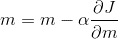
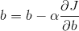

# DL03:梯度下降

> 原文：<https://medium.com/hackernoon/dl03-gradient-descent-719aff91c7d6>

之前的两个帖子可以在这里找到:
[DL01:神经网络理论](https://hackernoon.com/dl01-writing-a-neural-network-from-scratch-theory-c02ccc897864)
DL02:从零开始写一个神经网络(代码)

休息时间到了，程序员们！让我们钻研一下数学，好吗？*插入书呆子的微笑*

为了理解梯度下降，让我们来看看线性回归。线性回归是一种技术，其中给定一些数据点，我们试图拟合一条穿过这些点的线，然后通过外推该线来进行预测。挑战在于找到最适合该系列的产品。为了简单起见，我们假设输出( *y* )只依赖于一个输入变量( *x* )，即给我们的数据点的形式为 *(x，y)* 。

现在我们想通过这些数据点拟合一条线。这条线显然将是`y = mx + b`的形式，我们想要找到 *m* 和 *b 的最佳值*这条线被称为我们的“假设”。

首先， *m* 和 *b* 被随机初始化。因此，一开始我们得到一条随机的线。我们的目标是更新这些值，使结果行产生最小的误差。我们将使用均方误差作为**成本函数(J)** ，它计算实际值输出和假设预测之间的误差。

J(m，b) = (1/n) * **∑** (yᵢ - (mxᵢ + b))

其中 *n* 表示数据点的总数， *i* 表示 *iᵗʰ* 数据点( *i* 取 1 到 n 的值)。

这个误差函数典型的是**凸**。简单地说，我们可以说这个误差函数通常只有一个最小值(全局最小值)。

A convex function

横轴代表函数依赖的变量，纵轴代表输出。在我们的例子中，水平轴由 *m* 和 *b* 表示，而垂直轴由*y*表示

当我们从随机值 *m* 和 *b* 开始，我们相应地得到一些值 *y* 。该图最低点的误差最小，因此我们的目标是沿着斜坡向下移动，最终到达最底部的点。问题是，怎么做？

在继续之前，我想让你回忆一下你的高中数学。

图上任意一点的切线斜率等于该图相对于输入变量的导数。

Source: [https://spin.atomicobject.com/2014/06/24/gradient-descent-linear-regression/](https://spin.atomicobject.com/2014/06/24/gradient-descent-linear-regression/)

现在，如你所见，图中最底部点的切线斜率为 0，即 J 在最底部点的偏导数为 0。为了到达最底部的点，我们必须在斜坡的方向上移动，也就是说，我们将更新 *m* 和 *b* 的值，以便我们最终到达最佳值，其中误差函数最小。

更新方程式如下:

这里，α被称为“学习率”，它决定了在梯度方向上要走多大的步长。如果α的值非常小，达到最佳值是有保证的，但是要花很多时间才能收敛。如果α非常大，那么 *m* 和 *b* 的值可能会超过最佳值，然后误差将开始增大而不是减小。因此，学习率在凸优化中起着重要的作用。

梯度下降的直观表现如下所示:

Source: [https://alykhantejani.github.io/images/gradient_descent_line_graph.gif](https://alykhantejani.github.io/images/gradient_descent_line_graph.gif)

# 它是如何直观地工作的？

为了简单起见，考虑一个误差函数 *J* ，它只依赖于一个变量(或权重) *w* 。

考虑如图所示的情况，即初始重量超过最佳值。在这里，最初的斜率是大而正的。因此，在更新等式中，w 减少了。随着 w 不断减小，注意梯度也减小，因此更新变得越来越小，最终，它收敛到最小值。

现在考虑初始权重小于最优值的情况。这里，斜率是负的。因此，在更新等式中，w 的值在每次更新后都会增加。最初，斜率很大，因此更新也很大。随着 w 的增加，斜率变得越来越小，因此更新变得越来越小，最终收敛到最小值。

因此，在任何情况下，权重将最终收敛到一个值，使得成本函数的导数为 0(假设α的值足够小)。

在这篇文章中，我讨论了线性回归的梯度下降。然而，这也是神经网络背后的基本思想。根据该算法更新神经网络中的所有权重。梯度下降用于[反向传播算法](https://hackernoon.com/dl04-backpropagation-bbcfbf2528d6)中的优化，这将在[下一篇文章](https://hackernoon.com/dl04-backpropagation-bbcfbf2528d6)中介绍。

> **梯度下降 101:**
> 有时候正确方向上的最小一步，到头来却是你人生的最大一步。