# DL04:反向传播

> 原文：<https://medium.com/hackernoon/dl04-backpropagation-bbcfbf2528d6>

之前的三个帖子可以在这里找到:
[DL01:神经网络理论](https://hackernoon.com/dl01-writing-a-neural-network-from-scratch-theory-c02ccc897864)
[DL02:从零开始写一个神经网络(代码)](https://hackernoon.com/dl02-writing-a-neural-network-from-scratch-code-b32f4877c257)
[DL03:梯度下降](https://hackernoon.com/dl03-gradient-descent-719aff91c7d6)

因此，欢迎阅读本系列的第 4 部分！这需要一点数学知识，所以基础微积分是先决条件。

在这篇文章中，我将尝试用一个非常简单的神经网络来解释 backprop，如下所示:

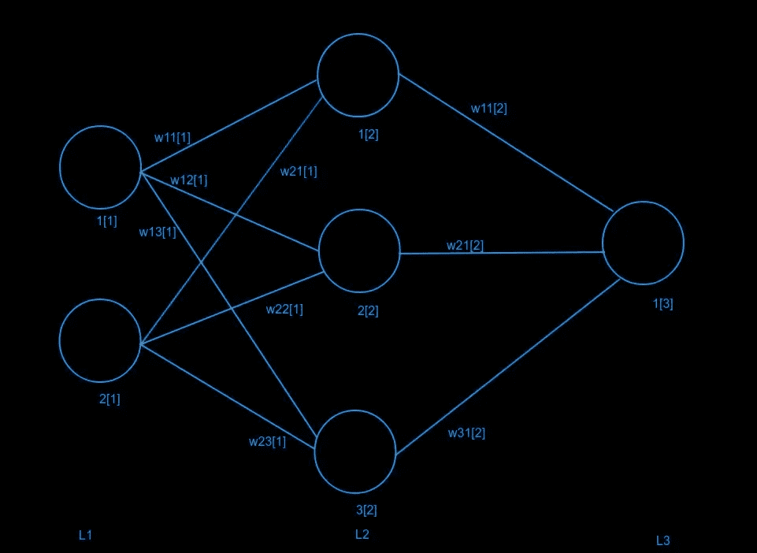

L1、L2 和 L3 代表神经网络中的层。方括号中的数字代表层数。我把每一层的每个节点都编号了。例如，第一层的第二节点被编号为 2[1]，等等。我也给每个重量都贴上了标签。例如，连接第二层的第二节点(2[2])和第三层的第一节点(1[3])的权重是 w21[2]。

我假设我们用的是激活函数 g(z)。

反向传播背后的基本概念是计算误差导数。前向通过网络后，我们计算误差，然后通过[梯度下降](https://hackernoon.com/dl03-gradient-descent-719aff91c7d6)更新权重(使用反向传播计算的误差导数)。

如果你理解微分中的[链式法则](http://www.mathcentre.ac.uk/resources/uploaded/mc-ty-chain-2009-1.pdf)，你将很容易理解反向传播。

首先，让我们写出向前传球的方程式。

设 x1 和 x2 为 L1 的输入。

我将`z`表示为前一层的加权和，`a`表示应用非线性/激活函数`g`后一个节点的输出。

> Z1[2]= w11[1]* x1+w21[1]* x2
> a1[2]= g(Z1[2])
> z2[2]= w12[1]* x1+w22[1]* x2
> a2[2]= g(z2[2])
> z3[2]= w13[1]* x1+w23[1]* x2
> a3[2]= g(z3[2])
> 
> Z1[3]= w11[2]* a1[2]+w21[2]* a2[2]+w31[2]* a3[2]
> a1[3]= g(Z1[3])

现在我用 MSE 作为损失函数。

> e =(1/2)×(a1[3]—t1)，其中 t1 为目标标签。

为了使用梯度下降来反向传播网络，我们必须计算这个误差对每个权重的导数，然后执行权重更新。

我们需要找到 dE/dwij[k]，其中，wij 是第 k 层的权重。

根据链式法则，我们有

现在，我们可以计算 RHS 上的这三项，如下所示:

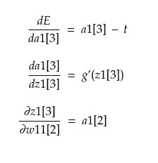

因此，我们有

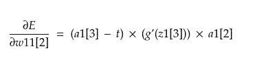

同样的，

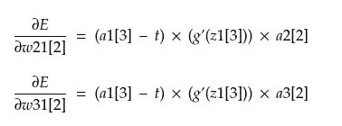

> 设δ1[3] = (a1[3] — t) * (g'(z1[3])。

因此，我们有

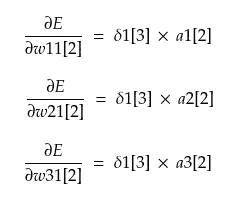

这里，我们将δ1[3]称为第 3 层的节点 1 传播的误差。

现在，我们想回到上一层。

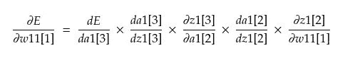

关于简化，我们得到

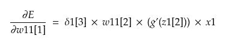

NOTE: The value of weight w11[2] is to be used before the update was performed on it. This applies to all equations and weights below.

同样的，

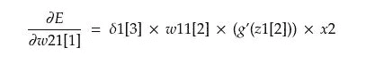

类似地，通过 L2 的其他节点，我们得到

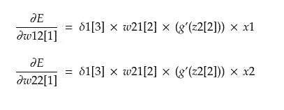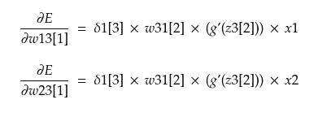

就δ而言，这些可以写成

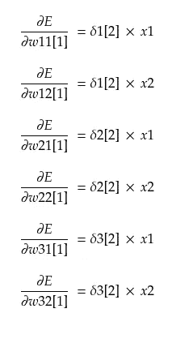

当我们得到所有的误差导数时，权重更新为:

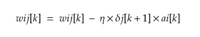

(wij[k] refers to weight wij at layer k)

其中η称为“学习率”，

所以，这是对你的支持！如果你的大脑现在是这样的话，这是完全可以理解的:

为了更好地理解这一点，您可以尝试自己推导它。

你甚至可以对一些其他的误差函数，比如交叉熵损失(用 softmax)来做。或者用于特定的激活功能，如 sigmoid、tanh、relu 或 leaky rely。

我希望通过这篇文章，我能够弄清楚反向传播的基础。我们为此投入了大量的时间和精力，因此非常感谢您的反馈！