# DL05:卷积神经网络

> 原文：<https://medium.com/hackernoon/dl05-convolutional-neural-networks-1d3bb7fff586>

## 理解和可视化 CNN

往期帖子:
[DL01:神经网络理论](https://hackernoon.com/dl01-writing-a-neural-network-from-scratch-theory-c02ccc897864)
[DL02:从零开始编写神经网络(代码)](https://hackernoon.com/dl02-writing-a-neural-network-from-scratch-code-b32f4877c257)
[DL03:梯度下降](https://hackernoon.com/dl03-gradient-descent-719aff91c7d6)
[DL04:反向传播](https://hackernoon.com/dl04-backpropagation-bbcfbf2528d6)


现在我们已经了解了反向传播，让我们深入了解卷积神经网络(CNN)！

(这本书里有很多图片，所以请耐心等待)

> 可视化代码可以在[这里](https://github.com/thesemicolonguy/convisualize_nb)([https://github.com/thesemicolonguy/convisualize_nb](https://github.com/thesemicolonguy/convisualize_nb))找到

# 直觉

*将前馈网络应用于图像极其困难。与这样一个网络相关的参数数量是巨大的。一个更好的、改进的网络是图像所需要的。

Hubel 和 Wiesel 进行了一些实验，这些实验给出了一些关于大脑如何生物处理图像的直觉。他们发现，当大脑看到边缘、图案等时，会做出特定的反应。
据报道，视皮层分为多层，其中前面的层识别像边缘这样的简单特征，但是后面的层识别更复杂的特征。

# 概念

*   **过滤器**

CNN 背后的基本概念是过滤器/内核。你可以把它们想象成较小的图像，然后在输入图像上滑动。通过滑动，我的意思是将同一滤波器乘以图像中的不同区域(即，在图像上卷积)。

图像由形状阵列(高度、宽度、深度/通道)表示，其中彩色图像有 3 个通道(RGB ),灰度图像有 1 个通道。对于能够在图像上“卷积”的滤波器，它应该具有与输入相同数量的通道。输出是滤波器元素和图像的元素乘法的和(可以认为是点积)。

因此，我们可以使用任意数量的过滤器。输出深度尺寸将等于我们使用的过滤器的数量。


Source: [http://cs231n.github.io/convolutional-networks/](http://cs231n.github.io/convolutional-networks/)

在上面的动画中，使用了两个滤镜。请注意，每个滤镜的深度(或通道)维度与输入深度相同(在本例中为 3)。动画中也清晰地描绘了卷积运算。输出深度尺寸等于过滤器的数量(在本例中为 2)。输出是所有通道上的滤波器和镜像的逐元素乘法之和(加上一些可选的偏置项)。所以，可以认为是 3x3x 3(filter _ height * filter _ width * input _ depth)体积的点积。

为了更直观地了解滤镜，我们来看一个检测垂直边缘的滤镜示例。

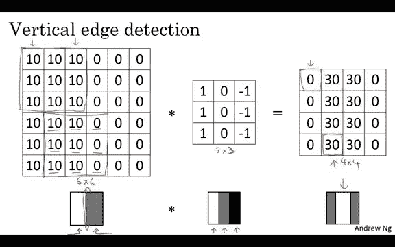

Source: [https://www.coursera.org/learn/convolutional-neural-networks/lecture/4Trod/edge-detection-example](https://www.coursera.org/learn/convolutional-neural-networks/lecture/4Trod/edge-detection-example)

滤镜可以被认为是检测图像中左边较亮而右边较暗的部分。

滑动过滤器还提供了平移不变性的额外优势，因为可以在任何地方检测到相同的特征，而不管它们出现在图像中的什么位置。

此外，在实践中，发现初始层倾向于学习更简单的特征，如边、角等。而较深的层倾向于学习复杂的特征，如眼睛、嘴唇、脸等。

直观上，可以认为我们正在组合较低级别的特征(例如边缘)，并且这些组合导致这些特征的混合，从而导致较高级别的特征。一个过于简单的例子是，以某种方式组合两个边缘检测滤波器来检测拐角:

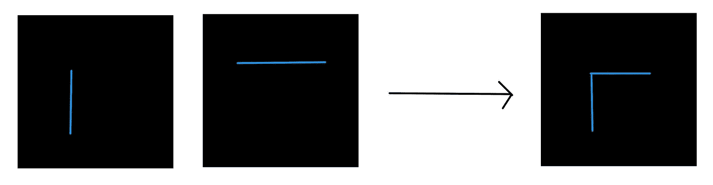

This is just for intuition (made using awwapp.com)

因此，完整的 convnet 通常如下所示:

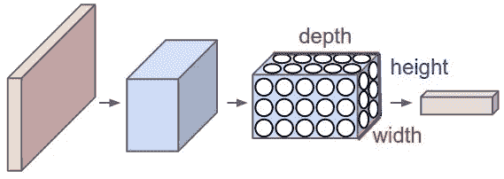

Source: [http://cs231n.github.io/convolutional-networks/](http://cs231n.github.io/convolutional-networks/)

过滤器被随机初始化，然后通过反向传播学习。

*   **层**

CNN 中主要有 4 种类型的层:

1.  Conv 层:这些层执行卷积运算，如上所述。这些层中可学习参数的数量等于每个滤波器中参数的数量乘以滤波器的数量，即滤波器高度*滤波器宽度*滤波器数量
2.  非线性:Conv 层之后通常是非线性层。通常使用 ReLU。该层中没有可学习的参数。
3.  池层:该层用于对图像进行缩减像素采样。它导致下一层中的参数较少，因此 convnet 可以做得更深一点。


Source: [http://cs231n.github.io/convolutional-networks/](http://cs231n.github.io/convolutional-networks/)

理论上，平均池看起来是最好的选择，即取图像的一部分，并对该部分进行平均，以给出该部分图像的一个像素值。但在实践中，发现最大池效果更好，即从图像中的该区域获取最大值。汇集层保持深度维度，即在输入的所有通道上独立完成汇集。该层中没有可学习的参数。

4.完全连接:这些通常位于 convnet 的末端。它们是简单的前馈层，具有与普通前馈网络一样多的可学习参数。

*   **填充**

有人可能会说，根据上述卷积运算，图像的边缘和拐角的重要性不如图像中间的部分。为了克服这一点，输入通常被零填充，即在图像的所有边上添加一层零。此外，零填充允许我们根据需要改变输出图像的大小。

*   **步幅**

在图像上滑动滤镜时跳跃的大小称为步幅。步幅越大，输出图像越小。

用于计算 conv 层之后的下一层的大小的公式是((*W*-*F*+2*P*)/*S)*+1，其中 W 是图像的大小(水平维度的宽度，垂直维度的高度)，F 是过滤器的大小，P 是填充，S 是跨距。

另一个值得注意的酷想法是，随着我们向网络的更深处移动，节点的**有效感受域**增加，也就是说，与之前的层相比，节点可以被认为是在查看图像的更大部分。

# 反向传播

反向传播通常像前馈神经网络一样完成。所有权重(或参数)的导数都是根据 r.t .损失计算的，并通过梯度下降(或梯度下降的一些变体，将在后面的帖子中讨论)进行更新。

在应用链规则寻找梯度 w.r.t. loss 时，一个权重的梯度将来自下一层中该权重在前向传递中贡献的所有节点(根据微分的**多元链规则**，它将是所有这些梯度的总和)。

# 形象化

现在我们已经了解了 convnet 的工作原理，让我们试着想象一下在 convnet 内部发生的一些事情。

一些著名网络架构的精彩解释可以在[这里](https://www.youtube.com/watch?v=DAOcjicFr1Y&list=PLC1qU-LWwrF64f4QKQT-Vg5Wr4qEE1Zxk&index=9)找到。

可视化 VGG 网络的重量没有多大用处，因为过滤器只有 3x3 大小。然而，alexnet 有 11x11 大小的过滤器。下图显示了 alexnet 学习的一些滤镜。

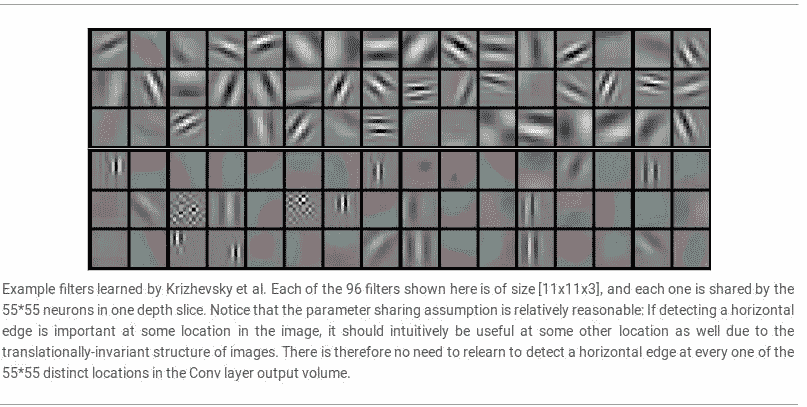

Source: [http://cs231n.github.io/convolutional-networks/](http://cs231n.github.io/convolutional-networks/)

从这一点开始，所有的可视化都是在 Pytorch 的 VGG16 上完成的。代码可以在[这里](https://github.com/thesemicolonguy/convisualize_nb)找到。

那么，让我们看看每一层的输出是什么样的:

输入图像:

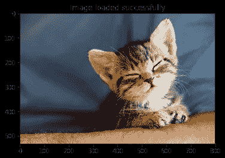

不同层的输出:

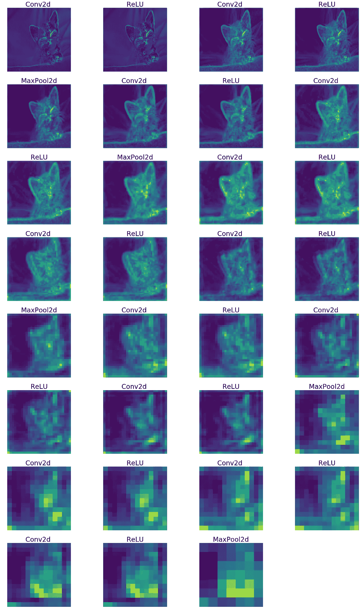

由于每一层的通道数量是不同的(不是 1 或 3)，我对所有通道进行了平均，最终得到一个灰度图像(颜色方案是因为 matplotlib 使用的默认 cmap 方案)。

请注意，maxpooling 只是对图像进行缩减采样。

如果我们不对所有通道取平均值，我们可以在特定层看到每个通道的输出(即每个滤波器的输出)。让我们来看看:

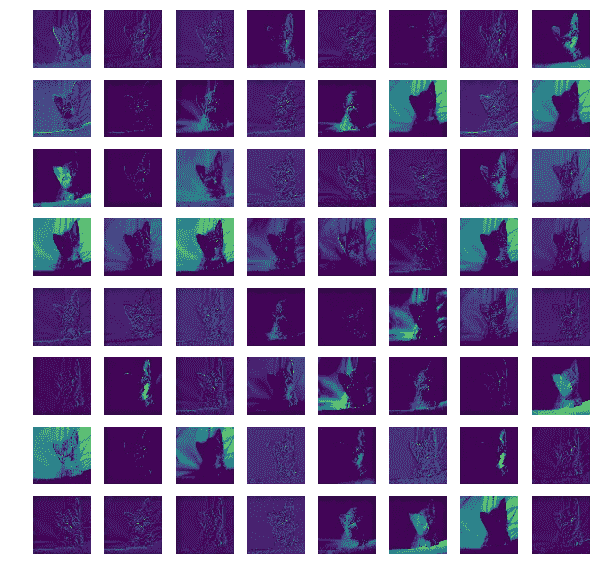

Output from first conv layer filters (all 64 channels from this layer)

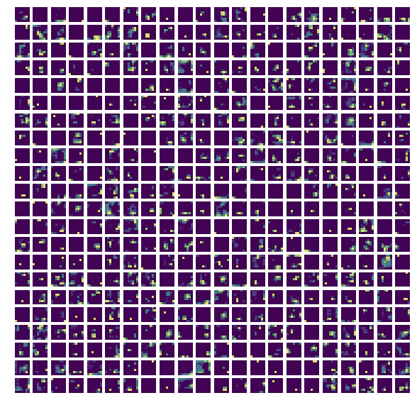

Output from last conv layer filters (first 484 channels are shown out of the total 512 channels at this layer)

我们已经看到了滤波器的输出，现在让我们看看滤波器的实际情况:

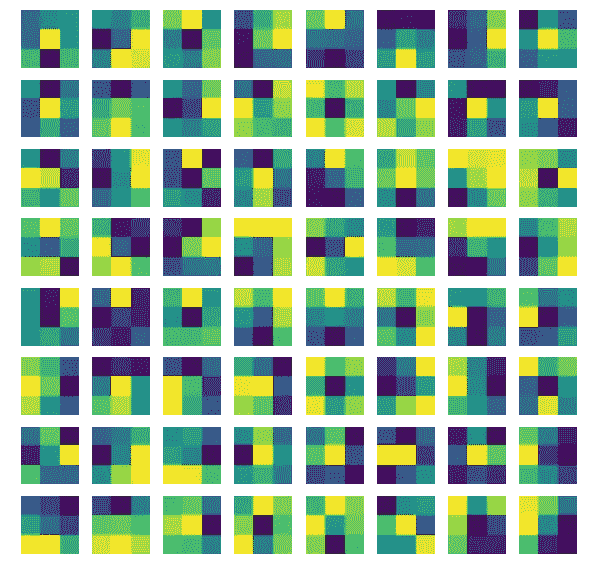

3x3 filters from first conv layer (64 filters)

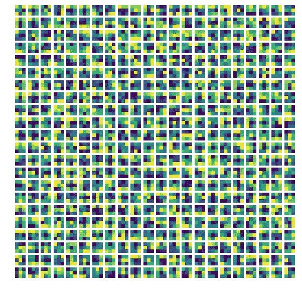

3x3 filters from last conv layer (first 484 out of total 512 filters at this layer)

## 闭塞

现在让我们来看看图像的哪一部分负责图像的分类。

首先，我使用了一种叫做遮挡的技术。在这种情况下，我们简单地从图像中移除一个区域，然后找到该图像作为真实类别的分类概率。我们对图像中的许多区域都这样做(基本上，我们通过在整个图像上滑动来移除区域)。

如果概率得分很高，那么我们知道涂黑的区域对于分类并不重要；没有那个区域，图像被正确分类。如果出现的概率很低，这意味着涂黑的区域对于正确分类图像是很重要的。

蓝色部分表示低输出得分概率，黄色区域表示高输出类别概率。因此，蓝色部分描述了对分类很重要的部分。

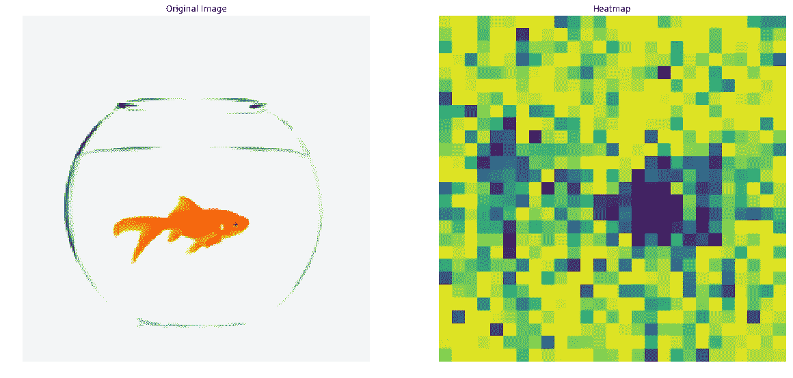

Occlusion Heatmap

印象深刻，对吧？

但是结果不太好，算法运行时间很长(因为运行分类的正向传递次数太多)。

所以，我们尝试不同的方法。

## 显著图

显著图背后的概念很简单。我们找到(图像，类别)对的输入图像 w.r.t .输出分数的导数。根据定义，导数告诉我们分类分数相对于该像素的变化率。

也就是说，如果我们改变输入图像中的特定像素，输出类得分会改变多少。

以下是一些例子:

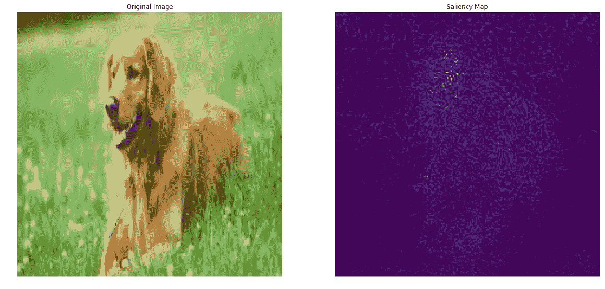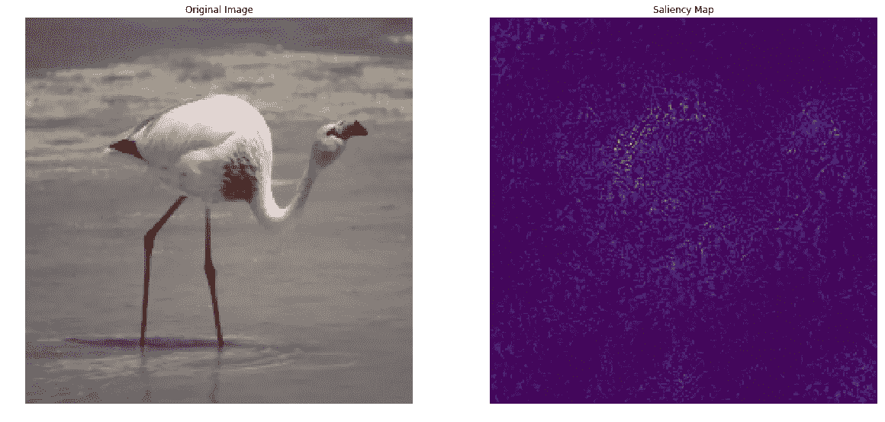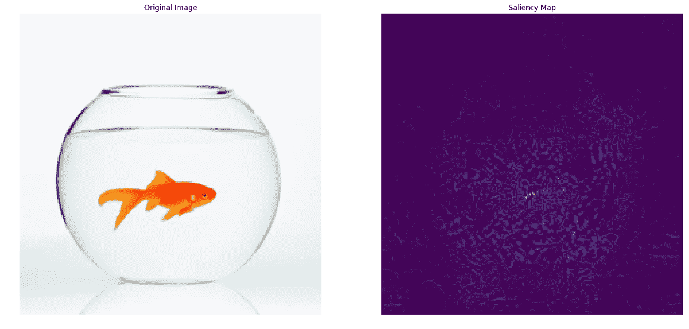

这运行得非常快，并且结果相当好。但是正如你所看到的，仍然有很大的改进空间。

## SmoothGrad

我们可以使用 SmoothGrad 技术来改进显著图(也称为敏感度图)。我想在这里引用这篇论文作者的话:

```
"The apparent noise one sees in a sensitivity map may be due to essentially meaningless local variations in partial derivatives. After all, given typical training techniques there is no reason to expect derivatives to vary smoothly."
```

作者向图像添加了一些噪声，并绘制了三个通道(RGB)的导数 w.r.t .输出类别分数:


Source: [https://arxiv.org/pdf/1706.03825.pdf](https://arxiv.org/pdf/1706.03825.pdf) (The original SmoothGrad paper)

这里，t 决定了添加到图像中的噪声量。在添加了一点点噪声之后，对于肉眼来说，图像看起来根本没有变化，即，它看起来是相同的图像，这是显而易见的。然而，输入图像的导数波动很大。

所以，作者建议我们进行多次迭代，每次迭代，给原始图像添加一点随机噪声。我们将为每次迭代计算输入图像的导数(添加了噪声),然后在绘制之前最后取这些导数的平均值。

平均而言，只有那些像素将具有在每次迭代中具有高值的相应导数的高值。因此，导数中无意义的局部变化将被移除。

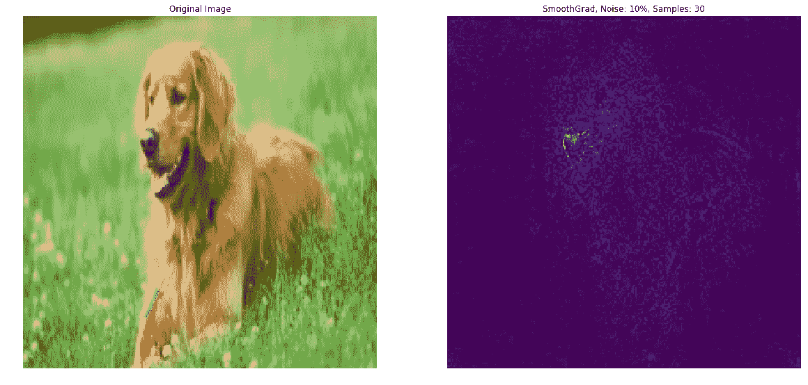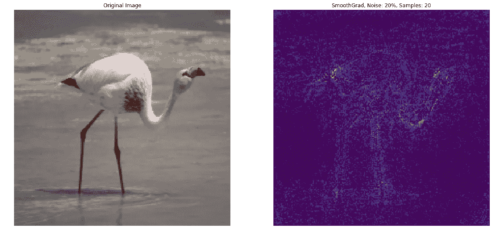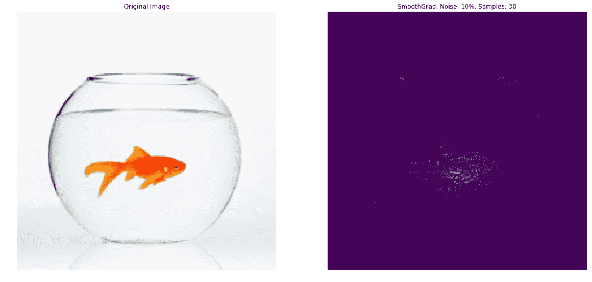

如你所见，结果比简单的显著图好得多。

这些技术极其有用，可以用 GrabCut 算法(我自己还没实现)进行语义切分。


Source: [http://cs231n.stanford.edu/slides/2017/cs231n_2017_lecture12.pdf](http://cs231n.stanford.edu/slides/2017/cs231n_2017_lecture12.pdf)

## 班级模型

我们也可以可视化班级模型，即 CNN 认为某个特定班级的最佳代表。这是通过一种叫做梯度上升的算法来实现的。

我们用零初始化输入图像(尽管将其初始化为 imagenet 训练示例的平均值会给出稍微好一点的结果)。然后我们向前传递，并计算该图像的类别分数。后面的传球是事情变得有趣的地方。我们不更新权重(就像我们通常在训练时做的那样)。重量保持不变。相反，我们计算输入图像的梯度 w.r.t .类得分，并以最大化输出类得分的方式更新所有输入像素。

*附注:我们希望最大化职业分数，而不是 softmax 概率，因为 softmax 概率也可以通过降低其他职业的分数来增加，但只是希望增加目标职业的分数。*

各种正则化技术也可以在这里使用(如 L2，剪辑等。).

在下面的动画中，我们从一个空白的图像开始，注意看类似真实物体的部分是如何开始出现的！

所以让我们来看看这是怎么回事吧！


Flamingo

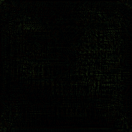

Mosque

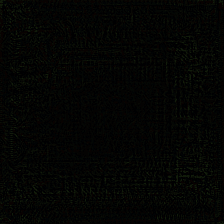

Zebra

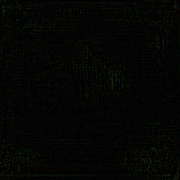

Dumbbell

伙计们，这就是全部了！如果你有任何问题，请在评论中提出。

如果你喜欢这个，给我一个🌟在 [Github](https://github.com/thesemicolonguy/convisualize_nb/) 和👏在这篇文章中:)