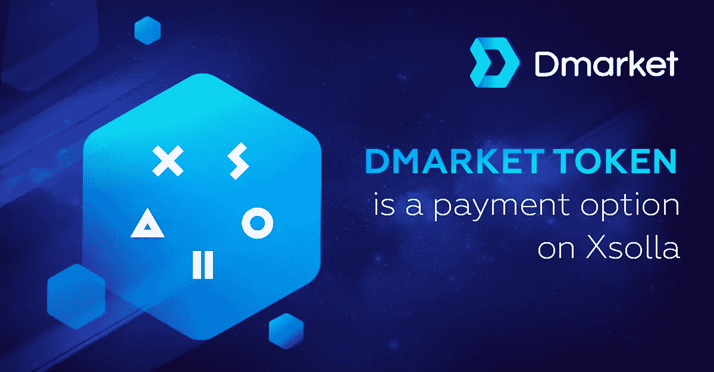

# DMarket 宣布与 Xsolla 合作

> 原文：<https://medium.com/hackernoon/dmarket-announces-partnership-with-xsolla-9bc34aacc045>

> 这是由 [**DMarket**](https://goo.gl/42amDn) 为您带来的付费故事。

**2017 年 11 月 22 日，加利福尼亚州圣莫尼卡** — **DMarket** ，世界上第一个总部位于区块链的将虚拟物品转化为实物资产的跨游戏市场，很高兴地宣布与视频游戏的全球分销商和发行商 **Xsolla** 合作，为游戏开发商和发行商提供先进的技术工具，以优化用户获取和货币化工作。

DMarket 令牌将作为 Xsolla 的 700 多种支付选项之一，也是新推出的加密货币之一。DMarket 团队将增加 Xsolla 的大数据和游戏销售的机器学习分析，最终帮助 Xsolla 的开发商和发行商合作伙伴增加销量和收入。为了最大限度地发挥合作伙伴关系的优势，双方将在全球游戏社区内推出一系列独家交叉促销活动。Aleksandr Agapitov 也加入了 DMarket 的顾问委员会。

Xsolla 首席执行官 Aleksandr Agapitov 表示:“在 Xsolla，我们致力于创造一个双赢的场景，玩家可以提供最佳、最无缝的游戏体验，同时我们的开发人员也可以帮助尽可能多的玩家发现、玩游戏和购买游戏内资产。“我们相信加密货币在交易游戏内物品方面的潜力，我们很高兴与 DMarket 这样有前途的项目合作。”

在评论这一合作关系时，DMarket 的首席执行官兼创始人 Volodymyr Panchenko 补充道:“我们很高兴与游戏世界中最进步的公司之一合作。这种合作关系肯定会给两家公司以及全球游戏社区带来巨大的价值。”

目前，DMarket 正在举行最后一次代币众卖，将持续到 11 月 28 日。迄今为止，DMarket 已经筹集了超过 1500 万美元。

***关于 Xsolla*** *:*

Xsolla 是一家视频游戏的全球分销商和发行商，为客户提供先进的技术工具来扩大他们游戏在全球的潜在影响。Xsolla 专注于视频游戏行业，提供单点菜单式的全球服务，包括用户获取、支付解决方案、游戏商店建设和管理、游戏行业排名第一的欺诈保护、国际全年客户支持、全球营销和数据分析/可视化。将创意留给开发者/出版商，Xsolla 通过构建定制的基础设施解决方案来补充他们的后端和前端工具包。Xsolla 总部位于洛杉矶，在全球各地设有办事处，是一家以合作伙伴为中心的公司，作为主要游戏实体(如 Valve、Twitch、Ubisoft、Epic Games 和 Bluehole)的商户和唱片销售商运营。

***关于 DMarket*** *:*

*DMarket 是世界上第一个基于区块链和智能合约的跨游戏平台，支持一键销售、交换或评估任何平台上任何游戏的任何虚拟物品。DMarket 在 2017 年 10 月展示了其未来市场和区块链测试网(*[*dmarket.com*](https://goo.gl/42amDn)*)的 Alpha/DEMO 版本。*

> 这是由 [**DMarket**](https://goo.gl/42amDn) 为您带来的付费故事。