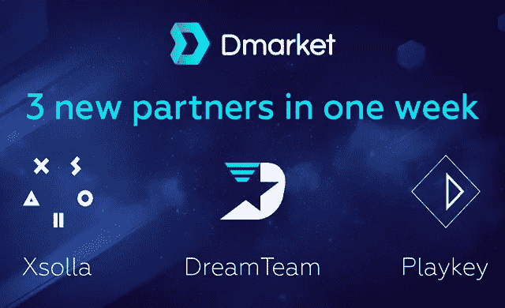

# DMarket 一周内签约三大合作伙伴

> 原文：<https://medium.com/hackernoon/dmarket-signs-three-major-partners-in-one-week-2e0d5463892a>

> 这是由 [**DMarket**](https://goo.gl/42amDn) 为您带来的付费故事。

**11 月 28 日，加州圣莫尼卡**。DMarket 是世界上第一个总部位于区块链的跨游戏市场，它将虚拟物品转化为实物资产，最近与 Xsolla、DreamTeam 和 Playkey 建立了三个新的非常重要的合作伙伴关系。

“每一次合作都将对整个游戏行业产生巨大影响，并将为 DMarket 平台及其用户和贡献者带来额外价值，”DMarket 首席执行官兼创始人 Volodymyr Panchenko 表示。

[**首先是**，DMarket 与全球领先的视频游戏分销商和发行商 Xsolla](https://hackernoon.com/dmarket-announces-partnership-with-xsolla-9bc34aacc045) 联手，后者为游戏开发商和发行商提供先进的工具来优化用户获取和盈利。Xsolla 已经与 Valve、Twitch.tv、Aeria Games 等大型游戏品牌和其他顶级玩家成功合作。

根据协议，Xsolla 将推动 DMarket 成为游戏开发者游戏内物品的优先市场。这一合作意味着 DMarket Token 将被接受为 Xsolla 上的核心游戏加密支付货币之一，并将成为 Xsolla 向游戏玩家提供的 700 多种支付选项之一。为了最大限度地发挥合作的优势，Xsolla 首席执行官 Aleksandr Agapitov 加入了 DMarket 的顾问委员会。

**第二个**，DMarket 与 DreamTeam 合作，后者是第一个去中心化的电子竞技和游戏招聘和管理平台。

两家公司将在大数据分析和机器学习工具方面进行合作。作为协议的一部分，梦之队将赞助 DMarket 额外 72 小时的代币众筹销售。众筹销售将持续到 12 月 1 日，并将得到特别优惠的支持:所有 DMarket 售前贡献者将在 DreamTeam Token 销售阶段#1 获得 15%的额外奖金，所有 DMarket 众筹销售贡献者将在 DreamTeam Token 销售阶段#1 获得 7%的奖金。

此外，DMarket 将在推出后的 12 个月内获得梦之队 30%的广告空间，并将在梦之队社区内推广。

**第三**，DMarket 与 Playkey 合作，Playkey 是第一个去中心化的сloud P2P 和区块链游戏平台，使游戏玩家能够在低端 PC 和 MacOS 设备上启动和玩 AAA 视频游戏。如今，80%的 Playkey 用户都在玩 MMO 游戏，这部分用户可以开始使用 DMarket 进行便捷的一键式游戏内物品交易。反过来，DMarket 用户将被引入 Playkey，作为在低端 PC 上玩硬核视频游戏的一种伟大的新方式，这是一个明显的双赢。

目前，DMarket 正在举行最后一次代币众筹，持续到 2017 年 12 月 1 日。迄今为止，该市场已经筹集了超过 1800 万美元。

***关于***[***DMarket***](https://goo.gl/42amDn)***:***

*DMarket 是世界上第一个基于区块链和智能合约的跨游戏平台，支持一键销售、交换或评估任何平台上任何游戏的任何虚拟物品。DMarket Token 将是平台内使用的唯一虚拟货币，为交易项目、交易所和智能合约提供不同的选项。DMarket 在 2017 年 10 月展示了其未来市场和区块链测试网的 Alpha/DEMO 版本。*

> 这是由 [**DMarket**](https://goo.gl/42amDn) 为您带来的付费故事。