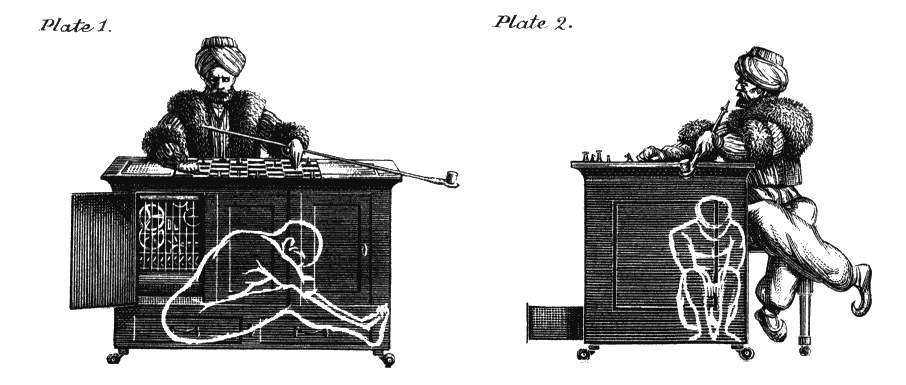
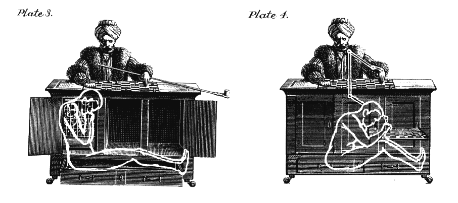

# 算法是发现抑郁症还是导致抑郁症？

> 原文：<https://medium.com/hackernoon/do-algorithms-find-depression-or-cause-depression-2e047ef84cda>

## 关于哈佛 Instagram 的研究…

你可能听说过哈佛的研究，其中研究人员"[训练一台机器在 Instagram 上发现抑郁症](https://www.technologyreview.com/s/602208/how-an-algorithm-learned-to-identify-depressed-individuals-by-studying-their-instagram/)。这篇论文的主题被完美地武器化，以使媒体传播，结合了数据，人工智能，健康，一个受欢迎的社交网络，以及一个鼓励点击的诱人问题(*什么过滤器意味着你抑郁？*)。[麻省理工科技评论](https://www.technologyreview.com/s/602208/how-an-algorithm-learned-to-identify-depressed-individuals-by-studying-their-instagram/)，[连线](http://www.wired.co.uk/article/ai-instagram-diagnose-depression)，[下期网络](http://thenextweb.com/insider/2016/08/19/a-new-algorithm-can-identify-depressed-individuals-by-their-instagram-photos/?utm_content=buffer4f21c&utm_medium=social&utm_source=twitter.com&utm_campaign=buffer)，[独立报](http://www.independent.co.uk/news/world/americas/instagram-filters-depression-link-mental-health-research-a7205601.html)等都贴出来了。这个故事已经在推特上火了将近一周了。

 [## 一台机器可以通过查看你在 Instagram 上的照片来判断你是否抑郁

### 关于颜色的一个奇怪的事情是，我们把它和情感联系在一起。直觉上，我们倾向于将较暗的…

www.technologyreview.com](https://www.technologyreview.com/s/602208/how-an-algorithm-learned-to-identify-depressed-individuals-by-studying-their-instagram/) 

但是一旦抑郁过滤器被揭开(Inkwell，*当然是*)，我很确定大家都不看了。如果他们有，他们会发现一个关于抑郁症的不同故事:**为算法提供燃料的众包工人非常沮丧，这些算法将评估我们。**

为了找到这个悲伤的故事，让我们来看看[麻省理工科技评论文章](https://www.technologyreview.com/s/602208/how-an-algorithm-learned-to-identify-depressed-individuals-by-studying-their-instagram/)中引用的数字:

*   研究人员要求亚马逊众包平台[机械土耳其](https://www.mturk.com/mturk/welcome)的 **500 名**员工完成一项包含标准临床抑郁症调查的调查。
*   研究人员询问这些 500 名员工是否愿意分享他们在 Instagram 上的帖子以供研究。工人们同意了。
*   在这些 **170 名**工人中， **70 名**根据他们的调查响应表现出临床抑郁症。
*   研究人员整理了和他们(同样是和土耳其机械工人)分享的 Instagram 照片，并用这些数据训练了一个[机器学习](https://hackernoon.com/tagged/machine-learning) [算法](https://hackernoon.com/tagged/algorithm)。
*   研究人员在 100 人的照片上测试了他们的算法，正确识别出了 70%的抑郁症患者。(这些人是谁，他们如何得到他们的照片，以及他们如何诊断他们没有具体说明——我认为他们重复了上述步骤。)

70%的准确率听起来相当不错！据称，这样的命中率比一般的从业者都要好。但从统计学意义上讲，它几乎算不上“T10”。100 人的测试小组小得可笑，论文还没有经过同行审查。(尼克·斯托克顿在《连线》杂志(Wired)第 13 期中讲述了这一点，弥补了该杂志此前气喘吁吁的错误。)

但他们掩盖了真实的故事。

[美国成年人的抑郁率为 6.7%](http://www.nimh.nih.gov/health/statistics/prevalence/major-depression-among-adults.shtml) 。

共享照片的众包员工抑郁率为 *41.2%* 。超过*六倍*的国家定额。

看来，在 Mechanical Turk 上的努力正在取得决定性的进展。

机械土耳其人的薪水不高。由于 Turkers(他们被称为 Turkers)是独立承包商，不受劳动法保护。[他们的小时工资从 1 美元到 5 美元不等](https://priceonomics.com/who-makes-below-minimum-wage-in-the-mechanical/)。

 [## 土耳其血汗工厂里谁的工资低于最低工资？

### Mechanical Turk 提供的工资似乎并不十分诱人。三美分为复制产品代码和价格…

priceonomics.com](https://priceonomics.com/who-makes-below-minimum-wage-in-the-mechanical/) 

但贫困似乎并不是这种高萧条率的驱动因素。[根据美国疾病预防控制中心的数据](http://www.cdc.gov/nchs/products/databriefs/db07.htm)，贫困使美国的平均抑郁率翻了一番。Instagram 的研究称，这款名为“机械 Turk”的手机将这个数字乘以 6。

随着最近深度学习的兴起，机械土耳其人已经成为算法的训练场。Turkers 对将用于创建机器学习产品的数据进行分类。对机械土耳其人、其工人和他们训练的机器的最好总结是[这一集的 NPR 星球货币](http://www.npr.org/sections/money/2015/01/30/382657657/episode-600-the-people-inside-your-machine)。

 [## 第 600 集:你机器里的人

### 他们有成千上万的人在你的互联网上做你可能认为是自动的事情…

www.npr.org](http://www.npr.org/sections/money/2015/01/30/382657657/episode-600-the-people-inside-your-machine) 

听听《金钱星球》,很容易明白群体工作是如何超越贫困本身，激发沮丧和无助感的。没有老板或结构，只是快速循环的任务。重复性工作的报酬通常低得令人难以忍受。除了[的自我组织和给亚马逊](https://www.theguardian.com/technology/2014/dec/03/amazon-mechanical-turk-workers-protest-jeff-bezos)的公开信没有任何回应之外，没有其他途径可以求助。

当我们讨论人工智能和机器学习固有的问题时，我们通常[专注于让计算机做出人类目前拥有的决策](http://www.economist.com/news/leaders/21705318-clever-computers-could-transform-government-power-learning)的风险。我们很少讨论那些自己创造算法的人。

这是一个错误。通过共享经济应用或在线工作，群体工作在未来只会增长。它的存在没有合适的现代规制，值得探讨。

具有讽刺意味的是，无权无势的人在“机械土耳其人”上做出的决定将在算法中被放大，最终将对我们所有人产生影响。抑郁者对抑郁或照片的判断与快乐者不同吗？如果训练这些机器的人不代表我们，我们将把决策交给我们可能不同意的算法。这里讨论的关于“机械土耳其人”的例子更糟糕:分类工作本身可能会把一个有代表性的群体变成一个抑郁的群体，使得扭曲的决策不可避免。

这是一个错过的机会，群体工作在很大程度上仍然不为人所知，而其产出，机器学习，是一个热门话题。

> [黑客中午](http://bit.ly/Hackernoon)是黑客如何开始他们的下午。我们是 [@AMI](http://bit.ly/atAMIatAMI) 家庭的一员。我们现在[接受投稿](http://bit.ly/hackernoonsubmission)，并乐意[讨论广告&赞助](mailto:partners@amipublications.com)机会。
> 
> 如果你喜欢这个故事，我们推荐你阅读我们的[最新科技故事](http://bit.ly/hackernoonlatestt)和[趋势科技故事](https://hackernoon.com/trending)。直到下一次，不要把世界的现实想当然！

