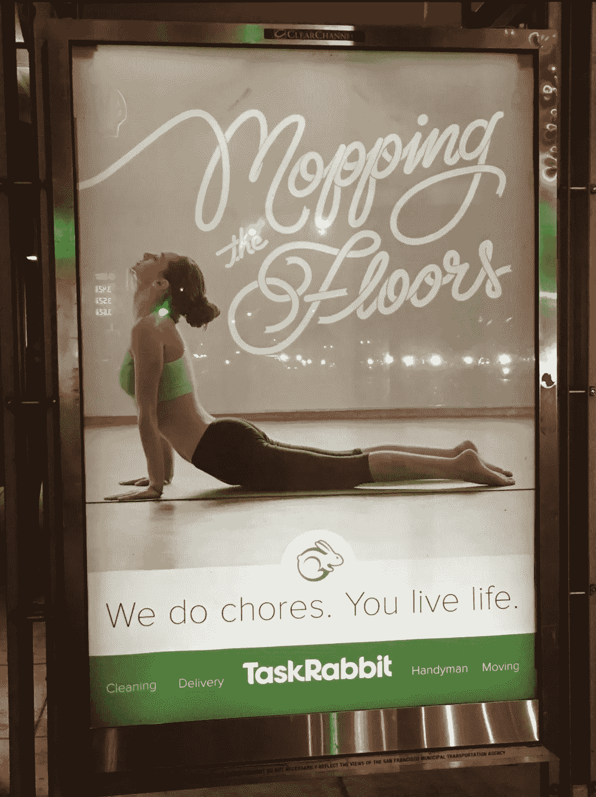

# 做得更好，TaskRabbit。

> 原文：<https://medium.com/hackernoon/do-better-taskrabbit-8bb22297f084>

亲爱的 TaskRabbit:

这当然是不言而喻的，但是在过去几个月看了你们的广告后，我觉得有必要把它写下来。

所有的人都应该“享受生活”——不仅仅是那些足够幸运的人在参加瑜伽的时候把家务外包给其他人。将整个广告活动建立在一个人必须支付额外费用才能享受生活的前提之上，是令人难以置信的音盲。

顺便问一下，你贴在城市各处的广告牌上的隐形“我们”是谁？他们有时间进行自我保健吗？当他们拖我们的地板时，谁在照看他们的孩子？他们在美国最昂贵的城市挣的是生活工资吗？[你在乎吗](https://www.glassdoor.com/Reviews/Taskrabbit-Reviews-E595166.htm)？

旧金山几乎已经将对整个群体(即有色人种的工人阶级居民)的侵略性清除和驱逐正常化，同时依赖他们的廉价劳动力来满足按需纵容的贪婪需求。欢迎这些人为我们服务，但他们肯定没有座位。事实上，我们已经迫使他们成群结队地离开这座城市。

**TL；幸福不是精英的专利。人不是为了服务你而存在的。无论他或她的教育背景或年收入如何，一个人都不应该沦为他人更有魅力的目的的工具。**

> [黑客中午](http://bit.ly/Hackernoon)是黑客如何开始他们的下午。我们是阿妹家庭的一员。我们现在[接受投稿](http://bit.ly/hackernoonsubmission)并乐意[讨论广告&赞助](mailto:partners@amipublications.com)机会。
> 
> 如果你喜欢这个故事，我们推荐你阅读我们的[最新科技故事](http://bit.ly/hackernoonlatestt)和[趋势科技故事](https://hackernoon.com/trending)。直到下一次，不要把世界的现实想当然！

