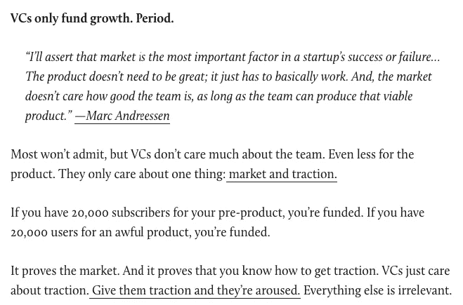

# 投资人真的不在乎创业团队吗？

> 原文：<https://medium.com/hackernoon/do-investors-really-not-care-about-the-startup-team-4fce4437780>

今年早些时候《观察家》上有一篇文章。实际上，这是一本很好的读物。这并不深刻(*其中涉及的大部分内容并不是你所说的启示*)，但确实发人深省。

下面是这篇文章的链接:

 [## 我和 65 个风投睡过，学到了这些东西

### 我们的第一个追求者在春天打电话给我们。他们提出支付咖啡的费用。那是我们第一次约会。我很紧张…

observer.com](http://observer.com/2017/02/i-slept-with-65-vcs-and-learned-these-things/) 

这是给我印象最深的部分。

Excerpt from the article at the observer.

> 大多数人不会承认，但风投们不太关心团队

我同意[马克·安德森](https://medium.com/u/fa65e64cf273?source=post_page-----4fce4437780--------------------------------)在那里说的几乎每一句话，但是不关心团队部分让我很恼火。主要是因为我看到了这篇文章，特别是马克在 Quora 上回答一个问题时引用的话，这个问题与处于创意阶段的**初创公司**有关——我猜是天使轮，甚至不是种子。现在，我不同意作者试图从 Marc 的陈述中得出的类比，因为我主要认为上述台词是在处于成长阶段(或至少是婴儿期后)的企业的背景下说的。但是如果我没有停下来想一想——“我在这里没有错，是吗？风投是不是一点都不在乎团队？不分阶段？”

在我看来，这就是天使投资人。一个扑克玩家。好吧，在这张图中，至少我们已经错过了转牌圈(*不知道翻牌圈或河牌*)。所以想想转牌前的牌桌。这就是我认为的天使。一个扑克玩家。玩弄手中的牌。这手牌主要是他考虑下注的队伍。转牌圈、翻牌圈或河牌圈能让他彻底翻盘吗？当然可以。这种风险一直存在。但在转牌圈前阶段，他必须只拿他手上的两张牌玩——1。业务，2。团队

# 生意

它是否有市场潜力和/或市场是否为这样的产品做好了准备。

市场够大吗？该企业有扩大规模的潜力吗？

利润率如何？他们是不是太瘦了，以至于为了让业务盈利，他们需要处理大量数据？如果是这样的话，面对激烈的竞争，他们能做到并继续这样做吗？

等等。

天使需要问自己很多这样的问题。没有多少人会超过第一对夫妇，但很少有人会走完整英里。

# 团队

现在是上一段的棘手后续部分。即使你问自己的问题中有很大一部分是正确的，但是如果团队不稳定，看起来不够有能力，不够有激情，或者不够值得信任怎么办？你会将企业成功所需的道路托付给他们吗？你会用你的钱赌他们吗？

另一种情况是，业务指标看起来并不完美。他们很体面，但并不完美。但是背后的团队看起来很棒。他们思路清晰，处理事情的方法好，经验丰富。当你和他们说话时，他们会和你发出所有正确的声音。您会打赌他们有能力改进业务指标吗？

在一个完美的世界里，你希望两者兼得——优秀的业务指标，更好的团队。但是我们并不是生活在一个完美的世界里，不是吗？所以，你必须玩好你手上的牌。所以选吧。你更愿意冒险站在哪一边？

1.  出色的业务指标，不稳定的团队
2.  薄弱的业务指标，令人惊叹的团队

在我看来，如果这是我仅有的两个选择，我可能会选择这支神奇的队伍。为什么？因为即使他们不能提高业务指标，他们也可以解决市场中更大的问题，甚至走出他们的舒适区。但是，这不关我的事。你会选择什么？

> [黑客中午](http://bit.ly/Hackernoon)是黑客如何开始他们的下午。我们是 [@AMI](http://bit.ly/atAMIatAMI) 家庭的一员。我们现在[接受投稿](http://bit.ly/hackernoonsubmission)，并乐意[讨论广告&赞助](mailto:partners@amipublications.com)机会。
> 
> 如果你喜欢这个故事，我们推荐你阅读我们的[最新科技故事](http://bit.ly/hackernoonlatestt)和[趋势科技故事](https://hackernoon.com/trending)。直到下一次，不要把世界的现实想当然！

