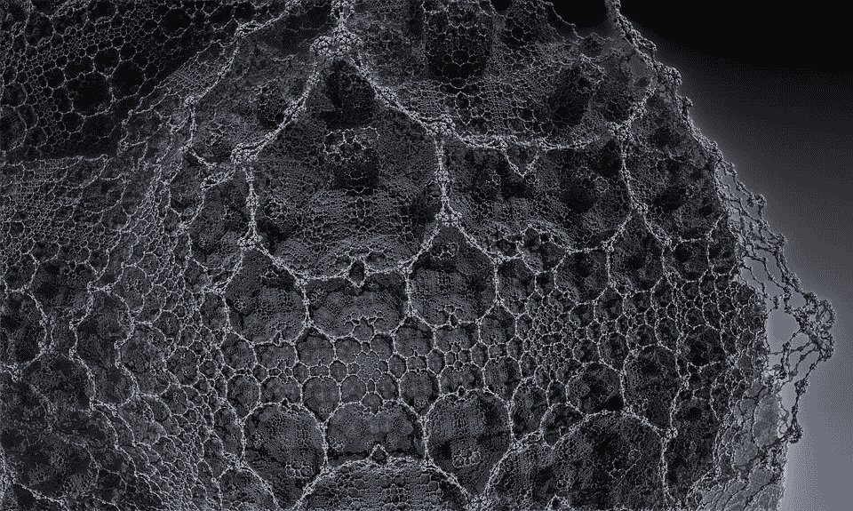

# 神经小集团有“维度”吗？

> 原文：<https://medium.com/hackernoon/do-neural-cliques-have-dimensions-5e0f12b4b>

《前沿》的编辑人员可能会这么认为。

由亨利·马克拉姆领导的蓝脑团队注意到在他们的老鼠和线虫的数字模型和模拟中出现了紧密连接的神经元群。在某个地方，这个故事变成了头条新闻，比如“[人脑可以创建多达 11 个维度的结构](https://www.sciencealert.com/new-study-discovers-your-brain-actually-works-in-up-to-11-dimensions)”。如果这个称号有什么收获的话，那么蓝脑团队一定是发现了虫洞什么的吧？

不，这就是为什么语法很重要。以原始陈述“12 个神经元网络可以对 11 维空间中的对象建模”为例。然后和新的说法“一个十二个神经元的网络占据了十一个维度的空间”做比较。这些标题现在除了主题之外什么都不共享。意义完全不一样。

正如我再次指出的[超过](https://hackernoon.com/programming-language-oxidization-6bb76b0c9099)和[超过](https://hackernoon.com/translating-unix-philosophy-into-modern-environments-80d7949834f3)，语言漂移很重要。以至于草率的新闻报道正在我们的社会中造成文化裂痕，在那些消费原始文件的人和那些消费衍生品的人之间。让我们称之为*涓滴新闻*。

是的，我知道新闻业的经济已经发生了变化。是的，我知道学术出版是排他性的。然而，这就是为什么我在意识形态上支持像 Sci-Hub 这样的 samizdat 项目。在一个研究生水平的科学被硬塞给我们来证明政治议程的世界里，没有借口的余地。公共资助的研究应该免费向公众开放。相反，我们有一个系统，普茨平民支付一倍，两倍，三倍以上的写作，他们永远不会被允许看到。

现在回到第十一个维度。我们如何更好地处理这个故事？首先，忽略记者，除非他们在页面顶部链接到原始(可公开访问的)文件。第二，如果你解释得很好，积极支持并分享好的技术写作，科学就不会无聊。第三，尽量忽略 BS，所以训练你的文艺鼻。

科学出版是一种艺术形式。然而，严谨的风格和散文，预期的同行评议提交正在恶化。现在，越来越少的人倾向于使用间接的“我们”代词，而倾向于信任一个有影响力的合著者。在 arXiv 或类似的库上，标题现在是为 skimmers 编写的。

改变语言以适应用法是很自然的，但是一些敬意应该留给旧的标准。如果你发现自己在写作或评论同行评审或其他技术写作，寻找对话的语气，因为这似乎越来越适合当前的环境。假设公众可以接触科学，光是这种语气的改变就能让科学变得更加平易近人。

我相信开放存取最终会成为标准。然而，现在我们仍然必须处理公共领域的伪科学。当科学被锁起来时，我们最终会成为科学盲。分享不是比囤积更有价值吗？

