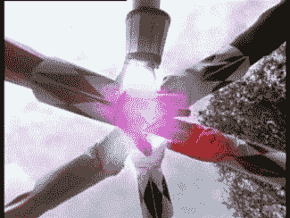
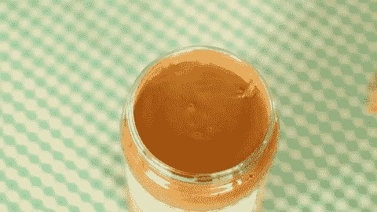

# 现在不要追捕我🙅🏻

> 原文：<https://medium.com/hackernoon/do-not-hunt-me-now-2d402dee95fb>

## 产品狩猎狩猎礼仪

问候！👋

我的名字是亚历山大[伊索拉](https://isora.me)。我是一名[网页创作者](https://itmeo.com)和[区块链爱好者](https://hackernoon.com/surviving-cryptofever-d7579ecce83e)。我的工作需要对新技术产品和创业公司了如指掌，这就是为什么过去几年来, [ProductHunt](https://www.producthunt.com/@alexanderisora) 一直是我最喜欢的网站。

ProductHunt 很久以前由 Ryan Hoover 创立。最初 ProductHunt 只是一份帮助发现酷科技产品的时事通讯。今天，它是[创业](https://hackernoon.com/tagged/startup)行业的代表。

许多科技产品将 ProductHunt 作为一个非常高效的推广平台。对于小型创业团队来说，PH 是市场切入点。在那里取得成功通常是极其重要的。

Via Giphy.

要想在 ProductHunt 上取得成功，必须做好充分的准备。团队必须为 48 小时的工作做好准备，社交媒体应该是活跃的，登录页面必须抛光，cdn 和服务器调整等。

> “不做准备，就是在为失败做准备”——本杰明·富兰克林

关键的一点是要准确地知道*你的 ProductHunt 首次亮相是在*什么时候。经常会发生男人被意外猎杀的事情。而且，如果他们足够幸运地注意到这个惊喜，他们必须放下一切，紧急积聚所有的力量。

活生生的例子是乔希·佩蒂，他的神秘水族馆最近在没有他意愿的情况下被猎杀了。我们看到了可悲的结果。

Via Giphy.

为了避免这种情况，我创建了[**don thuntmenow . club**](https://donthuntmenow.club)。这个想法非常简单:

# TL；速度三角形定位法(dead reckoning)

## 制造商应该:

*   创建一个。告诉他们产品搜索偏好的 html 页面(或从[**donthuntmenow . club**](https://donthuntmenow.club)下载免费页面)。
*   放在他们网站的“/ph”目录下。
*   确保访问“/ph”返回“/ph.html”(或任何其他*。html)或重定向到描述其 ProductHunt 搜索首选项的网站。

## 猎人应该:

*   在寻找创业公司之前，先看看他们的“/ph”。比如在猎杀 CryptoHackers.party 之前，先去 https://cryptohackers.party/ph 的[看看我是否希望产品被猎杀。](https://cryptohackers.party/ph)
*   联系产品负责人，确保团队做好了充分的准备。

善待彼此，我们将使这个世界变得更加美好，并对它产生更大的影响。

