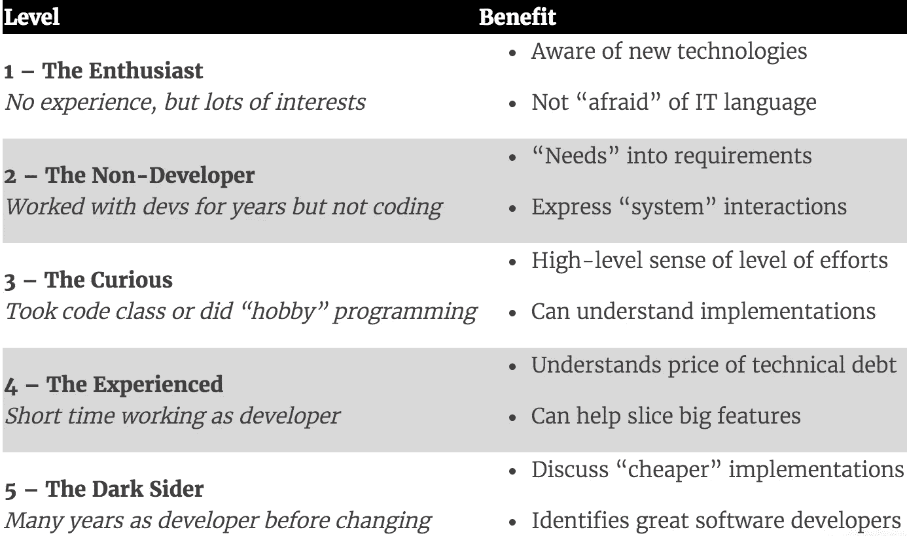

# 技术技能对产品经理有好处吗？

> 原文：<https://medium.com/hackernoon/do-tech-skills-benefit-a-product-manager-be20d908ae70>

我雇佣产品经理已经有一段时间了，和几十个人一起工作过。

由于我来自一个技术背景，我被问了很多次(我问我自己)产品经理是否应该有一些技术技能。他们是否应该知道如何编码，以及如何在日常工作中帮助他们？经验丰富的非技术产品经理甚至问过我，他们是否应该参加编码课程。

技术技能的问题很难回答。我认识到在我的职业生涯中，我的背景在很多情况下都对我有所帮助。对于产品经理来说，技术背景意味着:

*   你会发现用开发团队容易理解的术语来定义什么是需要的更容易。
*   您可以讨论范围，了解什么可能对工作有更大的影响
*   你可以更快地与团队建立关系。更容易说同一种语言，更容易理解如何以一种能让工程师信服的方式传递想法。

但我也有两个主要担忧:

*   当我加强我的开发技能时，我没有开发产品管理所需的其他技能。
*   需要多少技术知识？我做了很多年的开发者。一个人需要对软件开发了解多少才能获得一些好处？

# 技术技能量表

为了回答最后一个问题，我根据对许多具有不同技术水平的产品经理的观察，创建了一个收益量表。

## 1 级——发烧友

一些产品经理从来没有编码，但他们精通。他们喜欢探索新产品，喜欢尝试创新的解决方案。他们也可能已经与 IT 团队合作了一段时间。

**好处:**

*   了解可用于解决产品挑战的新技术
*   与 IT 团队的互动意味着他们能够理解技术语言和缩略语

## 第 2 级—非开发工程师

我把没有编码经验但参与开发的产品经理包括在这个组中。功能分析师就是一个例子。这些专业人员(不一定是工程师)非常熟悉开发过程，如何以结构化的方式定义解决方案，并且可能确实了解一点编程语言(例如，他们可以阅读 XML 或者使用 JSON 测试工具)。

**好处:**

*   能够轻松地将“需求”转化为系统需求
*   拥有表达系统组件、交互和序列的工具。

## 第三级——好奇

级别 2 和级别 3 并不相互排斥。在这个层次上，产品经理对编码有一些兴趣，参加过一些编程课程，甚至完成了一个“家庭项目”来尝试他们的新技术技能。

虽然它不涉及企业级的编码经验，但是在这个级别上，产品经理理解系统是如何工作的。

**好处:**

*   对某件事需要付出的努力程度有非常高的认识
*   理解事情如何实现的技术解释

## 第 4 级—有经验的人

这个级别是为那些曾经做过开发人员的产品经理准备的，但是他们不喜欢这个工作，或者意识到他们正在寻找其他的工作，并且决定转行。

这个水平的专业知识意味着曾经在一个真实的项目中工作过，并且在一个开发团队中工作过。

**好处:**

*   更好地了解实现一个想法所需的努力程度
*   真正了解技术债务的成本
*   有更多的工具将大功能分割成更小的块，同时保持客户价值

## 第五级——黑暗面

一个做了多年软件开发人员的人，决定转向产品管理。

**好处:**

*   将优秀的软件开发人员与“不太优秀”的软件开发人员区分开来
*   可以讨论实现某项功能的“更便宜”的方法
*   了解软件开发人员的内在动机

*注意:产品经理可能已经学会了这些技能，但没有经历过这一阶段。学习事物有许多不同的方法。*

# 你需要的是

如果你没有技术技能，为了成为更好的产品经理，你真的需要了解软件开发的哪些知识？

上面列出的大部分好处都不容易获得，但我相信它们也没那么重要。例如，能够讨论实现一个特性的“更便宜”的方法是技术领导或开发团队的工作，而不是产品经理的工作。如果你不信任他们，学习编码不是答案。

你所需要的是你可能在与开发团队交谈的几个小时内获得的知识。系统是如何组织的？什么类型的需求只影响系统的一个部分，什么类型的需求影响许多部分？它是如何工作的？

系统架构的知识会给你足够的信息来更好地理解团队讨论，并且更好地用与工程团队相同的术语表达你的想法。

最后，你需要有第一关提到的热情态度。你需要了解正在出现的新技术解决方案，并思考它们会如何影响你的产品。您能解决客户使用聊天机器人遇到的问题吗？人工智能将如何在你的行业中创造价值？

# 结论

1.  是的，考虑到这份工作需要的不同技能，技术背景可能有助于产品经理角色的某些方面，就像任何其他背景一样。
2.  我觉得，与对 UX、数据科学、市场营销或一般商业背景的关注相比，对拥有技术背景的产品经理的关注不成比例。所有这些都给了你其他的优势。
3.  除非你想编码，否则我不建议你去上编码课。这甚至可能适得其反:你可能试图更多地参与比你的技术能力所允许的更困难的技术讨论——而你从一开始就不应该参与其中。

但是，如果你觉得你需要更多的技术技能，我相信你实际上可能需要加强与你的技术团队的关系。通过更多地了解事物如何工作，你将获得产品管理活动所需的知识，并且你可能会对技术团队如何处理其产品工作更有信心。

*本文原载于 2017 年 8 月 16 日*[*【www.mindtheproduct.com】*](https://www.mindtheproduct.com/2017/08/tech-skills-benefit-product-manager/)*。如果您喜欢它，并希望获得更多关于产品管理的工具&提示，您可以通过* [***订阅此处***](https://www.getdrip.com/forms/245370375/submissions/new) *加入数百名产品人。*