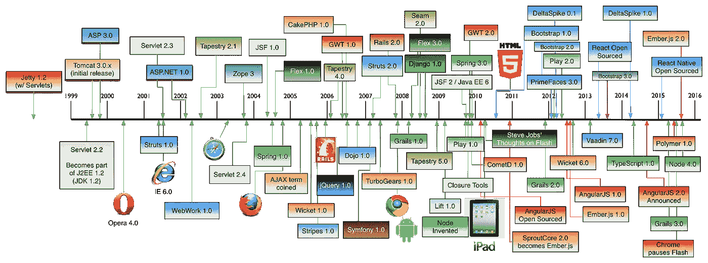
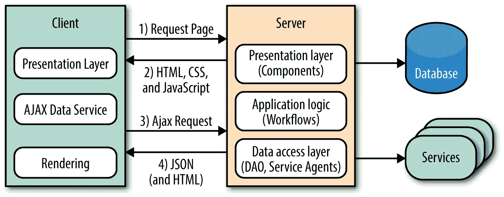

# 你有学习综合症吗？

> 原文：<https://medium.com/hackernoon/do-you-have-the-learners-syndrome-169c8158ec16>

好吧，那不是真的。然而，我注意到一种行为趋势开始出现——尤其是在技术和软件开发领域。我不知道它的名字，所以我们暂时称它为学习者综合症。它描述了一种行为，在这种行为中，受影响的人将不断地寻求学习，但从未真正地应用知识。

我见过的最常见的问题是在 web 开发中。我注意到近年来 web 框架的数量急剧增加。下图显示了它们的数量。

Source: [https://github.com/mraible/history-of-web-frameworks-timeline](https://github.com/mraible/history-of-web-frameworks-timeline)

您可以看到，在过去的 5 年中，出现了大量的框架。我还注意到，web 开发人员应该知道许多这样的框架，因为这似乎是一种荣誉。为什么？

我自己也患有学习综合症。我不得不与之抗争。学习一门新的语言或技术对我来说总是一种有趣的经历。我发现自己在使用

*   去
*   以打字打的文件
*   NodeJS
*   反应
*   有角的
*   春天
*   … x100

这样的例子还真不少。我已经开发了大量的 todo 应用程序，比我愿意承认的还要多。我现在认为自己擅长制作 todo 应用程序。也许我会把它写进我的简历。

> 采访者:你有生产过的产品吗？
> 
> 我:不完全是，但我的投资组合中有很多 todo mvc web 应用程序，我是用 NodeJS 中的同构 react 服务器自己构建的。

拥有如此多的这些技术的最大问题是，要成为一个“好”的 web 开发人员，你需要了解其中的大部分，包括后端技术。我认为这不公平。几年前，前端开发人员和后端开发人员之间的界限很清楚。今天，不再有真正的界限了。我们称之为“全栈”。这听起来像是让一个人做两倍的工作，而不是真正专注于两个领域中的一个。

我自己发现自己更喜欢后端技术，然而随着同构服务器的兴起，我发现自己也经常为前端编写代码。如果你不熟悉同构服务器，这里有一个例子。

Isomorphic Javascript

我觉得当我学习多种框架和技术时，我用它们构建任何有价值的东西的能力下降了。我花在[学习](https://hackernoon.com/tagged/learning)上的时间比我做建筑的时间还多。如果我开始构建一些东西并投入时间，我会觉得我错过了学习新的酷技术的机会，并害怕被落下。

我认为解决的办法是找到一个平衡点。专注于单一技术，并围绕该技术进行构建。当然，你可以学习新技术，但是每天花一个小时或者更少。确保这是一种爱好，而不是上瘾。当你有一份使用单一技术的工作时，学习者综合症似乎被放大了，因为我们把大部分业余时间都花在学习新技术上，而不是用它们来构建东西。然而，如果你在一个促进学习的地方工作，你就能同时获得两种工作的好处。我对就业的看法可以在这里找到。

我建议你退一步想一想。在过去的一年里，你通晓了多少种语言或框架。你做了多少 todo 应用？如果超过 3，你可能学得太多了。当然，也许这就是你喜欢做的事情，但我觉得我们中的许多人可以从花更多的时间专注于一项技术中受益。

我很想听听你的想法，如果你喜欢这篇文章，考虑跟随我阅读更多！