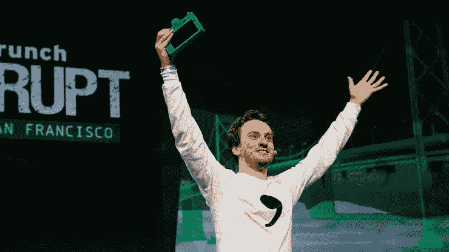
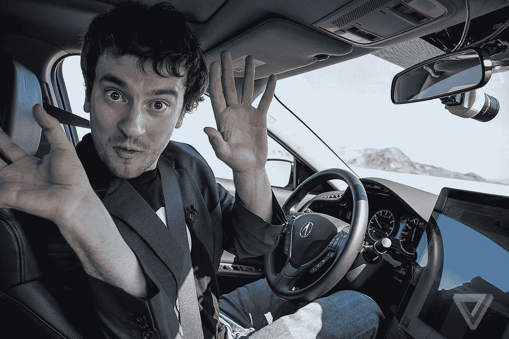

# 要给出令人难忘的推介，你必须是个傻瓜吗？

> 原文：<https://medium.com/hackernoon/do-you-have-to-be-a-douche-to-give-a-memorable-pitch-fd30227c182e>

George “GeoHot” Hotz Giving a Memorable Pitch at TechCrunch Disrupt

刚刚过去的这个周末的艾美奖被“极客”所预示——或者被称为 [TechCrunch Disrupt 战地](https://techcrunch.com/event-info/disrupt-sf-2016/)—[推销](https://hackernoon.com/tagged/pitch)你的产品的巅峰之作。在我多年指导的创始人中，没有一个人不暗暗梦想登上战场。

今年，与任何竞争公司相比，另一家推出他们的[创业公司](https://hackernoon.com/tagged/startup)的公司更受关注:[comma . ai](http://comma.ai/)——这家公司声称，到今年年底，你的汽车(任何汽车)将能够以不到 1000 美元的价格“在不接触任何东西的情况下，把你从山景城开到旧金山(对所有非硅谷人来说，大约一个小时的车程)。”这是一个相当雄心勃勃和令人兴奋的承诺！听起来，如果他们参加比赛的话，他们本可以轻而易举地赢得战场！

Watch the Buzzed-About Pitch Yourself

围绕 comma.ai 的讨论不仅与演讲者有关，也与产品有关，[George“geo hot”Hotz](https://twitter.com/geohotus)，这位臭名昭著的黑客因第一个“越狱”iphone 而闻名。我看到了很多关于他的球场和风格的评论，有些人说他们无法忍受，有些人说这太棒了。以下是我的观点:

**什么有效？**

*   **简单的解决方案** —这可能是我听过的任何人对机器学习给出的最好的解释。如果你抛开一点极客的话，他基本上说的是为了让机器自己做一些事情，你必须使用传感器来接收信息，然后“执行器”将其转化为“输出”或动作。所以基本上你可以教机器做任何事情，比如自己驾驶——如果你输入足够的数据。“让世界教我们开车吧。”
*   **经验教训** —简单就是聪明！把复杂的概念分解开来，让每个人都能理解。(如果没有一些行话，他本可以做到，但他做得很好)

Look Ma, no Hands!

*   **易于理解的演示** —他接着展示了“chffr”——他们的 Android 应用程序(以及后来的 iPhone 版本 dash)，这基本上是一个 dashcam 应用程序，记录了 700 多人(这不是一个大数字……)驾驶数十万英里，并通过手机教“他们”的自动驾驶汽车驾驶——没有昂贵的硬件。(这是他第一次抨击公司——优步——稍后再详细介绍)。接近尾声时，他还展示了他们实际的自动驾驶汽车设备 comma.ai 的原型，它基本上取代了你的后视镜(自行安装)，代替你开车。虽然这是一个粗糙的模型和草图，但它得到了他想要的回应。我敢打赌，房间里的每个极客都垂涎于年底拥有一辆自动驾驶汽车的前景…
*   **经验教训**——展示，不要说——让我们看看产品是什么样的，并想象我们自己在使用它。

但是在中间的某个地方，一切都开始变糟了…

**什么没起作用？**

*   喘不上气来——可能是紧张，也可能只是大量的热空气，但 Hotz 先生呼吸不够，让他喘着气。这也让观众感到喘不过气来，而且不是一种好的方式。这几乎让他看起来像是在吃什么东西——事实上，当他吃完后，主持人评论说，她会吃一些他吃的东西——他说“我很无聊！我好无聊！”
*   吸取的教训 —呼吸！！！如果你紧张，你的身体会自动停止呼吸，这反过来会让你更加喘不过气来，最终你会气喘吁吁，看起来很紧张。适时深呼吸，瑜伽式的呼吸会让你看起来很平静。尽量不要激动。

Don’t Bash Your Competition!

*   **痛击竞争对手**——先是[优步](https://www.uber.com/)因为使用昂贵的硬件来教他们的汽车驾驶而遭到痛击，然后是[谷歌](https://www.google.com/)“永远不会发货”，然后是[奥托](https://www.ottomotors.com/)“饥肠辘辘，却从优步获得了数百万美元。”(是的，他们[最近被优步以 6.8 亿美元的价格收购了](https://techcrunch.com/2016/08/18/uber-acquires-otto-to-lead-ubers-self-driving-car-effort-report-says/)——对于一家年轻的公司来说，这并不坏……)然后是[特斯拉](https://www.tesla.com/)——他实际上说他“非常尊重这家公司，因为他们实际上推出了自动驾驶汽车”，所以埃隆·马斯克在“乔治之怒”中毫发无损他接着说“硅谷几乎没有足够的垃圾言论”，并继续晒“小丑”——移动眼(他不喜欢他们！！！他在随后的采访中继续抨击他们！！！) [Drive.ai](http://www.drive.ai/) ， [Zoox](http://www.zoox.co.uk/) ，以及最糟糕的抨击， [Cruise](https://www.crunchbase.com/organization/cruise) 正如他所说，他们承诺推出自动驾驶汽车，但随后被通用汽车收购，他称之为“背叛”。他希望借此达到什么目的？气死人？我敢肯定这种情况确实发生过——想象一下，在座的有多少投资者投资了这些公司？有纪念意义？好吧，是的，这很有效。让无数人听到他的大惊小怪并观看他的比赛？没错。通过抨击竞争对手来提高他的可信度？嗯没有。
*   吸取的教训——不要说你的竞争对手的坏话——或者任何人的坏话。你不仅冒着得罪或惹怒别人的风险，还会让你失去很多可信度，因为他们可能会想，“如果他说这些，一定是垃圾，我想知道他在说我什么？”

Watch George’s Interview — a Different Person!

让我感到惊讶的是在球场后对达雷尔·埃瑟林顿的采访，他看起来是个不错的家伙，一个可爱的有点害羞的孩子，对问题给出了可靠的答案——有点多抨击，但如果我没有看到球场，我真的会喜欢这个家伙。有些人在一对一的谈话中比在推销中做得更好，有一些方法可以克服这一点，并轻松地进行推销。因此，Hotz 先生，我有一种感觉，在接下来的几个月里，你将会更多地出现在公众的视线中。在你打磨产品的 UX 时，我很乐意帮助你打磨你的 UX。:)

[唐娜·格里菲思](http://www.donnagriffit.com)是一个为创业公司讲故事的人，15 年来，[已经帮助世界各地数百家创业公司和风投](https://donnagriffit.com/testimonial/)筹集了数亿美元。需要一个球场甲板？[点击这里](https://donnagriffit.com/services/investor-pitch-deck/)。

> [黑客中午](http://bit.ly/Hackernoon)是黑客如何开始他们的下午。我们是 [@AMI](http://bit.ly/atAMIatAMI) 家庭的一员。我们现在[接受投稿](http://bit.ly/hackernoonsubmission)并乐意[讨论广告&赞助](mailto:partners@amipublications.com)机会。
> 
> 如果你喜欢这个故事，我们推荐你阅读我们的[最新科技故事](http://bit.ly/hackernoonlatestt)和[趋势科技故事](https://hackernoon.com/trending)。直到下一次，不要把世界的现实想当然！

