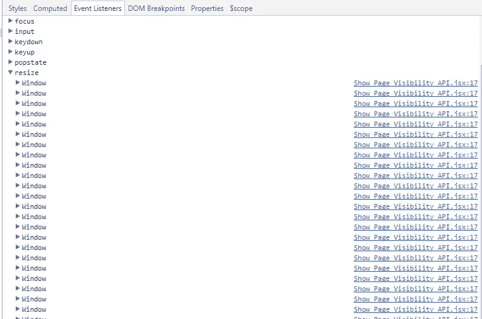
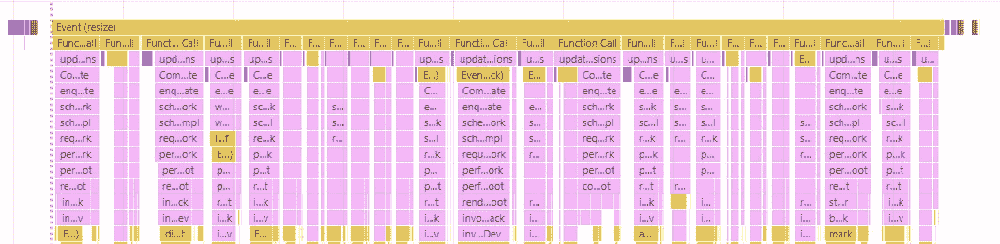
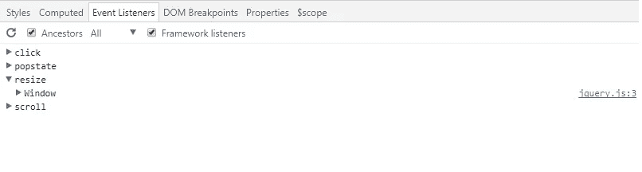

# 你仍然在每个组件中注册窗口事件监听器吗？(在示例中反应)

> 原文：<https://medium.com/hackernoon/do-you-still-register-window-event-listeners-in-each-component-react-in-example-31a4b1f6f1c8>


> 每次调用`**addEventListener()**`方法时，它会将指定的`EventListener`兼容对象添加到调用它的`EventTarget`上指定事件类型的事件监听器列表中。事件目标可以是文档中的`Element`、`Document`本身、`Window`或任何其他支持事件的对象(如`XMLHttpRequest`)。

从描述中我们可以发现，每次当你调用`window.addEventListener('resize', callback)`到 body 元素时，对象都会被添加到 resize 事件监听器列表中。

在 React 中，您可能会经常看到这样方法:

```
componentDidMount() {
   window.addEventListener('resize', **this**.handleResize)
}
componentWillUnmount() {
   window.removeEventListener('resize', **this**.handleResize)
}
```

这是可行的，但是正如我们之前提到的，当你重用这个组件时，调整事件列表的大小会增加很多倍。最终，你会看到这样照片:



一个主线程活动的火焰图。



我觉得看起来不太好。它会给你带来什么？首先，很难调试，代码不可伸缩。当每个 resizes 事件被触发时，如果你需要做一些事情怎么办？会很难，对吧？您需要转到 resize 事件正在侦听的每个组件并进行更改。其次，它可能会导致你表现不佳。

# 让我们改进

我们需要什么？

1.  一个调整大小事件侦听器
2.  如果需要，每个组件应该有可能监听调整大小事件，当组件被卸载时，它不应该监听

听起来发布/订阅模式可能会有所帮助。

> 这是系统中的对象可以订阅其他对象并在感兴趣的事件发生时得到通知的地方。~ [阿迪·奥斯马尼](http://twitter.com/addyosmani)

让我们创建一个可以订阅、取消订阅和发布的对象:

查看发布/订阅 UMD 软件包，了解更好的用法:

[](https://www.npmjs.com/package/publish-subscribe-js) [## 发布-订阅-js

### 发布/订阅 UMD 套餐

www.npmjs.com](https://www.npmjs.com/package/publish-subscribe-js) 

然后，我们需要一个地方来监听 resize 事件，并在事件触发时发布给每个订阅者。

首先，让我们创建一个将在应用程序间共享的全局对象，并设置`resizeEvent`属性。

当 DOM 准备好的时候监听窗口事件。

因此，我们创建了订阅者/发布者，在一个地方监听整个应用程序的调整大小事件，并在事件触发时发布给每个订阅者。还剩下什么？好的，让我们从一个组件订阅事件。

就是这样:)

您可以为每个窗口事件侦听器使用 subPub。结果，我们有了一个清晰的窗口调整事件侦听器列表，代码也更具可伸缩性。



在此处查找完整代码示例(page Resize_SubPub):

[](https://www.npmjs.com/package/create-react-redux-app-structure) [## 创建-反应-还原-应用-结构

### 使用构建配置创建 react redux 应用程序结构

www.npmjs.com](https://www.npmjs.com/package/create-react-redux-app-structure) 

**感谢您的阅读。欢迎建议、评论、想法:)**

**如果你喜欢这个，鼓掌，跟我上** [**中**](/@shystruk) **，** [**推特**](https://twitter.com/shystrukk) **，**[**github**](https://github.com/shystruk)**跟你的朋友们分享一下** ✌️