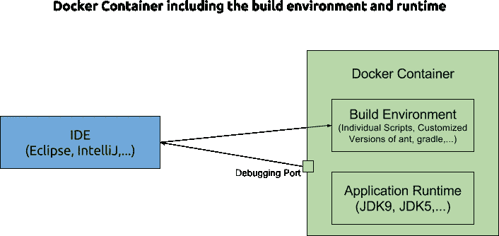

# Docker 作为构建环境

> 原文：<https://medium.com/hackernoon/docker-as-build-environment-50d6797e2e7a>

我想说明一下 [Docker](https://hackernoon.com/tagged/docker) 作为构建[环境](https://hackernoon.com/tagged/enviroment)在大型遗留应用程序中经常被忽略的角色，这些应用程序必须定期维护和扩展。特别是，我想强调 Docker 在构建过程中的作用。

在我看来，这一点没有得到应有的重视，因为 Docker 由于提高了生产率而越来越多地用于运行应用程序。

# 构建工具

每一项主要技术都有一套构建工具，可以围绕实际编码自动执行任务，比如下载依赖项、编译或捆绑。一般来说，你有一个主要的构建工具，它提供了工作流和执行特定任务的插件。

在项目开始时，开发人员自己安装构建工具没有问题。这些工具只是一些不需要任何定制的程序。比如 Java 给你 gradle 或者 maven 之类的选择。NET 主要是 MSBuild，而 JavaScript webpack 或 gulp。

# 构建工具如何成为构建环境


Complicated Build Environment

随着时间的推移，这种简单性会发生变化，因为您的构建工具已经到了不能简单地将其定义为工具的地步。推动这一转变的两个主要原因是:

*   复杂性增加
*   传统技术

随着您添加新工具、定制现有工具、更改操作系统设置等等，事情会变得更加复杂。此外，您将面临无法找到现有工具来自动化的任务，因此您必须自己编写。


Outdated Technology

当一个应用程序成功运行多年时，它很有可能会经历几代技术的兴衰。通常，应用程序的某些部分——以及构建工具——是基于过时的技术，因为移植整个应用程序并不总是可能的。

最初的几个程序变得越来越复杂，并使用不同的技术，直到它演变成一个工具的集合——甚至是黑客——我称之为构建环境。

# 将环境构建为问题孩子

构建环境一旦被安装到开发人员的机器上，就很难改变。开发人员只是很高兴它能工作，并遵循“永远不要改变一个运行中的系统”的原则，根本不会去碰它。

毫无疑问，随着时间的推移，关于每个工具的知识会逐渐消失，并且不会进行维护。

最终，这阻碍了新技术的采用。

应该允许专业软件开发人员建立他们自己的开发环境。通过这种方式，你鼓励他们尝试新事物和创新。然而，最终，构建环境变得如此复杂，以至于每个开发人员都需要一个虚拟机的副本，或者通过 Ansible 之类的配置管理工具来设置机器。

这是你应该意识到事情不对劲的时刻。

# 在 Docker 中运行构建环境

正如我们已经看到的，构建工具因为复杂性和遗留性而增长。它们最终处于一个难以维护和扩展的构建环境中。它甚至会导致对开发环境的严重限制，减少开发人员的行动自由。

这是 Docker 出场的时刻。它允许我们将完整的应用程序放入容器中，我们可以在任何安装了 Docker 运行时的机器上执行这些应用程序。这消除了重复的管理任务，如配置和安装。

整个构建环境可以打包到一个 Docker 容器(Dockerfile)中，完整的安装和配置必须在其中进行。粗略地说，Docker 文件是在创建 Docker 映像期间执行的命令的集合。这迫使我们完全自动化我们的构建环境，因为手动任务是不可能的。

基于 Docker 的方法保证每个开发人员都有相同的构建环境，这对于您的 CI 也是如此。不存在由不同版本的 bug 引起的“在我的机器上工作综合症”的可能性。此外，Docker 容器可以在每个开发人员的机器上立即启动。通过添加使用适当参数运行容器的 shell 脚本，新开发人员甚至可以在第一天就开始开发代码库。

# Docker 构建环境提高了生产率

当然 Docker 不能去除复杂性和遗留的负担，但是它让事情变得更简单。

容器没有启动时间，所以执行会立即开始。这使得容器化比 VirtualBox、VMware 等虚拟映像更快，也比物理机器快得多。

您可以重用现有的配置管理工具，如 Ansible 或 Puppet，并且由于 Dockerfile 处于版本控制中，您可以毫不费力地尝试新事物。

对于开发者体验也有巨大的改善。Docker 与主机系统共享目录的能力让我们的开发人员可以使用他们想要的任何 IDE，因为现代 IDE 已经配备了 Docker 支持。不需要同步源文件，他们只需编写他们习惯的代码并触发构建的创建。

如果您的技术允许通过网络进行调试(Java 允许)，那么 Docker 也可以这样做。下图显示了 Java 相关场景的原理。

# 陈列柜

因为每个构建环境都有自己的特点，所以我只展示了一个运行 Spring 并使用 ant 作为构建工具的应用程序的极简示例。这个星座可以追溯到 2004 年。

我让你去想象构建环境是如何在这么长的时间内进化的。我的主要意图是给出一个抓住大意的起点。

完整的项目可以在 [GitHub](https://github.com/rainerhahnekamp/docker-build-environment) 上找到。请注意，Dockerfile 使用 17.06 CE 版本中引入的新的多阶段构建功能:

```
FROM java:6 as builder
ADD . /data RUN wget [http://archive.apache.org/dist/ant/binaries/apache-ant-1.6.3-bin.tar.bz2](http://archive.apache.org/dist/ant/binaries/apache-ant-1.6.3-bin.tar.bz2)
RUN tar xfj apache-ant-1.6.3-bin.tar.bz2
RUN /apache-ant-1.6.3/bin/ant -buildfile data/build.xml jar FROM java:6 
COPY — from=builder /data/build/legacy.jar /legacy.jar 
CMD [“java”, “-jar”, “/legacy.jar”]
RUN wget [http://archive.apache.org/dist/ant/binaries/apache-ant-1.6.3-bin.tar.bz2](http://archive.apache.org/dist/ant/binaries/apache-ant-1.6.3-bin.tar.bz2)
RUN tar xfj apache-ant-1.6.3-bin.tar.bz2
RUN /apache-ant-1.6.3/bin/ant -buildfile data/build.xml jar
COPY — from=builder /data/build/legacy.jar /legacy.jar
`CMD [“java”, “-jar”, “/legacy.jar”]
```



# 进一步阅读

*   https://blog.alexellis.io/mutli-stage-docker-builds/
*   【https://blog.docker.com/2017/07/multi-stage-builds/ 
*   [https://docs . docker . com/engine/user guide/eng-image/stage-build/# name-your-build-stages](https://docs.docker.com/engine/userguide/eng-image/multistage-build/#name-your-build-stages)
*   [https://www . rainerhanekamp . com/en/single-instance-ECS-setup/](https://www.rainerhahnekamp.com/en/single-instance-ecs-setup/)

*原载于 2017 年 9 月 30 日 www.rainerhahnekamp.com*[](https://www.rainerhahnekamp.com/en/docker-build-environment/)**。**