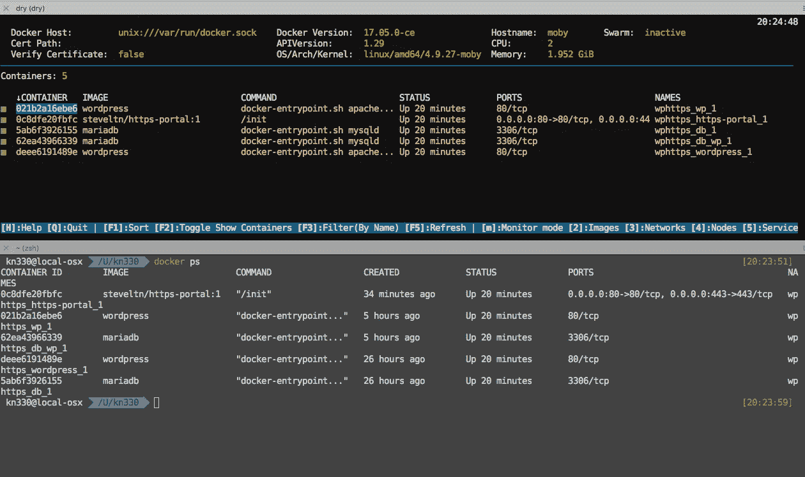
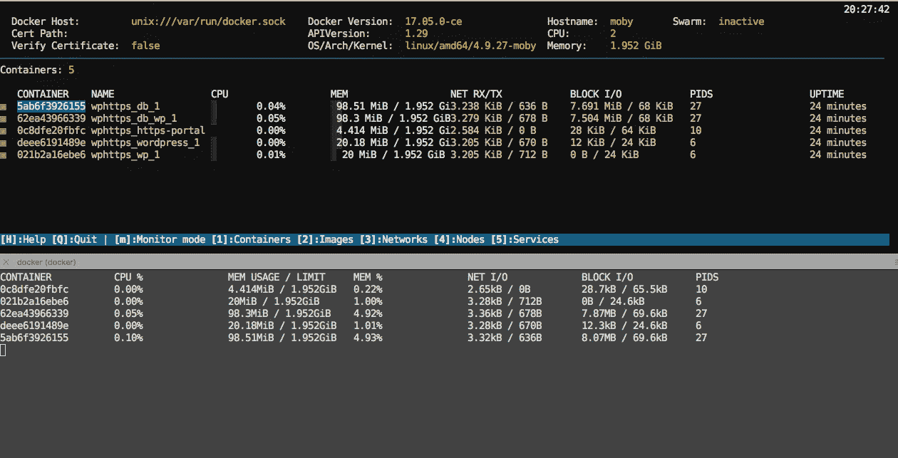
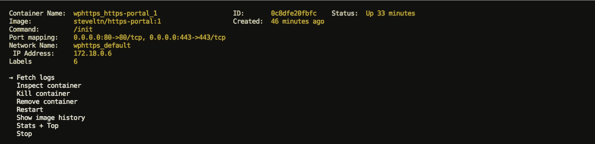
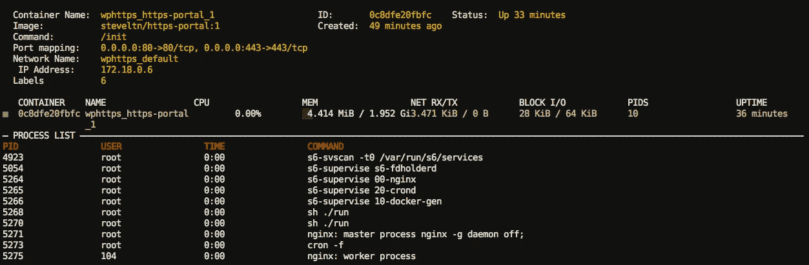
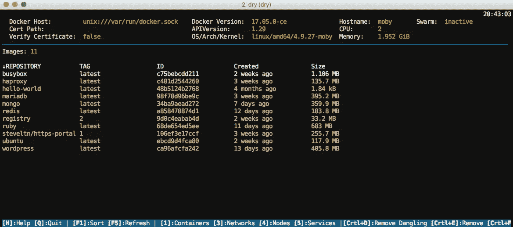

# DRY——Docker 的替代命令行工具

> 原文：<https://medium.com/hackernoon/docker-cli-alternative-dry-5e0b0839b3b8>

## **dry 与 docker cli 的比较。**


[Dry](https://moncho.github.io/dry/) 是管理 [Docker](https://hackernoon.com/tagged/docker) 容器和图像的终端应用。它旨在当需要在现有容器和映像上重复执行命令时，作为官方 Docker CLI 的替代，也作为从终端监控 Docker 容器的工具。你可以把 Dry 想象成容器的 htop。

## 装置

```
## LINUX
$ curl -sSf https://moncho.github.io/dry/dryup.sh | sudo sh
$ sudo chmod 755 /usr/local/bin/dry ## MAC
brew tap moncho/dry
brew install dry
```

## 使用

```
$ dry
```

这将打开一个提示符，其中装载了关于 docker 守护进程和正在运行的容器的所有有用信息。它可以连接到本地或远程码头主机。在本例中，我们连接到本地守护进程(`unix:///var/run/docker.sock)`)。



top: dry | bottom: docker ps

这张图片显示了`docker ps`和`dry`的对比。干体验肯定比默认 docker cli 好很多。

## 班长

按`m`键可以进入干态监控模式。这相当于`docker stats`的命令。让我们来看看两者之间的监控比较如何



top: dry | bottom: docker stats

两个[工具](https://hackernoon.com/tagged/tools)提供了相似的度量，但是`dry`的输出更加详细和有颜色。它还有一个额外的`NAME`列，当你有很多容器，而你又不是内存冠军时，这个列就派上用场了。

## 容器

如果您从主菜单中选择一个容器，您将获得可以执行的操作列表。



` dry: containers

您可以查看日志，检查，杀死和做一堆其他事情的容器。`Stats+Top`是一个有用的特性，它显示了资源利用率和容器的输出。



dry: Stats + Top

docker cli 流程将首先从`docker ps`获取容器 id，然后在容器`docker exec -it <container_id> top`内交互执行 top。

## 形象

在主菜单中按`2`可以对图像进行操作。



dry: images

如果您想删除图像，只需从菜单中选择该图像，然后按`Ctrl + E`。对于强制移除，您必须使用`Ctrl + F`。

## 帮助

要获得关于 dry 命令的帮助，您可以启动`dry`并按下`H`键或访问他们的 [github 页面](https://github.com/moncho/dry)。

干可能不会为每个人增加很多价值，但它肯定是香草 docker cli 上的一些糖。我经常使用这个工具，并推荐其他人尝试一下。

## ❤如果这篇文章有帮助，请点击绿色小心脏！

[](http://bit.ly/HackernoonFB)[](https://goo.gl/k7XYbx)[](https://goo.gl/4ofytp)

> [黑客中午](http://bit.ly/Hackernoon)是黑客如何开始他们的下午。我们是 [@AMI](http://bit.ly/atAMIatAMI) 家庭的一员。我们现在[接受投稿](http://bit.ly/hackernoonsubmission)，并乐意[讨论广告&赞助](mailto:partners@amipublications.com)机会。
> 
> 如果你喜欢这个故事，我们推荐你阅读我们的[最新科技故事](http://bit.ly/hackernoonlatestt)和[趋势科技故事](https://hackernoon.com/trending)。直到下一次，不要把世界的现实想当然！

