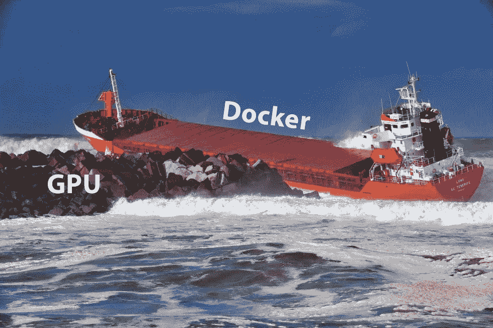
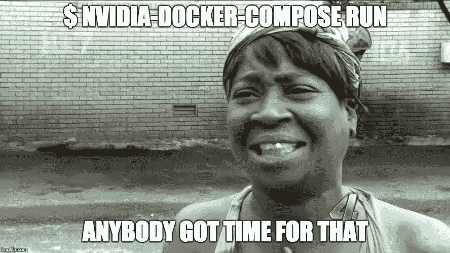
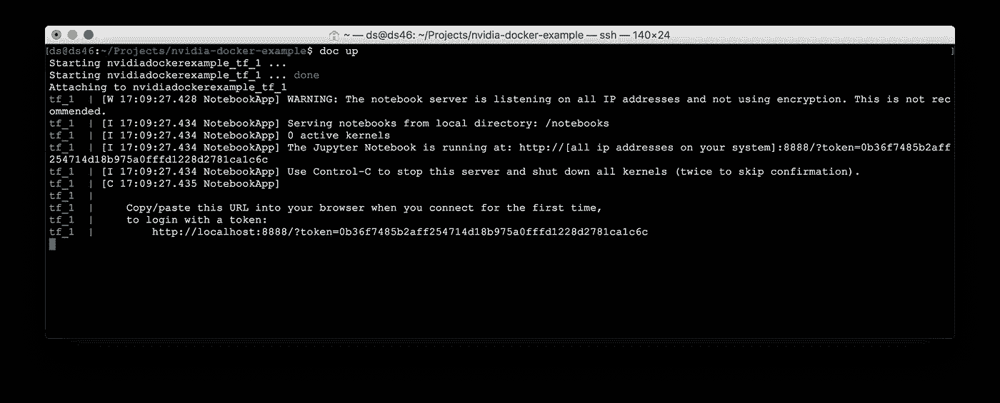
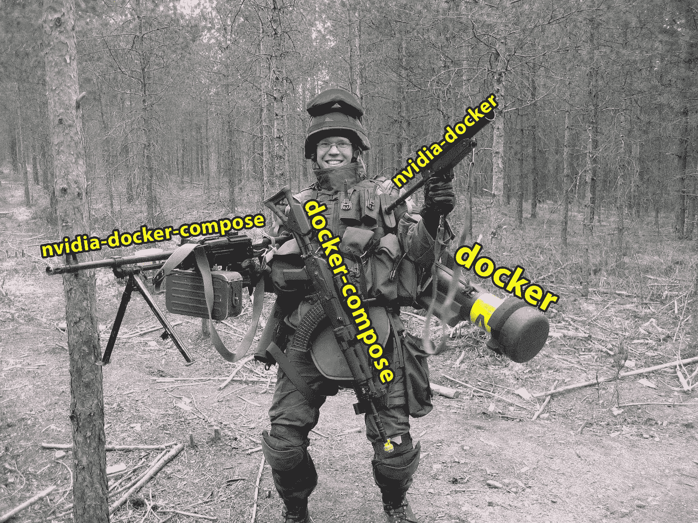

# docker compose+GPU+tensor flow =❤️

> 原文：<https://medium.com/hackernoon/docker-compose-gpu-tensorflow-%EF%B8%8F-a0e2011d36>

Docker 很棒——越来越多的人利用它进行开发和发布。即时环境设置、独立于平台的应用、现成的解决方案、更好的版本控制、简化的维护:Docker 有很多好处。

但是当涉及到数据科学和深度学习时，就有一定的障碍了。你必须记住所有这些 docker 标志，以便在主机和容器之间共享端口和文件，创建不必要的`run.sh`脚本，并处理 CUDA 版本和 GPU 共享。如果你见过这个错误，你就知道它的痛苦:

```
$ nvidia-smi 
Failed to initialize NVML: Driver/library version mismatch
```



# 我们的目标

这篇小帖子的目的是向您介绍我们公司经常使用的一套足够的 Docker 实用程序和 GPU 就绪样板文件。

所以，不要这样:

```
docker run \
--rm \
--device /dev/nvidia0:/dev/nvidia0 \
--device /dev/nvidiactl:/dev/nvidiactl \
--device /dev/nvidia-uvm:/dev/nvidia-uvm \
-p 8888:8888 \
-v `pwd`:/home/user \
gcr.io/tensorflow/tensorflow:latest-gpu
```

你会得到这样的结果:

```
doc up
```

很酷，对吧？

我们实际上想要实现什么:

*   使用一个命令管理我们的应用程序状态(运行、停止、删除)
*   将所有这些运行标志保存到我们可以提交给 git repo 的单个配置文件中
*   忘记 GPU 驱动版本不匹配和共享
*   在 Kubernetes 或 Rancher 等生产工具中使用 GPU 就绪的容器

下面是我们向每个深度学习者强烈推荐的工具列表:

# 1.库达

首先，你需要[的 CUDA 工具包](https://developer.nvidia.com/cuda-downloads)。如果你打算自己训练模特，这绝对是必备的。我们建议使用`runfile`安装程序类型，而不是`deb`，因为它不会在将来的更新中弄乱你的依赖关系。

*(可选)如何检查是否工作:*

```
cd /usr/local/cuda/samples/1_Utilities/deviceQuery
make
./deviceQuery # Should print "Result = PASS"
```

# 2.码头工人

你不想用大量的库污染你的计算机，也不想害怕破碎的版本。此外，您不必自己构建和安装软件——通常，软件已经为您构建好了，并打包在映像中！[安装 Docker](https://www.docker.com/get-docker) 很简单:

```
curl -sSL [https://get.docker.com/](https://get.docker.com/) | sh
```

# 3.Nvidia Docker

如果你使用 Docker，必须有 NVIDIA 的[实用程序](https://github.com/NVIDIA/nvidia-docker)——它真的简化了 Docker 容器中 GPU 的使用。

安装非常简单:

```
wget -P /tmp https://github.com/NVIDIA/nvidia-docker/releases/download/v1.0.1/nvidia-docker_1.0.1-1_amd64.deb
sudo dpkg -i /tmp/nvidia-docker*.deb
```

现在，不是每次都像这样共享 nvidia 设备:

```
docker run --rm --device /dev/nvidia0:/dev/nvidia0 --device /dev/nvidiactl:/dev/nvidiactl --device /dev/nvidia-uvm:/dev/nvidia-uvm nvidia/cuda nvidia-smi
```

您可以使用`nvidia-docker`命令:

```
nvidia-docker run --rm nvidia/cuda nvidia-smi
```

此外，您可以停止担心驱动程序版本不匹配:Nvidia 的 docker 插件将解决您的问题。

# 4.Docker 撰写

这是一个非常有用的工具，允许你在一个文件中存储`docker run`配置，并且更容易地管理应用程序状态。尽管 docker compose 被设计为将多个 docker 容器“组合”在一起，但当您只有一个服务时，它仍然非常有用。在这里选择稳定版本:

```
curl -L https://github.com/docker/compose/releases/download/1.15.0/docker-compose-`uname -s`-`uname -m` > /usr/local/bin/docker-compose
chmod +x /usr/local/bin/docker-compose
```

# 5.Nvidia Docker 撰写

可惜 Docker Compose 不知道 Nvidia Docker 的存在。幸运的是，有一个解决方案:一个微小的 [Python 脚本](https://github.com/eywalker/nvidia-docker-compose)，用`nvidia-docker`驱动程序生成配置。使用 pip 安装它:

```
pip install nvidia-docker-compose
```

现在你可以用`nvidia-docker-compose`命令代替`docker-compose`。

## 供选择的

如果不想用`nvidia-docker-compose`，可以[手动通过音量驱动器](https://github.com/NVIDIA/nvidia-docker/wiki/NVIDIA-driver#alternatives)。只需将这些选项添加到您的`docker-compose.yml`中:

```
# Your nvidia driver version here
volumes:
  nvidia_driver_375.26:
    external: true
...
  volumes:
    - nvidia_driver_375.26:/usr/local/nvidia:ro
```

# 6.Bash 别名

但是`nvidia-docker-compose`是 21 个字符打出来的！那太多了。



幸运的是我们可以使用 bash 别名。在您最喜欢的编辑器中打开`~/.bashrc`(有时是`~/.bash_profile`)并输入这些行:

```
alias doc='nvidia-docker-compose'
alias docl='doc logs -f --tail=100'
```

通过运行`source ~/.bashrc`更新您的设置。

# 启动 TensorFlow 服务

现在，我们已经准备好利用上述所有这些优势。例如，让我们运行一个支持 Tensorflow GPU 的 Docker 容器。

在项目目录下创建文件`docker-compose.yml`，内容如下:

```
version: '3'services:
  tf:
    image: gcr.io/tensorflow/tensorflow:latest-gpu
    ports:
      - 8888:8888
    volumes:
      - .:/notebooks
```

现在，我们可以用一条命令启动 TensorFlow Jupiter:

```
doc up
```



`doc`是`nvidia-docker-compose`的别名——它将使用正确的`volume-driver`生成修改后的配置文件`nvidia-docker-compose.yml`,然后运行`docker-compose`。

您可以使用相同的命令管理您的服务:

```
doc logs
doc stop
doc rm
# ...etc
```

# 结论

但这值得努力吗？这里我们来权衡一下利弊。

## 赞成的意见

*   忘记 GPU 设备共享
*   你再也不用担心 Nvidia 驱动版本了
*   我们抛弃了命令标志，支持干净和简单的配置
*   不再有用于管理容器状态的`--name`标志
*   众所周知的记录在案的和广泛使用的实用程序
*   您的配置已经为像 Kubernetes 这样理解 docker-compose 文件的编排工具做好了准备

## 骗局

*   你必须安装更多的工具

# 生产就绪了吗？

没错。在我们的电影推荐服务 [Movix](https://movix.ai) 中，我们使用 GPU 加速的 TensorFlow 网络根据用户输入计算实时电影选择。

在代理 API 后面的[牧场主集群](http://rancher.com/)中，我们有三台装有 Nvidia Titan X 的计算机。配置存储在常规的`docker-compose.yml`文件中:因此在新的服务器上设置开发环境或部署应用程序非常容易。到目前为止，它运行良好。



Be prepared for the future of ML!

*如有任何问题或意见，欢迎在此处或推特上写下*[*@ deepsystemsru*](http://twitter.com/deepsystemsru)*。*