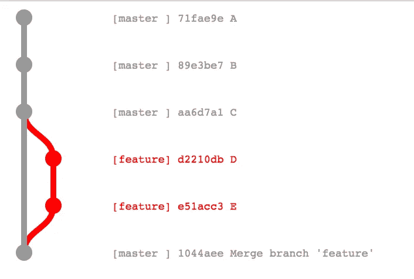
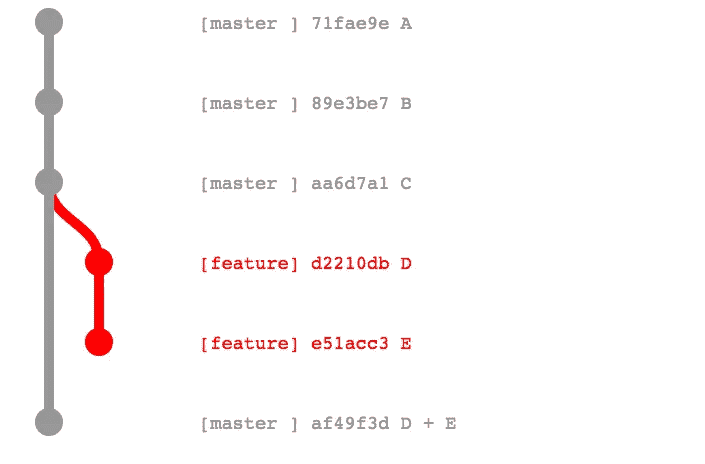
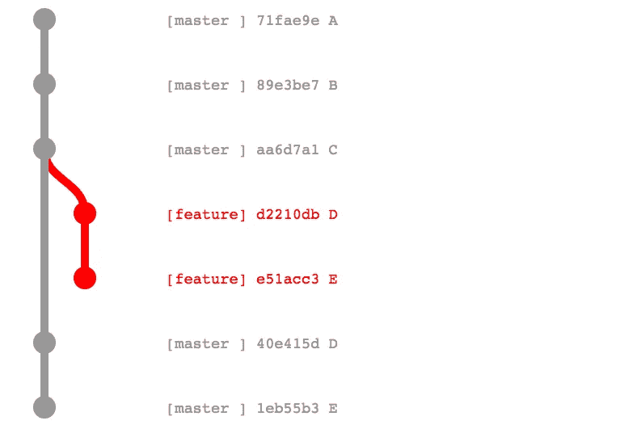

# Docker FastPath:只构建一次映像

> 原文：<https://medium.com/hackernoon/docker-fastpath-only-build-your-images-once-a4c3beeae7d3>

## 使用您喜欢的 Git 工作流程，通过 Docker 实现快速无误的环境升级

*TL；在您的构建系统中部署*[*Docker fast path*](https://github.com/mfornasa/docker-fastpath)*DR。*

我从 Humble 和 Farley 的经典 [*连续交付*](https://www.amazon.com/Continuous-Delivery-Deployment-Automation-Addison-Wesley/dp/0321601912/) 中学到的最有用的信息之一(立即获取您的副本！)就是**只编译你的二进制文件一次**。

> 许多构建系统使用版本控制系统中保存的源代码作为许多步骤的规范源。代码将在不同的上下文中反复编译[…]。每次编译代码，你都冒着引入一些差异的风险
> 【j . Humble，D. Farley，Continuous Delivery，p. 133】

你可以注意到，这本书是在 2011 年写的，使用了“编译”这个词。快进到 2017 年，在最近的 [StackOverlow 开发者调查](https://stackoverflow.com/insights/survey/2017)中，基于 Javascript 的技术达到了惊人的 85%的偏好，动态语言正在主导 [web 开发](https://hackernoon.com/tagged/web-development)。不出所料，这个建议在今天仍然很有价值:你只需要用你喜欢的构建方法(`npm install`、`bundle install`、`webpack`等)来改变“编译”。).

在一项研究中，研究人员发现:

> […]构建中断的典型情况是缺少引用的文件，错误地检入正在进行的工作，以及可传递的依赖关系。

此外，一次又一次地构建相同的代码库既费时又让开发人员难以获得及时的反馈。

所以，现在更有必要“只编译一次你的二进制文件”。在 [Docker](https://hackernoon.com/tagged/docker) 开发管道中，这转化为:

> **只构建一次映像**

# 典型的 Git + Docker 持续集成管道

使用 Docker 的典型持续集成流程是:

*   对 git 库的代码推送触发了构建过程(Jenkins、TravisCI、GitLab 等)。)
*   构建(标记)Docker 映像并将其推送到 Docker 注册表
*   图像被自动测试
*   该映像部署在您最喜欢的 Docker orchestrator (Kubernetes、ECS、Swarm 等)上。)在测试环境中
*   对管道中的以下环境重复该过程(试运行、生产等。)

通常，您有不止一个服务器环境。环境标签变化很大；常见的选择有`development`、`qa`、`staging`。当给定环境的目标实现时，就需要促进向更高环境的改变。

这里的目标是将我们的工件(Docker 映像)从一个环境推到下一个环境。一种可能性是将这个过程从代码存储库中分离出来:映像提升发生在外部系统上。这种方法不容易与常见的 git 工作流(G [itflow](http://nvie.com/posts/a-successful-git-branching-model/) 、 [GitHub Pull Requests](https://help.github.com/articles/about-pull-requests/) 、 [GitLab Merge Requests](https://docs.gitlab.com/ee/gitlab-basics/add-merge-request.html) 、[别的东西](http://endoflineblog.com/gitflow-considered-harmful))集成，在这些工作流中，控制权掌握在开发人员手中。但是，正如 Humble 和 Farley 告诉我们的，在代码级别提升是不好的。

# 介绍 Docker FastPath

我在这里提倡将控制权掌握在开发人员手中，让他们使用自己喜欢的 Git 工作流，享受**只构建一次映像的强大功能**。该方法独立于正在使用的特定 Git 工作流，它基于两个简单的规则:

1.  用 Git commit ID 标记这个映像，这个映像就是从这个 Git commit ID 构建的。
2.  如果代码库与现有映像相同，则不要在代码推送时重新构建:而是部署该映像。

要应用第 2 条规则，有必要检查 Git 历史记录，并将结果与图像的 Docker 注册表标记列表进行交叉检查。请注意，在大多数情况下，您可以有两个相同的代码库，但有不同的 Git 提交 id:因此比较 Git IDs 是不够的，您需要区分这两个代码库。 [Docker FastPath](https://github.com/mfornasa/docker-fastpath) 就是这么做的。

让我们看一些例子。

## 示例#1:合并特征分支

这是 GitHub Pull 请求的默认行为。使用合并提交(使用`--no-ff`选项)将特性分支的所有提交添加到基础分支`master`。在这种情况下，提交`1044aee`与提交`e51acc3`相同，不需要重新构建。图像标记为`1044aee`可以直接部署。

## 示例 2:挤压和合并

这是当你选择“挤压和合并”时 GitHub Pull 请求的行为。所有特性分支提交都被压缩成一个提交，并使用 Git 快进添加到基本分支。在这种情况下，提交`af49f3d`与提交`e51acc3`相同，不需要重新构建。标记为`e51acc3`的图像可以直接部署。

## 例子#3:重定基础和合并

当您选择“Rebase and merge”时，这是 GitHub Pull 请求的行为:来自 feature 分支的所有提交都被添加到 base 分支，没有合并提交。在这种情况下，提交`1eb55b3`与提交`e51acc3`相同，不需要重新构建。标记为`e51acc3`的图像可以直接部署。

# 尝试

[Docker FastPath](https://github.com/mfornasa/docker-fastpath) 代码可以在 GitHub 上作为命令行工具获得。您可以下载一个适用于 MacOS 或 Linux 的可执行文件，它可以很容易地部署在大多数构建系统上，但是如果您愿意，您也可以从源代码构建它。

提供了两个部署示例:一个使用 [Jenkins](https://github.com/mfornasa/docker-fastpath-jenkins) ，另一个使用 [Travis CI](https://github.com/mfornasa/docker-fastpath-travis) 。使用这些例子来使 FastPath 适应您现有的基于 Docker 的软件项目应该很容易。

> 如果你喜欢这篇文章，请点击下面的“♥︎”按钮。更多关于 DevOps 和 Docker 的文章，请加入我的邮件列表。

> [黑客中午](http://bit.ly/Hackernoon)是黑客如何开始他们的下午。我们是 [@AMI](http://bit.ly/atAMIatAMI) 家庭的一员。我们现在[接受投稿](http://bit.ly/hackernoonsubmission)，并乐意[讨论广告&赞助](mailto:partners@amipublications.com)机会。
> 
> 如果你喜欢这个故事，我们推荐你阅读我们的[最新科技故事](http://bit.ly/hackernoonlatestt)和[趋势科技故事](https://hackernoon.com/trending)。直到下一次，不要把世界的现实想当然！

