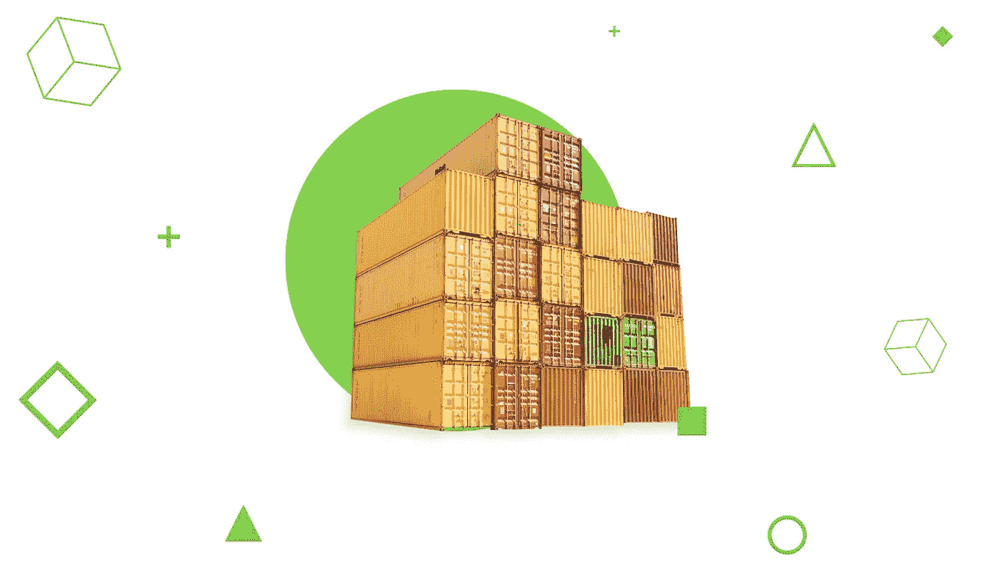
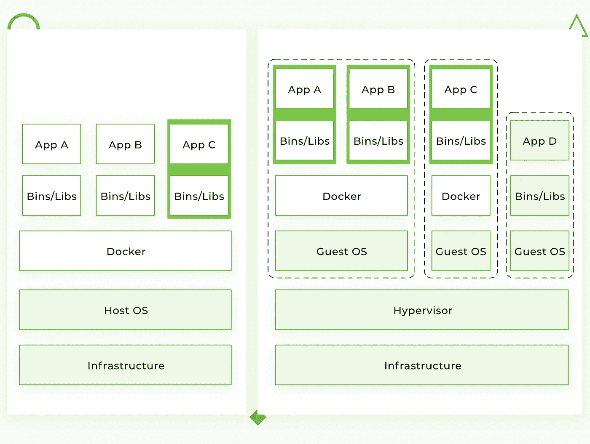
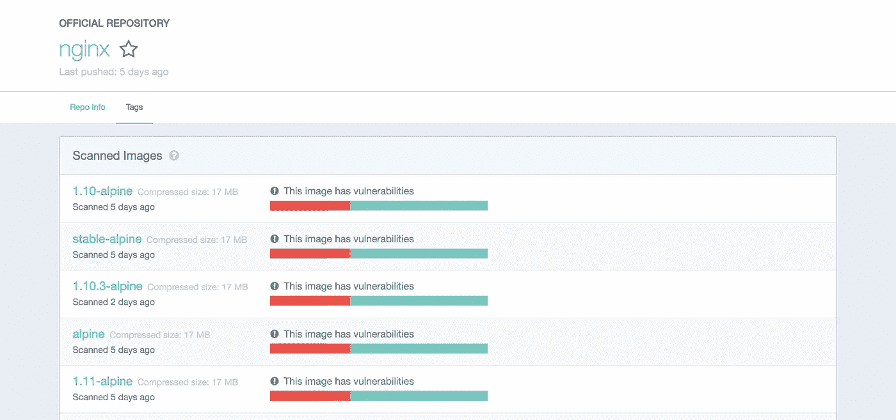

# Docker 教程 Python、Redis 和 Nginx 入门。

> 原文：<https://medium.com/hackernoon/docker-tutorial-getting-started-with-python-redis-and-nginx-81a9d740d091>

这是一个关于 Docker 容器的介绍性教程。到本文结束时，您将知道如何在您的本地机器上使用 Docker。除了 Python，我们还将运行 Nginx 和 Redis 容器。这些例子假设您熟悉这些技术的基本概念。将会有很多 shell 示例，所以继续并打开终端。



> 注意:由于降价，代码示例可能显示不正确。我建议[继续阅读我们博客](https://djangostars.com/blog/what-is-docker-and-how-to-use-it-with-python/?utm_source=medium&utm_medium=hackernoon.com&utm_campaign=docker%20tutorial&utm_content=continue%20reading%20on%20ds%20blog)上的原文，以确保所有的例子都能正确显示。

# Docker 是什么？

[***Docker***](https://www.docker.com/) 是一款开源工具，可以在软件容器内自动部署应用。要理解 Docker 背后的想法，最简单的方法就是将它与标准集装箱进行比较。

过去，运输公司面临以下挑战:

*   如何并排运输不同(不兼容)类型的货物(如食品和化学品，或玻璃和砖块)。
*   如何使用同一辆车处理不同尺寸的包裹？

容器出现后，砖块可以放在玻璃上，化学药品可以放在食物旁边。各种尺寸的货物可以放在一个标准集装箱内，并由同一辆车装卸。

让我们回到[**软件开发**](https://djangostars.com/services/python-django-development/?utm_source=medium&utm_medium=hackernoon.com&utm_campaign=docker%20tutorial&utm_content=software%20development) 中的容器。

[](https://djangostars.com/services/python-django-development/?utm_source=medium&utm_medium=hackernoon.com&utm_campaign=docker%20tutorial&utm_content=software%20development)

当你开发一个应用程序时，你需要提供你的代码以及所有可能的依赖，比如库、web 服务器、数据库等等。您可能会遇到这样的情况:应用程序在您的计算机上运行，但甚至无法在临时服务器、开发人员或 QA 的机器上启动。

这个挑战可以通过隔离应用程序使其独立于系统来解决。

# 这与虚拟化有何不同？

传统上，虚拟机用于避免这种意外行为。VM 的主要问题是在主机操作系统之上的“额外操作系统”给项目增加了千兆字节的空间。大多数时候，您的服务器会托管多个虚拟机，这些虚拟机会占用更多空间。顺便说一句，目前，大多数基于云的服务器提供商将向你收取额外空间的费用。VM 的另一个显著缺点是启动缓慢。

Docker 通过在作为主机操作系统的独立进程运行的所有容器之间共享操作系统内核，消除了上述所有问题。



请记住，Docker 不是第一个也不是唯一的容器化平台。然而，目前 Docker 是市场上最大和最有实力的玩家。

# 我们为什么需要 Docker？

这些优势包括:

*   更快的开发过程
*   便捷的应用程序封装
*   本地机器/开发/暂存/生产服务器上的相同行为
*   简单明了的监控
*   易于扩展

# 更快的开发过程

没有必要在系统上安装 PostgreSQL、Redis、Elasticsearch 等第三方应用——你可以在容器中运行它。Docker 还让你能够同时运行同一应用程序的不同版本。例如，假设您需要手动将旧版本的 Postgres 数据迁移到新版本。当您想要使用第三方软件的新版本创建新的微服务时，您可能会在微服务架构中遇到这种情况。

在一个主机操作系统上保存同一个应用程序的两个不同版本可能非常复杂。在这种情况下，Docker 容器可能是一个完美的解决方案——您可以为您的应用程序和第三方接收隔离的环境。

# 便捷的应用程序封装

你可以完整地递交你的申请。大多数编程语言、框架和所有操作系统都有自己的打包管理器。即使您的应用程序可以用它自己的包管理器打包，也很难为另一个系统创建一个端口。

Docker 为您提供了一个统一的映像格式，可以将您的应用程序分布在不同的主机系统和云服务上。您可以将您的应用程序与所有需要的依赖项(包含在一个映像中)一起交付，并准备好运行。

# 本地机器/开发/暂存/生产服务器上的相同行为

Docker 不能保证 100%的开发/试运行/生产均等，因为总是存在人为因素。但是它将由不同版本的操作系统、系统依赖性等引起的错误概率降低到几乎为零。

通过构建 Docker 映像的正确方法，您的应用程序将使用具有相同操作系统版本和所需依赖项的相同基础映像。

# 简单明了的监控

开箱即用，您有一个统一的方法来读取所有运行容器中的日志文件。您不需要记住应用程序及其依赖项存储日志文件的所有特定路径，也不需要编写自定义钩子来处理这些路径。
您可以集成一个[外部日志驱动程序，并在一个地方监控](https://docs.docker.com/config/containers/logging/configure/#supported-logging-drivers)您的应用程序日志文件。

# 易于扩展

一个正确包装的应用程序将涵盖十二个因素中的大部分[。通过设计，Docker 强迫你遵循它的核心原则，比如环境变量上的配置，TCP/UDP 端口上的通信等等。如果你的应用程序做得好，它不仅可以在 Docker 中扩展。](https://12factor.net/)

# 支持的平台

Docker 的本地平台是 Linux，因为它基于 Linux 内核提供的特性。但是，您仍然可以在 macOS 和 Windows 上运行它。唯一不同的是，在 macOS 和 Windows 上，Docker 被封装在一个微小的虚拟机中。目前，macOS 和 Windows 的 Docker 已经达到了相当高的可用性水平，感觉更像是一个原生应用程序。

# 装置

你可以在这里查看 Docker [的安装说明](https://docs.docker.com/install/)。
如果您在 Linux 上运行 docker，您需要以 root 用户身份运行以下所有命令，或者将您的用户添加到 Docker 组并重新登录:

```
sudo usermod -aG docker $(whoami)`
```

# 术语

*   容器—封装所需软件的运行实例。容器总是从图像创建的。容器可以暴露端口和卷，以便与其他容器或/和外部世界进行交互。容器可以很容易地在很短的时间内被杀死/移走和重新创建。容器不会保持状态。
*   图像——每个容器的基本元素。当您创建一个映像时，每一步都被缓存并可以重用([写模式下复制](https://en.wikipedia.org/wiki/Copy-on-write))。根据映像的不同，可能需要一些时间来构建。另一方面，容器可以马上从图像开始。
*   端口——TCP/UDP 端口的原始含义。为了简单起见，让我们假设端口可以暴露给外部世界(可以从主机操作系统访问)或连接到其他容器，即只能从这些容器访问，而对外部世界不可见。
*   卷—可以描述为共享文件夹。创建容器时会初始化卷。卷旨在保存数据，与容器的生命周期无关。注册表—存储 Docker 图像的服务器。它可以与 Github 相比较——您可以从注册表中取出一个映像，将其部署到本地，并将本地构建的映像推送到注册表中。
*   [Docker Hub](https://hub.docker.com/explore/)—Docker Inc .提供的一个具有 web 界面的注册表，它存储了大量使用不同软件的 Docker 映像。Docker Hub 是 Docker 团队或与原始软件制造商合作制作的“官方”Docker 映像的来源(不一定意味着这些“原始”映像来自官方软件制造商)。官方图片列出了它们的潜在漏洞。任何登录的用户都可以获得此信息。有免费和付费账户。每个账户可以有一张私人图片，也可以有无限数量的免费公共图片。还有一个 [Docker 商店](https://store.docker.com/search?type=image&source=verified)——一个非常类似于 Docker Hub 的服务。这是一个有评级、评论等的市场。我个人的看法是，这是营销的东西。我对 Docker Hub 非常满意。



# 示例 1: hello world

是时候运行您的第一个容器了:

```
docker run ubuntu /bin/echo 'Hello world'
```

控制台输出:

```
Unable to find image 'ubuntu:latest' locally  
latest: Pulling from library/ubuntu  
6b98dfc16071: Pull complete  
4001a1209541: Pull complete  
6319fc68c576: Pull complete  
b24603670dc3: Pull complete  
97f170c87c6f: Pull complete  
Digest:sha256:5f4bdc3467537cbbe563e80db2c3ec95d548a9145d64453b06939c4592d67b6d  
Status: Downloaded newer image for ubuntu:latest  
Hello world
```

*   docker run 是运行容器的命令。
*   ubuntu 是你运行的镜像。比如 Ubuntu 操作系统镜像。当您指定一个映像时，Docker 首先在您的 Docker 主机上查找该映像。如果映像不在本地，则从公共映像注册中心——Docker Hub 中提取映像。
*   /bin/echo“Hello world”是将在新容器中运行的命令。这个容器只是打印“Hello world”并停止执行。

让我们尝试在 Docker 容器中创建一个交互式 shell:

```
docker run -i -t --rm ubuntu /bin/bash
```

*   -t 标志在新容器内分配一个伪 tty 或终端。
*   -i flag 允许您通过获取容器的标准输入(STDIN)来建立交互式连接。
*   — rm 标志在流程退出时自动移除容器。默认情况下，不会删除容器。这个容器在我们保持 shell 会话之前一直存在，并在我们退出会话时终止(就像与远程服务器的 SSH 会话一样)。

如果希望在会话结束后保持容器运行，需要对其进行守护化:

```
docker run --name daemon -d ubuntu /bin/sh -c "while true; do echo hello world; sleep 1; done"
```

*   —名称守护程序将守护程序名称分配给新容器。如果没有明确指定名称，Docker 会自动生成并分配。
*   -d 标志在后台运行容器(即将其后台化)。

让我们看看目前有哪些集装箱:

```
docker ps -a
```

控制台输出:

```
CONTAINER ID  IMAGE   COMMAND                 CREATED             STATUS                         PORTS  NAMES  
1fc8cee64ec2  ubuntu  "/bin/sh -c 'while..."  32 seconds ago      Up 30 seconds                         daemon  
c006f1a02edf  ubuntu  "/bin/echo 'Hello ..."  About a minute ago  Exited (0) About a minute ago         gifted_nobel
```

*   docker ps 是一个列出容器的命令。
*   -a 显示所有容器(如果没有-a 标志，ps 将只显示正在运行的容器)。

ps 显示我们有两个容器:
* gifted_nobel(这个容器的名称是自动生成的，在您的机器上会有所不同)。这是我们创造的第一个容器，一次打印“Hello world”的容器。* daemon —我们创建的第三个容器，它作为一个守护程序运行。

注意:没有第二个容器(带有交互式 shell 的容器),因为我们设置了— rm 选项。因此，该容器在执行后会被自动删除。

让我们检查日志，看看守护进程容器现在正在做什么:

```
docker logs -f daemon
```

控制台输出:

```
...
hello world  
hello world  
hello world
```

*   docker 日志获取容器的日志。
*   跟踪日志输出的-f 标志(实际上类似于 tail -f)。

现在让我们停止守护进程容器:

```
docker stop daemon
```

确保容器已经停止。

```
docker ps -a
```

控制台输出:

```
CONTAINER ID  IMAGE   COMMAND                 CREATED        STATUS                      PORTS  NAMES  
1fc8cee64ec2  ubuntu  "/bin/sh -c 'while..."  5 minutes ago  Exited (137) 5 seconds ago         daemon  
c006f1a02edf  ubuntu  "/bin/echo 'Hello ..."  6 minutes ago  Exited (0) 6 minutes ago           gifted_nobel
```

容器被停止。我们可以重新开始:

```
docker start daemon
```

让我们确保它正在运行:

```
docker ps -a
```

控制台输出:

```
CONTAINER ID  IMAGE   COMMAND                 CREATED        STATUS                    PORTS  NAMES  
1fc8cee64ec2  ubuntu  "/bin/sh -c 'while..."  5 minutes ago  Up 3 seconds                     daemon  
c006f1a02edf  ubuntu  "/bin/echo 'Hello ..."  6 minutes ago  Exited (0) 7 minutes ago         gifted_nobel
```

现在，再次停止并手动移除所有容器:

```
docker stop daemon  
docker rm <your first container name>  
docker rm daemon
```

要删除所有容器，我们可以使用以下命令:

```
docker rm -f $(docker ps -aq)
```

*   docker rm 是移除容器的命令。
*   -f 标志(用于 rm)在容器运行时停止容器(即强制删除)。* -q 标志(用于 ps)仅打印容器 id。

# 您可能还喜欢:

[](https://djangostars.com/blog/merging-django-orm-with-sqlalchemy-for-easier-data-analysis/?utm_source=medium&utm_medium=hackernoon.com&utm_campaign=docker%20tutorial&utm_content=youmayalsolike1) [## 将 Django ORM 与 SQLAlchemy 合并以简化数据分析

### Django 产品的开发通常简单明了:优秀的文档，许多现成的工具…

djangostars.com](https://djangostars.com/blog/merging-django-orm-with-sqlalchemy-for-easier-data-analysis/?utm_source=medium&utm_medium=hackernoon.com&utm_campaign=docker%20tutorial&utm_content=youmayalsolike1) [](https://djangostars.com/blog/django-performance-optimization-tips/?utm_source=medium&utm_medium=hackernoon.com&utm_campaign=docker%20tutorial&utm_content=youmayalsolike2) [## Django 性能优化技巧

### 当开发人员接到一个在 Django 上进行性能优化的任务时，我经常会遇到这种情况…

djangostars.com](https://djangostars.com/blog/django-performance-optimization-tips/?utm_source=medium&utm_medium=hackernoon.com&utm_campaign=docker%20tutorial&utm_content=youmayalsolike2) 

# 示例 2:环境变量和卷

从这个例子开始，你需要几个可以在我的 [GitHub repo](https://github.com/alexryabtsev/docker-workshop/) 上找到的附加文件。你可以克隆我的回购或简单地使用[以下链接](https://github.com/alexryabtsev/docker-workshop/archive/master.zip)下载样本文件。

是时候创建和运行更有意义的容器了，比如 Nginx。
将目录改为 examples/nginx:

```
docker run -d --name "test-nginx" -p 8080:80 -v $(pwd):/usr/share/nginx/html:ro nginx:latest
```

警告:这个命令看起来很重，但它只是解释 volumes 和 env 变量的一个例子。在 99%的实际情况下，您不会手动启动 Docker 容器——您将使用编排服务(我们将在[示例#4](https://github.com/alexryabtsev/docker-workshop#example-4-connection-between-containers) 中介绍 [docker-compose](https://docs.docker.com/compose/overview/) )或编写自定义脚本来完成。

控制台输出:

```
Unable to find image 'nginx:latest' locally  
latest: Pulling from library/nginx  
683abbb4ea60: Pull complete  
a470862432e2: Pull complete  
977375e58a31: Pull complete  
Digest: sha256:a65beb8c90a08b22a9ff6a219c2f363e16c477b6d610da28fe9cba37c2c3a2ac  
Status: Downloaded newer image for nginx:latest  
afa095a8b81960241ee92ecb9aa689f78d201cff2469895674cec2c2acdcc61c
```

*   -p 是端口映射主机端口:容器端口。
*   -v 是卷挂载主机目录:容器目录。

重要提示:run 命令只接受绝对路径。在我们的例子中，我们使用$(pwd)来设置当前目录的绝对路径。
现在在您的网络浏览器中检查这个 [url](http://127.0.0.1:8080/) 。

我们可以尝试更改/example/nginx/index.html(作为卷挂载到容器内部的/usr/share/nginx/html 目录)并刷新页面。

让我们获得关于 test-nginx 容器的信息:

```
docker inspect test-nginx
```

该命令显示关于 Docker 安装的系统范围的信息。这些信息包括内核版本、容器和映像的数量、公开的端口、挂载的卷等。

# 示例 3:编写您的第一个 docker 文件

要构建 Docker 映像，您需要创建一个 Docker 文件。它是一个带有指令和参数的纯文本文件。下面是我们将在下一个示例中使用的指令的描述:

*   从-设置基础图像
*   运行—在容器中执行命令
*   ENV —设置环境变量
*   工作目录—设置工作目录
*   卷—为卷创建装载点
*   CMD —为容器设置可执行文件

您可以查看 [Dockerfile reference](https://docs.docker.com/engine/reference/builder/) 了解更多详情。

让我们创建一个图像，该图像将使用 url 获取网站的内容，并将其存储到文本文件中。我们需要通过环境变量 SITE_url 传递网站 URL。生成的文件将放在一个目录中，作为一个卷挂载。

将文件名 Dockerfile 放在 examples/curl 目录中，内容如下:

```
FROM ubuntu:latest  
RUN apt-get update \  
    && apt-get install --no-install-recommends --no-install-suggests -y curl \
    && rm -rf /var/lib/apt/lists/*
ENV SITE_URL [http://example.com/](http://example.com/)  
WORKDIR /data  
VOLUME /data  
CMD sh -c "curl -Lk $SITE_URL > /data/results"
```

Dockerfile 准备好了。是时候构建实际的图像了。

转到 examples/curl 目录，执行以下命令来构建映像:

```
docker build . -t test-curl
```

控制台输出:

```
Sending build context to Docker daemon  3.584kB  
Step 1/6 : FROM ubuntu:latest  
 ---> 113a43faa138
Step 2/6 : RUN apt-get update     && apt-get install --no-install-recommends --no-install-suggests -y curl     && rm -rf /var/lib/apt/lists/*  
 ---> Running in ccc047efe3c7
Get:1 [http://archive.ubuntu.com/ubuntu](http://archive.ubuntu.com/ubuntu) bionic InRelease [242 kB]  
Get:2 [http://security.ubuntu.com/ubuntu](http://security.ubuntu.com/ubuntu) bionic-security InRelease [83.2 kB]  
...
Removing intermediate container ccc047efe3c7  
 ---> 8d10d8dd4e2d
Step 3/6 : ENV SITE_URL [http://example.com/](http://example.com/)  
 ---> Running in 7688364ef33f
Removing intermediate container 7688364ef33f  
 ---> c71f04bdf39d
Step 4/6 : WORKDIR /data  
Removing intermediate container 96b1b6817779  
 ---> 1ee38cca19a5
Step 5/6 : VOLUME /data  
 ---> Running in ce2c3f68dbbb
Removing intermediate container ce2c3f68dbbb  
 ---> f499e78756be
Step 6/6 : CMD sh -c "curl -Lk $SITE_URL > /data/results"  
 ---> Running in 834589c1ac03
Removing intermediate container 834589c1ac03  
 ---> 4b79e12b5c1d
Successfully built 4b79e12b5c1d  
Successfully tagged test-curl:latest
```

*   docker build 命令在本地构建新映像。
*   -t flag 为图像设置名称标签。

现在我们有了新图像，我们可以在现有图像列表中看到它:

```
docker images
```

控制台输出:

```
REPOSITORY  TAG     IMAGE ID      CREATED         SIZE  
test-curl   latest  5ebb2a65d771  37 minutes ago  180 MB  
nginx       latest  6b914bbcb89e  7 days ago      182 MB  
ubuntu      latest  0ef2e08ed3fa  8 days ago      130 MB
```

我们可以从映像创建并运行容器。让我们用默认参数试试看:

```
docker run --rm -v $(pwd)/vol:/data/:rw test-curl
```

要查看保存到文件中的结果，请运行:

```
cat ./vol/results
```

让我们试试 Facebook.com 的:

```
docker run --rm -e SITE_URL=[https://facebook.com/](https://facebook.com/) -v $(pwd)/vol:/data/:rw test-curl
```

要查看保存到文件中的结果，请运行:

```
cat ./vol/results
```

# 创建图像的最佳实践是什么

*   仅包含必要的上下文—使用[。dockerignore](https://docs.docker.com/engine/reference/builder/#dockerignore-file) 文件(如。git 中的 gitignore)
*   避免安装不必要的软件包——它会消耗额外的磁盘空间。
*   使用缓存。在 Dockerfile 的末尾添加变化很大的上下文(例如，项目的源代码)——这将有效地利用 Docker 缓存。
*   小心体积。你应该记住什么是卷中的数据。因为卷是持久的，不会随着容器而消亡，所以下一个容器将使用前一个容器创建的卷中的数据。
*   使用[环境变量](https://docs.docker.com/engine/reference/builder/#environment-replacement)(在运行、曝光、卷中)。这会让你的 Dockerfile 更加灵活。

# 阿尔卑斯山图片

许多 Docker 映像(映像的版本)是在 Alpine Linux(T9)之上创建的——这是一个轻量级发行版，允许你减少 Docker 映像的整体大小。

对于第三方服务，如 Redis、Postgres 等，我建议您使用基于 Alpine 的图片。对于你的应用程序映像，使用基于 [buildpack](https://hub.docker.com/_/buildpack-deps/) 的映像——在容器内部调试会很容易，而且你会有很多预装的系统级需求。

只有您可以决定使用哪个基本映像，但是您可以通过对所有映像使用一个基本映像来获得最大的好处，因为在这种情况下，缓存将得到更有效的利用。

# 示例 4:容器之间的连接

[Docker compose](https://docs.docker.com/compose/overview/) —是一个 CLI 实用程序，用于将容器相互连接。你可以通过 pip 安装 docker-compose [:](https://pypi.org/project/docker-compose/)

```
sudo pip install docker-compose
```

在这个例子中，我将连接 Python 和 Redis 容器。

```
version: '3.6'  
services:  
  app:
    build:
      context: ./app
    depends_on:
      - redis
    environment:
      - REDIS_HOST=redis
    ports:
      - "5000:5000"
  redis:
    image: redis:3.2-alpine
    volumes:
      - redis_data:/data
volumes:  
  redis_data:
```

转到 examples/compose 并执行以下命令:

```
docker-compose up
```

控制台输出:

```
Building app  
Step 1/9 : FROM python:3.6.3  
3.6.3: Pulling from library/python  
f49cf87b52c1: Pull complete  
7b491c575b06: Pull complete  
b313b08bab3b: Pull complete  
51d6678c3f0e: Pull complete  
09f35bd58db2: Pull complete  
1bda3d37eead: Pull complete  
9f47966d4de2: Pull complete  
9fd775bfe531: Pull complete  
Digest: sha256:cdef88d8625cf50ca705b7abfe99e8eb33b889652a9389b017eb46a6d2f1aaf3  
Status: Downloaded newer image for python:3.6.3  
 ---> a8f7167de312
Step 2/9 : ENV BIND_PORT 5000  
 ---> Running in 3b6fe5ca226d
Removing intermediate container 3b6fe5ca226d  
 ---> 0b84340fa920
Step 3/9 : ENV REDIS_HOST localhost  
 ---> Running in a4f9a1d6f541
Removing intermediate container a4f9a1d6f541  
 ---> ebe63bf5959e
Step 4/9 : ENV REDIS_PORT 6379  
 ---> Running in fd06aa65fd33
Removing intermediate container fd06aa65fd33  
 ---> 2a581c31ff4f
Step 5/9 : COPY ./requirements.txt /requirements.txt  
 ---> 671093a12829
Step 6/9 : RUN pip install -r /requirements.txt  
 ---> Running in b8ea53bc6ba6
Collecting flask==1.0.2 (from -r /requirements.txt (line 1))  
  Downloading [https://files.pythonhosted.org/packages/7f/e7/08578774ed4536d3242b14dacb4696386634607af824ea997202cd0edb4b/Flask-1.0.2-py2.py3-none-any.whl](https://files.pythonhosted.org/packages/7f/e7/08578774ed4536d3242b14dacb4696386634607af824ea997202cd0edb4b/Flask-1.0.2-py2.py3-none-any.whl) (91kB)
Collecting redis==2.10.6 (from -r /requirements.txt (line 2))  
  Downloading [https://files.pythonhosted.org/packages/3b/f6/7a76333cf0b9251ecf49efff635015171843d9b977e4ffcf59f9c4428052/redis-2.10.6-py2.py3-none-any.whl](https://files.pythonhosted.org/packages/3b/f6/7a76333cf0b9251ecf49efff635015171843d9b977e4ffcf59f9c4428052/redis-2.10.6-py2.py3-none-any.whl) (64kB)
Collecting click>=5.1 (from flask==1.0.2->-r /requirements.txt (line 1))  
  Downloading [https://files.pythonhosted.org/packages/34/c1/8806f99713ddb993c5366c362b2f908f18269f8d792aff1abfd700775a77/click-6.7-py2.py3-none-any.whl](https://files.pythonhosted.org/packages/34/c1/8806f99713ddb993c5366c362b2f908f18269f8d792aff1abfd700775a77/click-6.7-py2.py3-none-any.whl) (71kB)
Collecting Jinja2>=2.10 (from flask==1.0.2->-r /requirements.txt (line 1))  
  Downloading [https://files.pythonhosted.org/packages/7f/ff/ae64bacdfc95f27a016a7bed8e8686763ba4d277a78ca76f32659220a731/Jinja2-2.10-py2.py3-none-any.whl](https://files.pythonhosted.org/packages/7f/ff/ae64bacdfc95f27a016a7bed8e8686763ba4d277a78ca76f32659220a731/Jinja2-2.10-py2.py3-none-any.whl) (126kB)
Collecting itsdangerous>=0.24 (from flask==1.0.2->-r /requirements.txt (line 1))  
  Downloading [https://files.pythonhosted.org/packages/dc/b4/a60bcdba945c00f6d608d8975131ab3f25b22f2bcfe1dab221165194b2d4/itsdangerous-0.24.tar.gz](https://files.pythonhosted.org/packages/dc/b4/a60bcdba945c00f6d608d8975131ab3f25b22f2bcfe1dab221165194b2d4/itsdangerous-0.24.tar.gz) (46kB)
Collecting Werkzeug>=0.14 (from flask==1.0.2->-r /requirements.txt (line 1))  
  Downloading [https://files.pythonhosted.org/packages/20/c4/12e3e56473e52375aa29c4764e70d1b8f3efa6682bef8d0aae04fe335243/Werkzeug-0.14.1-py2.py3-none-any.whl](https://files.pythonhosted.org/packages/20/c4/12e3e56473e52375aa29c4764e70d1b8f3efa6682bef8d0aae04fe335243/Werkzeug-0.14.1-py2.py3-none-any.whl) (322kB)
Collecting MarkupSafe>=0.23 (from Jinja2>=2.10->flask==1.0.2->-r /requirements.txt (line 1))  
  Downloading [https://files.pythonhosted.org/packages/4d/de/32d741db316d8fdb7680822dd37001ef7a448255de9699ab4bfcbdf4172b/MarkupSafe-1.0.tar.gz](https://files.pythonhosted.org/packages/4d/de/32d741db316d8fdb7680822dd37001ef7a448255de9699ab4bfcbdf4172b/MarkupSafe-1.0.tar.gz)
Building wheels for collected packages: itsdangerous, MarkupSafe  
  Running setup.py bdist_wheel for itsdangerous: started
  Running setup.py bdist_wheel for itsdangerous: finished with status 'done'
  Stored in directory: /root/.cache/pip/wheels/2c/4a/61/5599631c1554768c6290b08c02c72d7317910374ca602ff1e5
  Running setup.py bdist_wheel for MarkupSafe: started
  Running setup.py bdist_wheel for MarkupSafe: finished with status 'done'
  Stored in directory: /root/.cache/pip/wheels/33/56/20/ebe49a5c612fffe1c5a632146b16596f9e64676768661e4e46
Successfully built itsdangerous MarkupSafe  
Installing collected packages: click, MarkupSafe, Jinja2, itsdangerous, Werkzeug, flask, redis  
Successfully installed Jinja2-2.10 MarkupSafe-1.0 Werkzeug-0.14.1 click-6.7 flask-1.0.2 itsdangerous-0.24 redis-2.10.6  
You are using pip version 9.0.1, however version 10.0.1 is available.  
You should consider upgrading via the 'pip install --upgrade pip' command.  
Removing intermediate container b8ea53bc6ba6  
 ---> 3117d3927951
Step 7/9 : COPY ./app.py /app.py  
 ---> 84a82fa91773
Step 8/9 : EXPOSE $BIND_PORT  
 ---> Running in 8e259617b7b5
Removing intermediate container 8e259617b7b5  
 ---> 55f447f498dd
Step 9/9 : CMD [ "python", "/app.py" ]  
 ---> Running in 2ade293ecb25
Removing intermediate container 2ade293ecb25  
 ---> b85b4246e9f8Successfully built b85b4246e9f8  
Successfully tagged compose_app:latest  
WARNING: Image for service app was built because it did not already exist. To rebuild this image you must use `docker-compose build` or `docker-compose up --build`.  
Creating compose_redis_1 ... done  
Creating compose_app_1   ... done  
Attaching to compose_redis_1, compose_app_1  
redis_1  | 1:C 08 Jul 18:12:21.851 # Warning: no config file specified, using the default config. In order to specify a config file use redis-server /path/to/redis.conf  
redis_1  |                 _._  
redis_1  |            _.-``__ ''-._  
redis_1  |       _.-``    `.  `_.  ''-._           Redis 3.2.12 (00000000/0) 64 bit  
redis_1  |   .-`` .-```.  ```\/    _.,_ ''-._  
redis_1  |  (    '      ,       .-`  | `,    )     Running in standalone mode  
redis_1  |  |`-._`-...-` __...-.``-._|'` _.-'|     Port: 6379  
redis_1  |  |    `-._   `._    /     _.-'    |     PID: 1  
redis_1  |   `-._    `-._  `-./  _.-'    _.-'  
redis_1  |  |`-._`-._    `-.__.-'    _.-'_.-'|  
redis_1  |  |    `-._`-._        _.-'_.-'    |           [http://redis.io](http://redis.io/)  
redis_1  |   `-._    `-._`-.__.-'_.-'    _.-'  
redis_1  |  |`-._`-._    `-.__.-'    _.-'_.-'|  
redis_1  |  |    `-._`-._        _.-'_.-'    |  
redis_1  |   `-._    `-._`-.__.-'_.-'    _.-'  
redis_1  |       `-._    `-.__.-'    _.-'  
redis_1  |           `-._        _.-'  
redis_1  |               `-.__.-'  
redis_1  |  
redis_1  | 1:M 08 Jul 18:12:21.852 # WARNING: The TCP backlog setting of 511 cannot be enforced because /proc/sys/net/core/somaxconn is set to the lower value of 128\.  
redis_1  | 1:M 08 Jul 18:12:21.852 # Server started, Redis version 3.2.12  
redis_1  | 1:M 08 Jul 18:12:21.852 # WARNING overcommit_memory is set to 0! Background save may fail under low memory condition. To fix this issue add 'vm.overcommit_memory = 1' to /etc/sysctl.conf and then reboot or run the command 'sysctl vm.overcommit_memory=1' for this to take effect.  
redis_1  | 1:M 08 Jul 18:12:21.852 # WARNING you have Transparent Huge Pages (THP) support enabled in your kernel. This will create latency and memory usage issues with Redis. To fix this issue run the command 'echo never > /sys/kernel/mm/transparent_hugepage/enabled' as root, and add it to your /etc/rc.local in order to retain the setting after a reboot. Redis must be restarted after THP is disabled.  
redis_1  | 1:M 08 Jul 18:12:21.852 * The server is now ready to accept connections on port 6379  
app_1    |  * Serving Flask app "app" (lazy loading)  
app_1    |  * Environment: production  
app_1    |    WARNING: Do not use the development server in a production environment.  
app_1    |    Use a production WSGI server instead.  
app_1    |  * Debug mode: on  
app_1    |  * Running on [http://0.0.0.0:5000/](http://0.0.0.0:5000/) (Press CTRL+C to quit)  
app_1    |  * Restarting with stat  
app_1    |  * Debugger is active!  
app_1    |  * Debugger PIN: 170-528-240
```

当前示例将增加 Redis 中的视图计数器。在您的网络浏览器中打开下面的 url 并检查它。

如何使用 docker-compose 是一个单独教程的主题。首先，您可以使用 Docker Hub 中的一些图像。如果您想创建自己的图像，请遵循上面列出的最佳实践。就使用 docker-compose 而言，我唯一可以补充的是，您应该始终在 docker-compose.yml 中为您的卷给出明确的名称(如果映像有卷)。这个简单的规则将使你在将来检查你的卷时避免一个问题。

```
version: '3.6'  
services:  
  ...
  redis:
    image: redis:3.2-alpine
    volumes:
      - redis_data:/data
volumes:  
  redis_data:
```

在这种情况下，redis_data 将是 docker-compose.yml 文件内部的名称；对于真实的卷名，将在前面加上项目名称前缀。

要查看卷，请运行:

```
docker volume ls
```

控制台输出:

```
DRIVER              VOLUME NAME  
local               apptest_redis_data
```

如果没有明确的卷名，将会出现 UUID。下面是我的本地机器上的一个例子:

```
DRIVER              VOLUME NAME  
local               ec1a5ac0a2106963c2129151b27cb032ea5bb7c4bd6fe94d9dd22d3e72b2a41b  
local               f3a664ce353ba24dd43d8f104871594de6024ed847054422bbdd362c5033fc4c  
local               f81a397776458e62022610f38a1bfe50dd388628e2badc3d3a2553bb08a5467f  
local               f84228acbf9c5c06da7be2197db37f2e3da34b7e8277942b10900f77f78c9e64  
local               f9958475a011982b4dc8d8d8209899474ea4ec2c27f68d1a430c94bcc1eb0227  
local               ff14e0e20d70aa57e62db0b813db08577703ff1405b2a90ec88f48eb4cdc7c19  
local               polls_pg_data  
local               polls_public_files  
local               polls_redis_data  
local               projectdev_pg_data  
local               projectdev_redis_data
```

# 码头工人路

Docker 有一些限制和要求，这取决于系统的架构(打包到容器中的应用程序)。您可以忽略这些需求或找到一些变通办法，但在这种情况下，您不会获得使用 Docker 的所有好处。我强烈建议遵循这些建议:

*   1 个应用程序= 1 个容器。
*   在前台运行流程(不要使用 systemd、upstart 或任何其他类似的工具)。
*   将数据保存在容器之外—使用卷。不要使用 SSH(如果需要进入容器，可以使用 docker exec 命令)。
*   避免在容器内进行手动配置(或操作)。

# 结论

总结一下这篇教程，Docker 已经和 ide、Git 一起成为了一个必备的开发工具。这是一个生产就绪的工具，具有丰富和成熟的基础设施。

Docker 可以用于所有类型的项目，无论项目的规模和复杂程度如何。一开始可以先从[作曲](https://docs.docker.com/compose/overview/)和[蜂群](https://docs.docker.com/engine/swarm/)开始。当项目增长时，你可以迁移到云服务，如[亚马逊容器服务](https://aws.amazon.com/containers/)或 [Kubernetes](https://kubernetes.io/) 。

像货物运输中使用的标准容器一样，将代码包装在 Docker 容器中有助于您构建更快、更高效的 CI/CD 流程。这不仅仅是一群极客推动的另一种技术趋势——这是一种新的范式，已经在大公司的架构中使用，如 [PayPal](https://blog.docker.com/2017/12/containers-at-paypal/) 、 [Visa](https://blog.docker.com/2017/04/visa-inc-gains-speed-operational-efficiency-docker-enterprise-edition/) 、 [Swisscom](https://www.docker.com/customers/swisscom-goes-400vms-20vms-docker) 、[通用电气](https://www.docker.com/customers/ge-uses-docker-enable-self-service-their-developers)、 [Splink](https://www.docker.com/customers/docker-datacenter-delivers-splunks-house-demos) 等。

[](https://djangostars.com/services/python-django-development/?utm_source=medium&utm_medium=hackernoon.com&utm_campaign=docker%20tutorial&utm_content=banner_end)

> 文章由[亚历山大·里亚布采夫](https://medium.com/u/2a5b28db86e2?source=post_page-----81a9d740d091--------------------------------) ( [**亚历山大·里亚布采夫**](https://djangostars.com/blog/author/alexander-ryabtsev/)**)**——Django Stars 的后端工程师撰写。在 Django Stars 博客上阅读更多关于 docker 的信息。
> 
> 特别分享给 [Hackernoon](https://medium.com/u/4a8a924edf41?source=post_page-----81a9d740d091--------------------------------) 社区。

我们随时欢迎您提出问题，分享您想阅读的话题！

你已经在你的项目中使用过 Docker 了吗？在下面给我们留言或提问吧！

> *如果你觉得这篇文章有用，请点击👏下方按钮:)*

[](http://bit.ly/HackernoonFB)[](https://goo.gl/k7XYbx)[](https://goo.gl/4ofytp)

> [黑客中午](http://bit.ly/Hackernoon)是黑客如何开始他们的下午。我们是 [@AMI](http://bit.ly/atAMIatAMI) 家庭的一员。我们现在[接受投稿](http://bit.ly/hackernoonsubmission)并乐意[讨论广告&赞助](mailto:partners@amipublications.com)机会。
> 
> 如果你喜欢这个故事，我们推荐你阅读我们的[最新科技故事](http://bit.ly/hackernoonlatestt)和[趋势科技故事](https://hackernoon.com/trending)。直到下一次，不要把世界的现实想当然！

