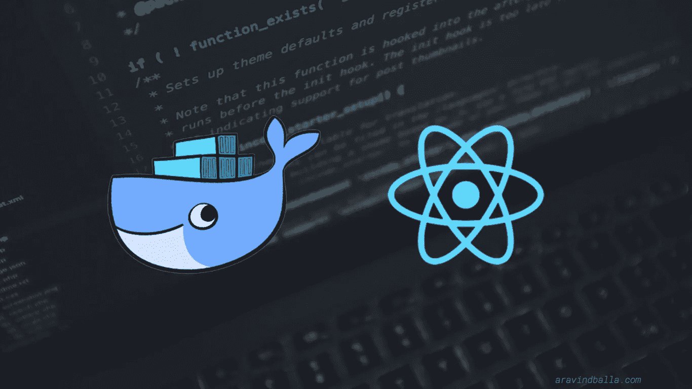

# React/Web 应用程序的 Docker 工作流

> 原文：<https://medium.com/hackernoon/docker-workflow-for-react-web-applications-b62b09571736>

我最近一直在摆弄 React。在上面建了我的网站。我在部署时没有遇到大问题，因为这是一个静态站点。但是，总的来说，我们在部署时会遇到问题。它在我们的本地上运行，但不在生产中运行。常见问题吧？

如果你了解 Docker，那么你可能会疑惑，他为什么不开门见山！

是的，使用 Docker，我们在开发和生产时有相同的环境。甚至是测试，如果你选择去做的话。

使用 docker 进行生产很容易。我们只需要

在 *Dockerfile* 中从当前工作目录中复制我们的代码到 docker 容器中。这使得我们所有的代码都在容器中，我们可以在其中运行命令。我们所要做的就是运行容器并暴露服务器运行的端口。现在，我们可以利用这个容器，根据需要从性能上进行扩展。

但是，如果我们甚至想将我们的开发工作流程 dockerize，那就有点不同了。

我们必须使用将卷安装到容器的概念。我们将当前工作目录挂载到容器中的一个目录，同时通过添加

> -v/host/directory:/container/directory

到“docker run”命令。主机目录中的任何更改也将反映在容器中。所以这个可以用来开发。

因此，混合工作流可以由两个 docker 文件组成，一个用于开发，一个用于生产。在运行它进行开发时，我们必须将目录挂载到它上面。

通过使用这个工作流，我们可以保证开发和生产具有相同的环境。

继续黑！