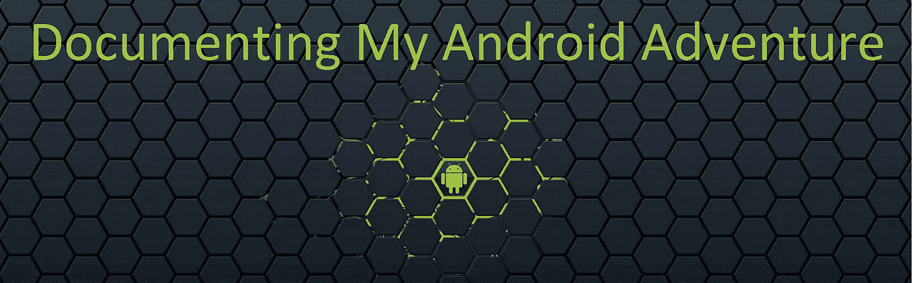
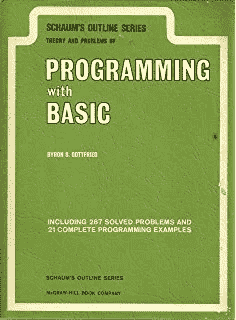
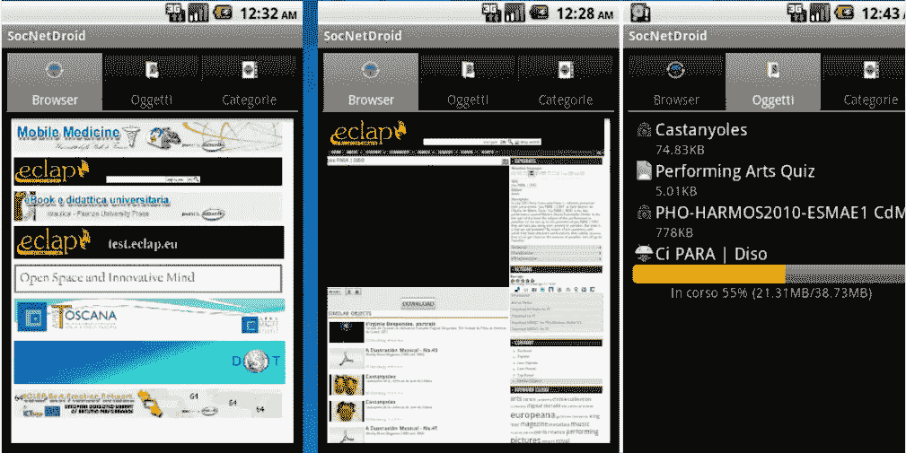
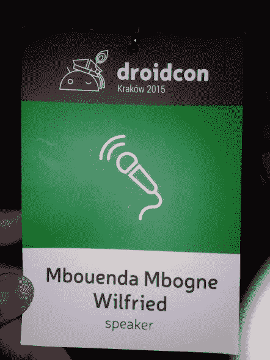
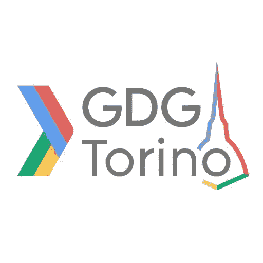
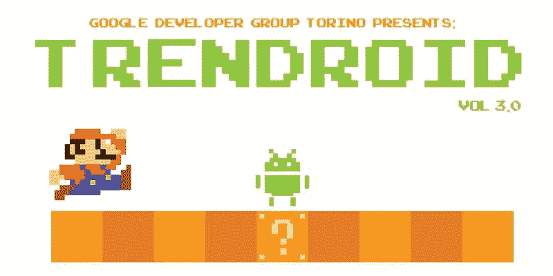
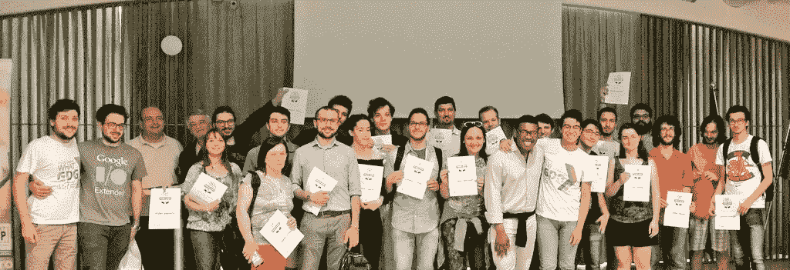
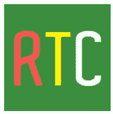
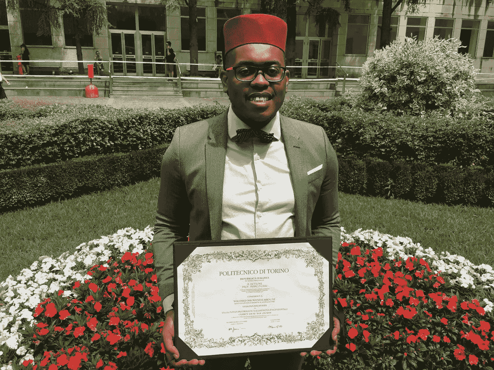

# 记录我的安卓冒险

> 原文：<https://medium.com/hackernoon/documenting-my-android-adventure-9352747910e6>

## #documentyourcareer

#documentyourcareer

大家好，我叫威尔弗里德·姆本达·姆博涅，是一名对计算机科学和绿色机器人充满热情的[安卓](https://hackernoon.com/tagged/android) [开发者](https://hackernoon.com/tagged/developer)。

我决定写这篇文章，开始记录我的职业生涯，讲述我的故事。(#documentyourcareer)。

我受到了[加里·维纳查克](https://medium.com/u/c4ec9163657c)的启发，他有时会说:记录与创造。

# 开始

一切都始于对计算机科学的热爱。我在大学的时候在我的房子里(在我出生的喀麦隆)找到了一本书，是关于基础语言的。我决定读它，这样我就可以学习如何用 BASIC 编程。我完成了这本书，并尝试编写自己的程序，它很漂亮，也很有趣。我爱上了计算机科学。

# 旅行

为了获得更好的教学机会，我搬到了意大利，并学会了一门新语言:意大利语。

在我的 BASIC 语言的小经验之后，我在大学选择了计算机工程。我可以说，从那一刻起，我的激情一直持续到现在。

2011 年在佛罗伦萨的学士论文，我选择了一条艰难的道路:关于 Android 的论文。这很难，因为我对 Android 开发一无所知。本论文是关于一个以多媒体数据为中心的医疗社交网络应用程序的设计和开发。这花了我 6 个月的时间。2 个月的学习(google 和[栈溢出](http://stackoverflow.com)帮助很大)和 4 个月的 app 开发和论文写作。

> 我对结果很满意。我作为自学的 Android 开发者的第一个应用。

My first Android App

# 另一次旅行

然后我搬到都灵，在都灵理工大学攻读计算机工程硕士学位。

与此同时，我也接受了一份初级 Android 开发人员的工作。于是我成了勤工俭学。我试图管理我的全职工作和我的学习。这是一条复杂而漫长的道路，但我学到了很多。

在 6 年的勤工俭学生涯中，我设法做了一些有趣的事情:

1.  我开了一个博客
2.  我在 3 个 Android 会议上发言，还开了一个研讨会。
3.  我在我所在城市的当地谷歌开发团队做志愿者:GDG·都灵
4.  我开发了 2 个个人 Android 应用程序

让我深入这些东西。

# 我的博客

[graduate or die trying](http://mysc.altervista.org)

对我来说，边工作边毕业是一项艰巨的任务，所以为了确保完成任务，我创建了一个副业:博客。博客的目标是:

1.与其他学生分享我的计算机科学知识

2.让我对自己的学习负责

3.激励自己为考试而学习

我写了 19 篇文章，我在有关脸书的粉丝页面上收集了 122 个赞。现在这个博客每周被阅读 200 次左右。

你可以在这个[链接](http://mysc.altervista.org/)找到我的博客。将来我会写一篇关于那个博客的深度博文。

# 安卓音箱

在一家封闭的小公司工作了 4 年后，我开始接触网络社区。我发现了关于 android 和移动开发的会议。

就像睁开了我的眼睛。android 的每一项新功能都在会议上讨论。我决定从会议中学习。

我也想说话，但不知道从何说起。两个人帮我搞定了那个[陈秋琪](https://medium.com/u/cd95dc24dfe)通过她的[时事通讯](https://tinyletter.com/techspeak)和[扎克霍尔曼](https://medium.com/u/342eaad033f9)通过他的[网站](http://speaking.io/)。从那以后我讲了 3 次。

这里和这里我详细说说我的说话经验[。](/@be.betr.codr/droidcon-kraków-a-well-organized-conference-7a073be610e2)

# GDG 经验

在两年的时间里，我投入了部分精力在 GDG 都灵共同组织活动。

我们一起组织了很多活动。

2015 年我和一个朋友带来了 Trendroid 系列的原始创意。这是一个每月一次的活动，有两次关于成功开发 Android 应用的轻松谈话。我们拍了 4 集。Trendroid 活动的视频可以在[这里](https://www.youtube.com/playlist?list=PLWdJfD4pqCx4seBRySzH-DAByokaGU26R)找到

2016 年，我被选为都灵 Android study jam 的主持人。真的很有趣。作为一名辅导员，我必须从[这门 Udacity 课程](https://in.udacity.com/course/android-development-for-beginners--ud837)中解释 Android 开发的基本概念，然后审查每个参与者的最终 Android 项目。

study jam torino 2016 — Certification day

# **我的个人申请**

## [比托](https://play.google.com/store/apps/details?id=com.willycode.bito&hl=en)

bito

BiTo 是一款面向都灵市民的意大利 Android 应用程序，他们使用自行车服务并热爱环境。比托允许你保存你最喜欢的自行车停车场，并跟踪有多少可用的自行车或空缺。比托还允许你在推特上谈论环境和自行车世界。

## [记得打电话](https://play.google.com/store/apps/details?id=com.willycode.keepintouch&hl=en)

这个应用程序帮助你记住什么时候给你爱的人打电话。

# 现在呢？

我最近毕业了，我真的为自己感到骄傲。

#looklikeanengineer

## 还有什么？

我订婚了，我将专注于在[如果你喜欢这篇文章，如果你能给我一些掌声，我将不胜感激。](https://medium.com/u/504c7870fdb6# documentyourcareer)。
</blockquote>
</blockquote>
</blockquote><p id=)

**在你离开之前…** 如果你喜欢这篇文章，你会喜欢[订阅](http://eepurl.com/dcSFmz)我的时事通讯。获取我的备忘单:“ *Android Studio 键盘快捷键备忘单”。*