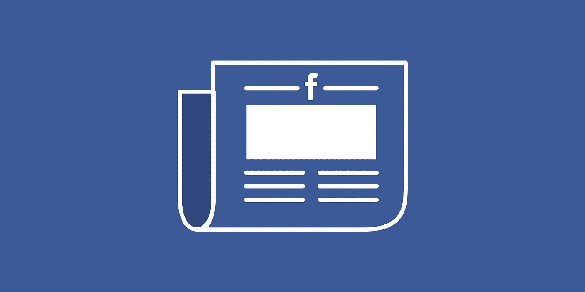

# 脸书是一家科技公司还是一家媒体公司有关系吗？

> 原文：<https://medium.com/hackernoon/does-it-matter-if-facebook-is-a-tech-company-or-a-media-company-6115cd5dce93>

## 加入辩论…你的观点是什么？

关于脸书是否是一家媒体公司的争论并不新鲜。

回到 2012 年，在脸书进行首次公开募股之前，该公司负责全球营销解决方案的副总裁 Caroline Everson 在加利福尼亚州贝弗利山举行的 4A 转型会议上给脸书以及谷歌和 Twitter 等媒体公司打电话后，试图对 WPP 首席执行官马丁·索罗做出回应。

> 我们实际上把自己定义为一家科技公司。媒体公司因其创造的内容而闻名。我们的方法是拥有开放的技术，真正投资于最好的工程人才，最好的基础设施，并提供一个平台，不仅用户可以使用它作为他们的数据库通信工具，而且品牌，企业，非营利组织也可以使用它。

这场辩论最近再次出现。

本月早些时候，首席运营官雪莉·桑德伯格在 WSJDLive 大会上与[克里斯蒂娜·帕萨瑞罗](https://medium.com/u/dce903ec8af1?source=post_page-----6115cd5dce93--------------------------------)聊天时，将脸书定义为“所有想法的平台”。

 [## 脸书领导人称其为科技公司，而非媒体公司

### 加州拉古纳海滩-脸书公司正在抵制媒体公司的标签，但却越来越多地卷入…

www.wsj.com](http://www.wsj.com/articles/facebook-leaders-call-it-a-tech-company-not-media-company-1477432140) 

9 月，脸书负责新闻推送[的产品管理副总裁 Adam Mosseri](https://medium.com/u/786bc50498eb?source=post_page-----6115cd5dce93--------------------------------) 告诉 TechCrunch Disrupt，虽然他们将自己视为一个技术平台，但“我们知道我们在媒体中扮演着有意义的角色。”

5 月初，该公司试图通过首次发布其[编辑指南](https://fbnewsroomus.files.wordpress.com/2016/05/full-trending-review-guidelines.pdf)来缓解对其*趋势话题*的担忧，该指南强调了人类编辑在选择过程中的作用。

*我的观点:重要的是用户如何看待脸书，而不是其他人——不管是不是脸书内部人士——如何定义它。重要的是，作为用户，我们要理解这个平台是什么，它是如何工作的，以及它对世界各地的其他用户意味着什么，不管它实际上是不是一家媒体公司。*

以下是脸书内部人士和外部专家对该公司的定义:

今年夏天，脸书联合创始人兼首席执行官马克·扎克伯格[在意大利罗马](http://www.reuters.com/article/us-facebook-zuckerberg-idUSKCN1141WN)发表演讲:

> 我们是科技公司，不是媒体公司。当你想到一家媒体公司时，你会发现有人在制作内容，有人在编辑内容，这不是我们。我们是一家技术公司。我们制造工具。我们不制作任何内容。

雪莉·桑德伯格[在加州拉古纳海滩举行的 WSJDLive 大会上接受采访:](http://www.wsj.com/articles/facebook-leaders-call-it-a-tech-company-not-media-company-1477432140)

> 脸书是所有想法的平台，人们可以在脸书分享他们关心的事情，这是我们使命的核心。[……]我们也希望成为一个非常安全的社区:没有暴力、恐怖主义或仇恨的容身之地。这两件事可能会发生冲突，因为一个人的自由表达可能会成为另一个人的仇恨。你可以看到很多这样的决定——我们正在平衡这些事情。

[脸书首席产品官 Chris Cox 在加州拉古纳比奇举行的 WSJDLive 大会](http://fortune.com/2016/10/25/facebook-resists-media-company/)上发言:

> 我们把自己定义为一家科技公司。媒体公司是关于它所讲述的故事。一家科技公司是关于它所制造的工具。

脸书负责新闻订阅的亚当·莫塞里在 TechCrunch Disrupt 上说:

> 我们认为自己是一家技术公司，因为我们每天处理的问题主要是技术问题。我们试图弄清楚人们对什么感兴趣；如何将人们与他们认为有意义的内容来源联系起来；如何根据故事与人们的相关程度对故事进行排序。这些问题本质上主要是技术性的，这就是为什么我们认为自己是一家技术公司。也就是说，我们知道我们在媒体中扮演着有意义的角色。

[哥伦比亚大学新闻](https://medium.com/u/1b6a4ef63240?source=post_page-----6115cd5dce93--------------------------------)[学院数字新闻](https://medium.com/u/ba0a124b4ee4?source=post_page-----6115cd5dce93--------------------------------)[牵引中心](https://medium.com/u/affb56e09c14?source=post_page-----6115cd5dce93--------------------------------)创始主任艾米丽·贝尔在推特上说:

[Jonathan Taplin](https://medium.com/u/162e856ae68?source=post_page-----6115cd5dce93--------------------------------) ，[南加州大学安嫩伯格实验室](https://medium.com/u/c8599cbf16a?source=post_page-----6115cd5dce93--------------------------------)主任，即将出版的新书*的作者:谷歌、脸书和亚马逊如何垄断文化和破坏民主，* [告诉](http://www.usatoday.com/story/tech/columnist/2016/09/20/facebook-mark-zuckerberg-media-baron/90499900/) [《今日美国》](https://medium.com/u/979cb9a2cd42?source=post_page-----6115cd5dce93--------------------------------):

> 他们越来越多地决定新闻如何传播，甚至如何制作，比如你如何写标题，如何写文章。我认为他们是世界上最重要的新闻机构。

[REDEF](https://medium.com/u/62ca81990ccf?source=post_page-----6115cd5dce93--------------------------------)的首席执行官兼首席策展人 Jason Hirschhorn 在推特上说:

[CNN 资深媒体记者、*可靠消息来源*、](https://medium.com/u/9afe333e8a8?source=post_page-----6115cd5dce93--------------------------------)[主持人布莱恩·斯特尔特](http://www.businessinsider.com/why-facebook-is-a-media-company-even-though-it-says-its-not-2016-8)告诉商业内幕:

> 媒体公司的一个传统定义是“向用户提供信息并通过在信息旁边销售广告来盈利的公司。”根据这个定义，脸书是一家媒体公司。脸书并不生产它分发的信息，但它从广告中获利。

[卡夫卡](https://medium.com/u/becde02f7db?source=post_page-----6115cd5dce93--------------------------------)彼得[的重新编码](http://www.recode.net/2016/8/30/12710318/facebook-media-company-advertising-chart):

> 我们明白了。我们理解你为什么不想称脸书为媒体公司。但事情是这样的。当你吸引人们的注意力，并把这种注意力卖给广告商时，猜猜会发生什么？你是一家媒体公司。

《T2》一书的作者大卫·柯克帕特里克在接受彭博采访时说:

> 他们是世界上头号新闻来源。[……]因此，他们负有一系列独特的责任。我认为在某种程度上，作为一家公司，他们甚至不知道如何处理这个问题。作为一个新闻来源和编辑是一个相对较新的事情。

> [黑客中午](http://bit.ly/Hackernoon)是黑客如何开始他们的下午。我们是 [@AMI](http://bit.ly/atAMIatAMI) 家庭的一员。我们现在[接受投稿](http://bit.ly/hackernoonsubmission)并乐意[讨论广告&赞助](mailto:partners@amipublications.com)机会。
> 
> 如果你喜欢这个故事，我们推荐你阅读我们的[最新科技故事](http://bit.ly/hackernoonlatestt)和[趋势科技故事](https://hackernoon.com/trending)。直到下一次，不要把世界的现实想当然！

