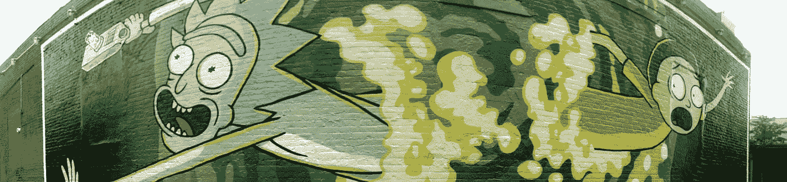

# 不喜欢《瑞克和莫蒂》是不是意味着我很蠢？

> 原文：<https://medium.com/hackernoon/does-not-liking-rick-and-morty-mean-i-m-stupid-37bb2701bd2>

## 还是说我不是个混蛋？

source: [Jack Zalium via flickr](https://www.flickr.com/photos/kaiban/20184132336/) (CC BY-ND 2.0)

“我知道我还没有完全不间断地看完一集，但我想我对这部剧仍持观望态度，”我说，当《瑞克和莫蒂》片头字幕滚动时，我漫不经心地侧身走向沙发上的迈克。

“可能那是因为你智商不够高吧？”迈克回答道。

我可以告诉他不是认真的，但我绝对没有被侮辱的心情，即使是讽刺。

“去你妈的！”我喊道，“对不起，我不够聪明，这他妈的狗屁节目！”

他盯着我看了一会儿，被我的愤怒吓了一跳。

“……你知道……那是个玩笑？”他主动提出。

“是啊，我知道！”我翻了翻白眼。我跺着脚走了，迅速结束了刚刚开始的沙发依偎。我没有被逗乐。

我处于极度紧张、易怒、焦虑、无眠状态，这与我的反应有很大关系。通常，我会让这样的评论滚出我的视线。但是，除了我已经很糟糕的心情之外，他的评论尤其令人愤怒，因为这是我听到到处都在说的一句话:

**如果你没有“明白”*瑞克和莫蒂*，那是因为你不够聪明，理解不了这些笑话。**

但问题是，这种观点愚蠢至极。

我“得到”*瑞克和莫蒂*。我得到了科学，我得到了哲学，我得到了笑话，我得到了那些本该有趣的词语或场景。我知道聪明人认为愚蠢的人想不到的事情。

理论上，这种幽默是精心构思的。当我有确切的零钱时，当我注意到牛津逗号被使用时，当完全煮熟的鸡蛋被煮熟时，或者当我不用“Reveal Word”[工具](https://hackernoon.com/tagged/tool)完成《纽约时报》的填字游戏时(事实上，我至少可以从周一到周三这样做)，我内心的智慧对这场表演表示赞同。《瑞克和莫蒂》中的幽默是整洁的。这是合乎逻辑的。它是虚无主义的、侮辱性的、粗糙的，然而，它偶尔会做出聪明的社会评论。让大脑愉悦的东西。

然而，在我看来，这真的不是一个令人愉快的节目。它并不吸引人，不能吸引我的注意力，充满了绝对不是专门为门萨级别的观众准备的插科打诨。这部动画并不有趣(它就像一个不太合群的家伙)，声音也很烦人(无意冒犯克里斯·帕内尔和萨拉·乔克，但也许他们不适合我？)，哦，粉丝基本上都是混蛋。

## 不是所有的粉丝都是混蛋。我很聪明，不会做出那样笼统的概括。

如果你喜欢里克和莫蒂，并且你没有因此表现得比世界上其他人更好，你很酷。我喜欢你。我们可以一起出去玩。

但是如果你真的喜欢*瑞克和莫蒂*，并且仅仅因为我不喜欢*瑞克和莫蒂*就质疑我的智力，那你就是个混蛋。你可以拿着你的川菜酱滚蛋。

## “也许她只是一个无聊、无趣的人，”你可能会想。

我会说，“错。”

嗯，可能很无聊，但不好笑，该死的。为了证明这一点，**这里列出了一些我认为比*瑞克和莫蒂* :** 更有趣的事情

*   *宋飞*的《晚宴》一集(其实是*宋飞*的全部，但这一集是个范例)
*   《辛普森一家》的前几季，大概 1-9 岁
*   费城总是阳光明媚
*   *怪胎和极客*
*   *加尔文和霍布斯*
*   路易斯·C·K
*   [艾莉·古兹曼](https://medium.com/u/37d07410f039?source=post_page-----37bb2701bd2--------------------------------)
*   [xkcd](https://xkcd.com/)
*   等待但是为什么
*   有时，但不是所有时间
*   "我需要更多的牛铃，宝贝儿！"
*   [2 个兴奋剂皇后](http://www.wnyc.org/shows/dopequeens)
*   [vitamitavegemin](https://www.youtube.com/watch?v=KY3eOtJwOhE)
*   所有这些取笑瑞克和莫蒂粉丝的迷因

我第一次介绍*瑞克和莫蒂*的时候，完全是反着来的。我们从搜索 YouTube 开始，找到了泡菜里克这一集，分部分播放。我们显然是从中间部分开始，而不是开头部分，因此里克已经是一个没有解释为什么的难题了。"*这个人物一直都是咸菜吗？我想知道。结果是:没有(这是我在观看第二部分之后的第一部分时发现的)。啊，所以他们做科学的东西，在这一集里，科学把瑞克变成了泡菜。明白了。我愿意多看一些。*

因此，晚上躺在床上时，我模模糊糊地注意到了另外几集，每看完一半我就打瞌睡。

所以当我说，“我知道我没有真正完整不间断地看过一集…”我没有夸大其词。我只是不确定我是否喜欢这个节目，因为我还没有看够。我所看到的是睡眠诱导。

在因为不确定自己对瑞克和莫蒂的爱而被称为愚蠢之后，我在心里记下了坐下来看完几集。我做到了。我看了整整两集，现在我确定我不是《T2》的粉丝。

在第二集的时候，我真的拿出手机和朋友们玩*单词游戏*，因为这个节目本身不够有趣。再次为我的愚蠢感到抱歉，我失去了幽默感。大概是因为我是女生吧。

然而在现实中，我认为瑞克和莫蒂属于某种类型的幽默，而这种类型的幽默不是我喜欢的。听着，我以前来过这个营地。

在大学里，我所有的朋友都痴迷于另一部漫画: *Aqua Teen Hunger Force* 。我坐在宿舍里看了很多集，假笑和他们真正的笑一起，我试图弄明白为什么他们认为肉丸这么好笑。

我从来没有真正弄明白。直到今天，我还是有点不明白。我的意思是，我在理论上得到它，就像我在概念上得到*瑞克和莫蒂*一样，但是我真的不 ***喜欢*** 它。

ATHF 是一场哑剧。当然，这可能有点滑稽，但最终是愚蠢的。瑞克和莫蒂也一样。

这并不是说我不喜欢愚蠢的幽默(见我上面的列表)。我甚至可以排在*南方公园*和贾德·阿帕图电影以及第一部*超级名模*之后，这就是哑巴的缩影。

我想只是这种 ATHF 式的幽默不合我的胃口。(这种风味/流派叫什么，btw？我觉得它必须有个名字。)

或者也许我不喜欢流行的东西，只是因为它们本不应该流行，但它们确实流行？

## …有点像潮人喜欢的东西？

# **有没有可能*瑞克和莫蒂*是动漫界的潮人格子？**

我希望我让你大吃一惊。)

我不知道。不管是什么，我不喜欢瑞克和莫蒂，也许这让我变得愚蠢，但这总比做个混蛋(或潮人)好。