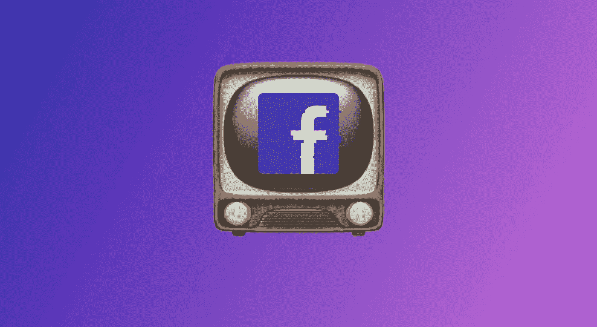

# 滚动会释放多巴胺吗？

> 原文：<https://medium.com/hackernoon/does-scrolling-release-dopamine-deaea53fe629>

## 为什么我觉得很有收获？

从一开始，我就是社交媒体的狂热用户。我注册并积极使用最近十年流行的所有社交媒体:

*   *Myspace*
*   *网络日志*
*   *MSN Messenger*
*   [*脸书*](https://hackernoon.com/tagged/facebook)
*   *Instagram*
*   *Reddit*
*   *推特*
*   *Snapchat*

你说吧，我注册了，我一直活跃着，我尝试过，最终还是放弃了。

最近，我开始思考为什么使用它们会有如此大的回报，并且我有了一些*(可能不是那么新)*的结论。我认为社交媒体——尤其是脸书，因为它是有史以来最复杂、最大、最成功的社交媒体——正在利用我们大脑中的一个漏洞。

但是让我们从一个老式的嗜好开始:电视。没有人再谈论电视了，我们已经习惯了。但是我注意到电视和提要滚动之间的相似之处，这是我之前提到的漏洞的主要引擎:**切换**。

> 滚动社交媒体源就像从一个频道换到另一个频道

## 我们为什么要换台？

想想:换台是一种奇怪的活动。一边看画面和声音，一边从一个频道跳到另一个频道。你无法控制正在发生的事情，除了你可以跳到下一个频道。它是内容的火绒。

不知何故，我们的大脑喜欢这样。我想这是一种选择的感觉，一种娱乐的感觉，以及找到一个有趣内容的高期望——这可能是下一个。不知何故，我们的大脑会对这种活动释放一种奖励，即使它根本不是一种有用的活动。

Zapping 就是漏洞。

脸书现在是什么样的？是一个视频接一个视频接一个照片，有图有音。我相信你现在明白其中的相似之处了。你的大脑天生喜欢这种互动，由于脸书为你量身定制了这些内容，这种吸引力就更加强大了。

我很想看到实时多巴胺水平，以便了解我们的大脑在与社交媒体互动时的行为。

脸书是新的电视。

> [黑客中午](http://bit.ly/Hackernoon)是黑客如何开始他们的下午。我们是 [@AMI](http://bit.ly/atAMIatAMI) 家庭的一员。我们现在[接受投稿](http://bit.ly/hackernoonsubmission)，并乐意[讨论广告&赞助](mailto:partners@amipublications.com)机会。
> 
> 如果你喜欢这个故事，我们推荐你阅读我们的[最新科技故事](http://bit.ly/hackernoonlatestt)和[趋势科技故事](https://hackernoon.com/trending)。直到下一次，不要把世界的现实想当然！

