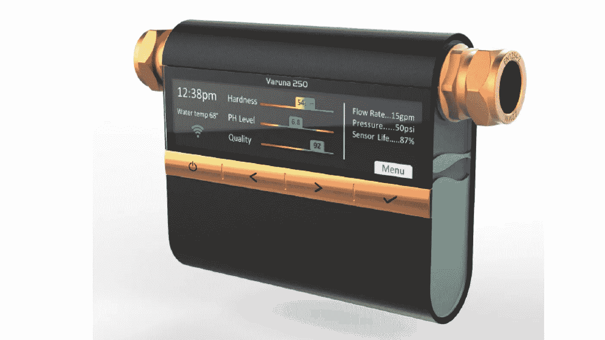
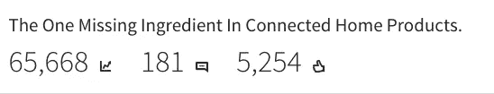
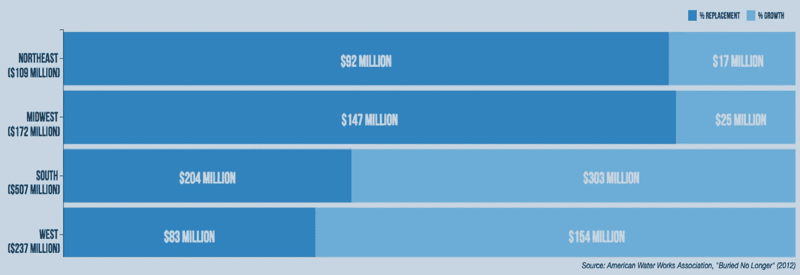
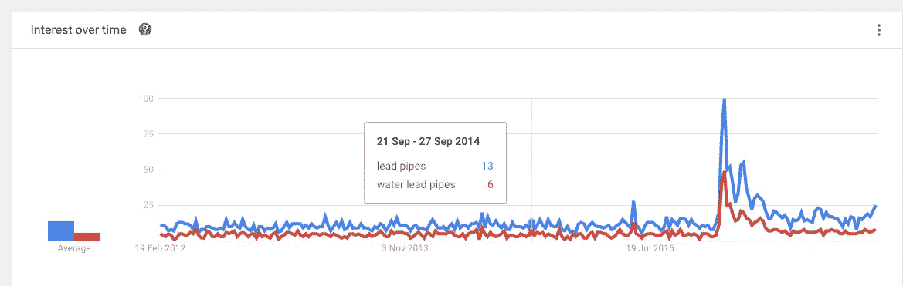
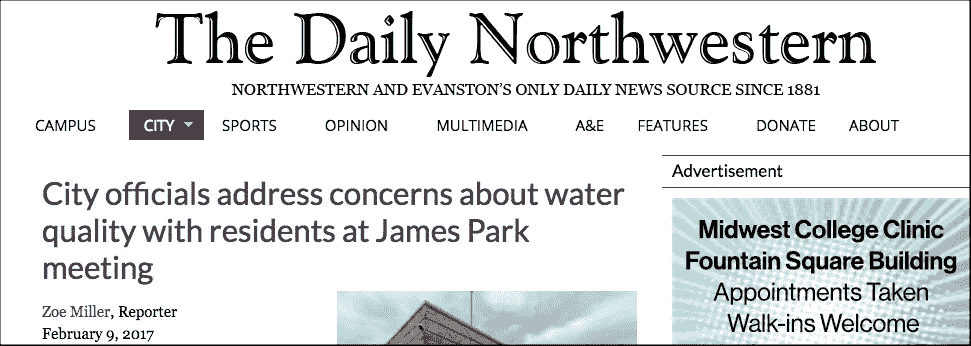
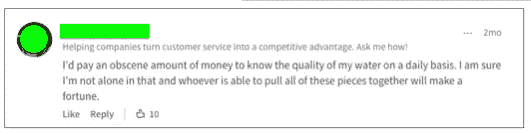
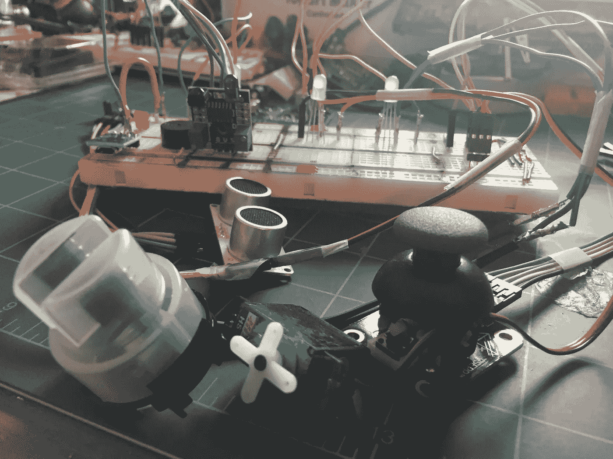
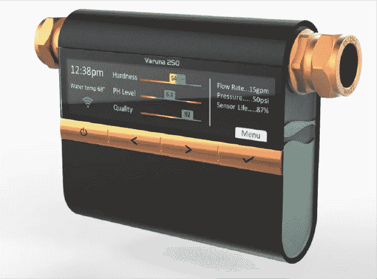
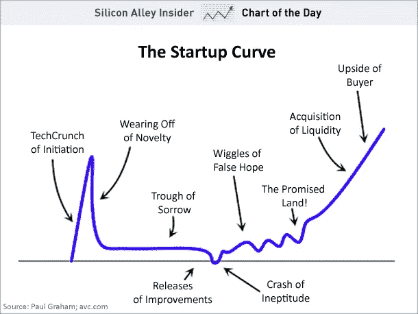

# 做重要的工作…为什么？

> 原文：<https://medium.com/hackernoon/doing-work-that-matters-why-6345ddd3a90b>

Initial Design of Varuna: The Smart Water Quality Meter by Axis Design

在这篇博文的最后，我将请求大家为上面图片中的水质设备的开发提供资金。 [**希望大家投稿**](http://www.asha-labs.com/varuna-donation/) **。**不管你做不做，请看完帖子分享。有人告诉我，我不要求我想要的，我埋葬了 led。这次不会。

本岗位零件 [#2](https://hackernoon.com/doing-the-work-that-matters-the-who-and-the-what-9353f3f89eee#.6oqfxf8ez) 和 [#3](https://hackernoon.com/why-vc-fails-most-hardware-companies-da75eecfdb7e) 见[此处](https://hackernoon.com/doing-the-work-that-matters-the-who-and-the-what-9353f3f89eee#.6oqfxf8ez)和[此处](https://hackernoon.com/why-vc-fails-most-hardware-companies-da75eecfdb7e)。

几个月前，在 [Axis Design](http://axisdesign.com) 与朋友/设计师进行了一次很棒的交谈后，我决定写一篇主题文章，涵盖我们讨论的内容。问题是(现在仍然是)物联网(IoT)设备的设计和这些产品中缺少的元素；**感同身受**。这篇名为《 [*联网设备*](https://www.linkedin.com/pulse/one-missing-ingredient-connected-home-products-seyi-fabode) 缺少的一个要素》的文章已经获得了**70000 次浏览、5000 次分享和几百条评论。**

我们也联系了一些上市公司，但是我被如此多的人阅读/分享/喜欢这个帖子而震惊了，**我完全没有抓住要点……**

## 弗林特，密歇根州和自来水公司的毒井

在美国，几乎没有人没有听说过发生在弗林特密歇根州的水资源问题；2 年前，弗林特市官员选择停止向底特律支付休伦湖的水费，而选择从肮脏的弗林特湖取水。水是腐蚀性的，铁从管道渗入水中达两年之久，使水变成褐色。由于官员声称水是好的，儿科医生 Mona Hanna-Atisha 博士进行了测试，发现接触这种水的儿童体内的铅含量是推荐水平的三倍。湖水被转回休伦湖，但损害已经造成。此时，弗林特至少有 9000 名儿童受到铅中毒的影响 。9000 个孩子受到那些对这些孩子没有**同情心的人所做决定的影响**。

弗林特的问题不是一次性的。美国几乎所有的水利基础设施都需要更换。本周早些时候，由于奥罗维尔大坝可能发生泄漏，加州 20 万人的疏散将水基础设施的断裂状态展现在我们眼前。

这个问题的范围是什么？美国环保署对 52，000 个社区供水系统和 21，400 个非营利非社区供水系统进行了分类。2012 年，[美国水务协会](https://www.awwa.org/)得出结论，如果一次性更换所有管道，超过 100 万条管道的更换价值约为 2.1 万亿美元，如果费用可以在 25 年内分摊，则为 1 万亿美元。这相当于每个美国公民 7000 美元，仅仅是为了让供水系统达到电信技术的标准。

Source: [American Water Works Association](http://www.awwa.org/portals/0/files/legreg/documents/buriednolonger.pdf) ‘Buried No Longer’ Report

像大多数穿过弗林特的管道一样，[美国的水利基础设施](https://theconversation.com/piping-as-poison-the-flint-water-crisis-and-americas-toxic-infrastructure-53473)系统铺设有[铅贯穿其中](https://www.ncbi.nlm.nih.gov/pmc/articles/PMC2509614/)。摘自一篇 [2008 年的文章](https://www.ncbi.nlm.nih.gov/pmc/articles/PMC2509614/)

> 在过去的几年里，许多城市显著升高的铅含量引起了公众的强烈抗议。马萨诸塞州的波斯顿 [8](https://www.ncbi.nlm.nih.gov/pmc/articles/PMC2509614/#r8) ， [9](https://www.ncbi.nlm.nih.gov/pmc/articles/PMC2509614/#r9) 检测出家庭和学校中被铅污染的水；北卡罗来纳州达勒姆[10](https://www.ncbi.nlm.nih.gov/pmc/articles/PMC2509614/#r10)；和新泽西州卡姆登市等许多城市。2004 年，在 DC 的华盛顿州，当超过一半的家庭铅服务管道被发现超过环境保护局(EPA)的行动水平十亿分之十五时，引起了公众的极大关注。

来自密西西比州弗林特、洛杉矶圣约瑟和伊利诺伊州埃文斯顿的喊声呼应了上述 2008 年的引文，并表明了所需工作的紧迫性。2016 年 12 月,[水资源开发法案](https://www.congress.gov/bill/114th-congress/senate-bill/612/text)签署成为法律，授权花费 1 亿美元解决其中一些升级问题。几乎抵消改善水资源状况的决定的影响的是 2017 年 2 月 16 日签署的国会审查法案，该法案现在允许煤炭公司将废物倾倒入河流。每向前迈一大步，我们似乎都会立即来一个大的后空翻。

不幸的是，这些大规模的解决方案无法解决我们现在每天面临的问题。每天。我们必须从基层做起。这种草根方法将得到我们今天所拥有的技术的帮助。

No marks for guessing why searches spiked in 2015/2016

另外两个因素增加了美国水资源状况的紧迫性。这些是

1.  饮用水的缺乏。地球上 97.5%的水是咸水。剩下的 2.5%是淡水，但 65%的淡水被锁在冰川中。只剩下 0.33%可以饮用。
2.  对水的需求日益增加:在世界上的许多地方，战争和冲突实际上是为了获得水源。特别是在美国，[(为我们发电的)公用事业也消耗大量的水。这是一种需求关系，按照目前的速度，到 2050 年，水的需求将超过供应。](http://www.ucsusa.org/clean_energy/our-energy-choices/energy-and-water-use/freshwater-use-by-us-power-plants.html#.WKOa_rYrJE4)

## 技术解决方案

我们正在目睹技术和智能设备的爆炸式发展。像它的姐妹电力行业一样，水行业正在转向一种更加分布式的模式，在这种模式下，客户(由于他们家中拥有的技术能力)可以亲自监控和调整他们的使用，以满足他们的需求。加入智能设备，将管理工作从消费者手中拿走(*“Alexa，关掉洒水器”*)，超本地解决方案就有望在我们的家中出现。

# 做重要的工作:Varuna

我们生活在一个设备比朋友还多的时代。人工智能威胁着我们的工作。面对所有这些系统问题，我们似乎需要神和英雄来拯救我们，使我们免于全球水资源灾难。尤其是当我们对政府失去信任，需要为照顾家人和管理地球承担更多个人责任的时候。

虽然问题是系统性的，但解决办法必须是地方性的。我相信 [Varuna](http://www.asha-labs.com/varuna-donation/) 是在最大程度上为中低收入消费者解决问题的方法之一，他们将在任何灾难中遭受最大的损失…

随着博客帖子的浏览量增加， ***我意识到我从人们那里听到的信息是，智能水质传感器是成千上万人想要的产品*** 。消费者告诉我，他们希望在水质造成任何损害或导致任何疾病之前，就水质可能出现的问题得到警告。**我被召唤去做资源利用和健康相关的工作。**

Hacking away at a Smart Water quality Meter.

考虑到水行业的惯性，由于缺乏资金和老化的商业模式，我意识到产品必须直接面向消费者。 ***我意识到的另一件事是，构建这个产品必须以不同的方式完成*** 。上图是智能水质测量仪的电子设备正在进行的工作。下图是我们正在考虑的产品的当前外形。产品将关注的两个初始质量指标是浊度(水中的污染物)和铅含量，这是受访者要求的两个最常见的选择。它还将测量使用情况。我们正为这可能对数百万人的生活产生的影响而兴奋不已。但是我们需要你的帮助。这就是我今天联系你的原因。

你能帮什么忙？如果你想看到这个产品存在于世界上，就在这里捐赠。没有量太少。或者通过**贡献你的技能和时间，把这个产品推向世界。你可以发邮件给我在 asha-labsdotcom 的 seyi 或者** [**填好这张表**](https://goo.gl/forms/BgrBkxs56H6Wif7V2) **。我们需要你的帮助！**并请分享这篇帖子。但是为什么要捐款呢？为什么不是传统的风险投资(VC)模式？

## 为什么你不应该贡献

从表面上看，向大众市场捐赠并资助一个可能不起作用的产品的产品开发似乎是违反直觉的。但并没有看起来那么激进。这是像 [Kickstarter](http://kickstarter.com) 和 [Indiegogo](http://indiegogo.com) 这样的网站已经建立的方法的变体。这是一种奖励创造新事物的工作的资助形式。这也是我们以政治捐款的形式资助(我们所认为的)运动的方式。

它也认识到这样一个事实:创造新事物会为失败敞开大门。对失败的 kickstarter 项目的贡献者感到失望，是因为他们觉得创造者一开始就有欺骗的意图。我个人为几个 kickstarter 活动捐过款，但只收到了其中一个产品(一本诗集)。 [***所以有理由你不应该把***](http://www.asha-labs.com/varuna-donation/) ***捐给瓦鲁纳。***

[https://stevebanfield.blog/2012/03/19/the-wiggles-of-false-hope/](https://stevebanfield.blog/2012/03/19/the-wiggles-of-false-hope/)

1.  虽然技术风险很低，但这更多的是关于整合而不是发明，赢得胜利的是品牌。我们还不是科勒，但给我们几年时间。这种方法，在你的帮助和支持下建立品牌，实际上帮助我们做到了这一点。
2.  我们分享所有的缺点；我们的目标是以适合大众市场的价格将设备推向市场，我们需要帮助来实现这一目标。我们会分享很多我们搞砸的事情，如果你捐赠的话，看起来可能会不舒服。
3.  如果有人盗用了这个想法怎么办？然后产品进入市场，我会对被阻止饮用危险水的人数欣喜若狂。如果能养活我的家人或者赚很多钱，那就太好了，但是这个松散的集体工作可以养活我们的家庭，而不需要瓦鲁纳。不管结果如何，这都是值得做的工作。
4.  你在这件事上太标新立异了！我已经获得了足够的特质学分，可以尝试以新的方式在新产品/平台上建立新的业务。如果我们失败了，我希望是因为我们尽了最大努力，但这还不够，而不是因为我们没有努力。我们正在尝试这种方法，而不是为公用事业市场尝试旧的非迭代式产品创新方法。加入我们吧！
5.  这会很难！当然啦！！所以我们需要尽可能多的帮助。

尽管我们知道这将是多么艰难，但我们坚信，任何人都不应该在不知不觉中饮用或使用对他们有害的水，我们现在有智能技术来防止这种情况发生。优化产品的第一步是智能水质测量仪 Varuna。[在这里捐款帮助我们的工作](http://www.asha-labs.com/varuna-donation/)或者[在这里报名贡献你的专长](https://goo.gl/forms/tiadwcSfuQ6DKNVB3)。谢谢！

# [捐赠此处](http://www.asha-labs.com/varuna-donation/)

## 如果你喜欢这篇文章，请点击下面的心。这有助于其他人看到这个故事，也有助于我知道你想看到我写更多(我们都需要一些验证:)。

> [黑客中午](http://bit.ly/Hackernoon)是黑客如何开始他们的下午。我们是 [@AMI](http://bit.ly/atAMIatAMI) 家庭的一员。我们现在[接受投稿](http://bit.ly/hackernoonsubmission)并乐意[讨论广告&赞助](mailto:partners@amipublications.com)机会。
> 
> 如果你喜欢这个故事，我们推荐你阅读我们的[最新科技故事](http://bit.ly/hackernoonlatestt)和[趋势科技故事](https://hackernoon.com/trending)。直到下一次，不要把世界的现实想当然！

