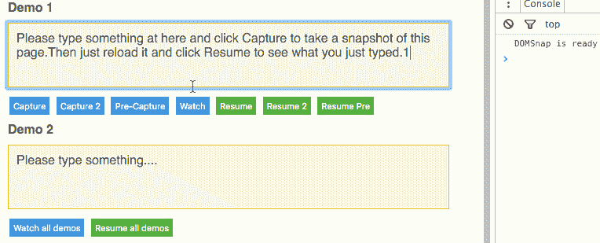

# 通过将 DOM 持久化到 IndexedDB/WebSQL 来离线网页。

> 原文：<https://medium.com/hackernoon/domsnap-offline-web-pages-by-persisting-dom-to-indexeddb-websql-a4750d591ea1>

[](https://github.com/unbug/DOMSnap) [## unbug/DOMSnap

### DOMSnap -通过将 DOM 持久化到 IndexedDB/WebSQL 来离线网页

github.com](https://github.com/unbug/DOMSnap) 

# DOMSnap

通过将 DOM 持久化到 IndexedDB/WebSQL 来离线网页。请尝试[演示](http://unbug.github.io/DOMSnap/)。

# 它是如何工作的

HTML5 提供了 LocalStorage、IndexedDB 和[window . cache](https://googlechrome.github.io/samples/service-worker/window-caches/)来构建离线 web 应用。但是所有这些技术，我们不能错过本地数据库。DOMSnap 充分利用了离线技术。将 HTML 存储到本地 IndexedDB/WebSQL 并在脱机时恢复。有了 DOMSnap，web 页面可以恢复到它们最后的状态，对服务器的请求更少，模板呈现也更少。觉得线下很远，为什么不直接给 DOMSnap 试试？

# 使用

1.在 HTML 中包含`[dist/DOMSnap.min.js](https://github.com/unbug/DOMSnap/tree/master/dist)`文件

```
<script src="DOMSnap.min.js"></script>
```

2.或者安装软件包

```
npm install --save domsnap
```

并在你的文件中要求它

```
var DOMSnap = require('domsnap');
```

例子

```
//init DOMSnap
var DS = DOMSnap({
  onReady: function(){
    console.log('DOMSnap is ready');
  }
});//capture snapshot html of #main
DS.capture('#main');
//capture with specified capture id
DS.capture('#main', {id: 'my_id'});//set the html of #main by it's captured snapshot html
DS.resume('#main');
//set by specified capture id
DS.resume('#main',{id: 'my_id'});
```



# 蜜蜂

# DOMSnap(配置)

初始化 DOMSnap

因素

*   `config`对象【可选】
*   `config.onReady`当 DOMSnap 准备好时，将调用函数
*   `config.version`编号版本控制，非零。如果 web 应用程序已更新，则需要更新。默认值为 1
*   `config.scope`字符串“主机|路径|或任何字符串值”。“主机”:location.host“路径”:location . host+location . pathname；默认为“路径”
*   `config.storeType`存储要使用的字符串数据。“IndexedDB”或“WebSQL”，如果没有定义，iOS 使用“WebSQL”，其他使用“IndexedDB”。
*   `config.expires`每个快照将过期的毫秒数，默认为 1 周。请注意，在页面重新加载之前，新快照永远不会过期。

返回对象{{capture: capture，resume: resume，get: get，getAll: getAll，remove: remove，clear: clear}|*}

# 。捕获(选择器，选项)

元素的捕获快照 html 匹配选择器，并使用捕获 id 存储结果

因素

*   `selector`元素的字符串选择器
*   `options`对象【可选】
*   `options.id`字符串或函数捕获 id，如果 html 不为空，则将 id 设置为空，以将 html 存储为默认快照
*   `options.html`字符串或函数快照 html，设置 id 为 null 将 html 存储为默认快照
*   `options.expires`快照将过期的毫秒数。如果未指定，则与 initialize DOMSnap 的值相同。

返回 DOMSnap

# 。简历(选择器，选项)

将元素的 html 设置为通过其捕获的快照 html 来匹配选择器[和捕获 id]

因素

*   `selector`元素的字符串选择器
*   `options`对象【可选】
*   `options.id`字符串或函数捕获 id，如果 html 不为空，则将 id 设置为空以将 html 存储为默认快照
*   `options.fallback`函数一个回调函数，如果没有匹配的快照将被调用

返回 DOMSnap

# 。手表(选择器，选项)

观察并自动捕获与选择器匹配的元素

因素

*   `selector`元素的字符串或数组选择器
*   `options`对象【可选】
*   `options.id`字符串或函数捕获 id
*   `options.html`字符串或函数快照 html

例子

```
//e.g.1
DS.watch('#main');//e.g.2
DS.watch('#main',{
  id: 'my_capture_id',//capture id
  html: 'my_snapshot_html'//snapshot html
});//e.g.3
DS.watch('#main',{
  id: function(selector){ return 'generated_capture_id_for_'+selector;}, //return capture id
  html: function(selector){ return 'generated_snapshot_html_for_'+selector;} //return snapshot html
});//e.g.4
DS.watch(['#main', '#another']);//watch multi elements
```

返回 DOMSnap

# 。get(选择器，id)

retrun 元素的捕获快照 html 匹配选择器和捕获 id

因素

*   `selector`元素的字符串选择器
*   `id`string[可选]捕获 id，如果没有指定，结果是默认快照

返回字符串 html

# 。getAll(选择器)

retrun 元素的所有捕获的快照 html 匹配选择器

因素

*   `selector`元素的字符串选择器

将对象所有快照作为对象返回，例如{ DEFAULT _ CAPTURE _ ID:' html of DEFAULT _ CAPTURE '，my_id: 'html of my_id'}

# 。移除(选择器，id)

删除与选择器[和捕获 id]匹配的元素的捕获快照 html

因素

*   `selector`元素的字符串选择器
*   `id`string[可选]捕获 id，如果未指定，将清空所有快照

返回 DOMSnap

# 。清除(版本)

清除所有捕获的快照

因素

*   `version`number[可选]如果未指定，与初始化 DOMSnap 的值相同。

返回 DOMSnap

> [黑客中午](http://bit.ly/Hackernoon)是黑客如何开始他们的下午。我们是 [@AMI](http://bit.ly/atAMIatAMI) 家庭的一员。我们现在[接受投稿](http://bit.ly/hackernoonsubmission)，并乐意[讨论广告&赞助](mailto:partners@amipublications.com)机会。
> 
> 要了解更多信息，请[阅读我们的“关于”页面](https://goo.gl/4ofytp)、[在脸书上点赞/给我们发消息](http://bit.ly/HackernoonFB)，或者简单地说， [tweet/DM @HackerNoon。](https://goo.gl/k7XYbx)
> 
> 如果你喜欢这个故事，我们推荐你阅读我们的[最新科技故事](http://bit.ly/hackernoonlatestt)和[趋势科技故事](https://hackernoon.com/trending)。直到下一次，不要把世界的现实想当然！