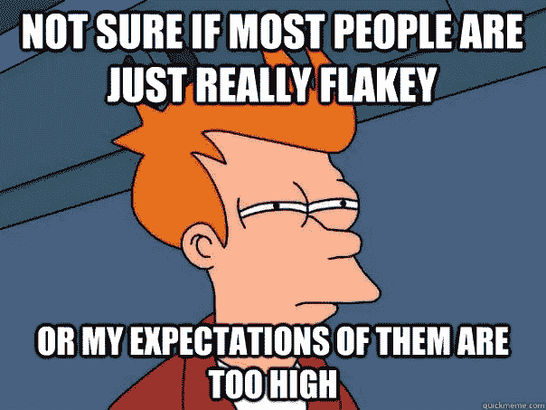
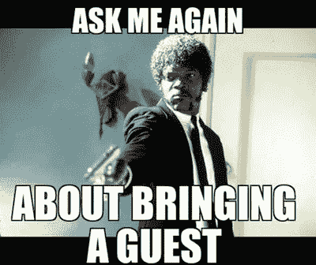
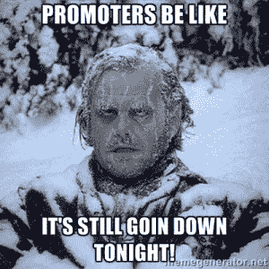
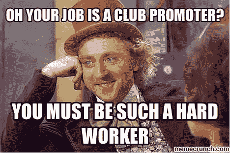
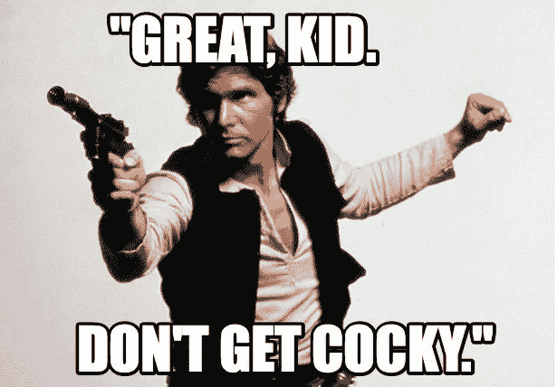

# 不要成为当地的活动发起人

> 原文：<https://medium.com/hackernoon/don-t-become-a-local-event-promoter-7c6da2061197>

三个理由，你就是不该做。

# 人们很差劲

*   **人们会告诉你他们会参加你的下一次活动，每次活动:**

这一天总是不是最好的，“啊，我周四没空，周五有空的时候告诉我一声！”

在你努力工作得到一个星期五事件之后，“那太棒了！抱歉，每一个第一、第三和第四个星期五我都有另一个承诺。也许如果你在第二个星期五有一个。”

*   **每个人都想成为嘉宾:**

场地、劳动力和人才都是要花钱的。如果每个人都在宾客名单上，谁会得到报酬？我们不是向你要不必要的服务费，我们只是向你要 8 美元去看有才华的个人和家乡的英雄。

*   **人有选项:**

天气、懒惰、网飞或者同龄人的压力加上俱乐部活动的免费入场券，都会让我们当中的强者变得软弱。

# 做一个推广人，真糟糕

我曾经看到一条推文写道， ***“如果你想成为一名推广者，第一步是拿一百万美元……点燃它，看看你感觉如何。”***

想想看:你试图说服有资格的崭露头角的艺术家来你的舞台上表演，因为你可以吸引一群人，另一方面，你试图说服一群人来欣赏你和他们的几个朋友可能知道的才华。

你是二手车销售员的娱乐版。

因此，你把你的金钱和名誉押在一个惊人事件的“预期”上。

# 表演者，烂透了

如今，一些崭露头角的艺术家可能会天真地认为这是推销一场展览的正确方式。

“我会在几天前张贴传单，这样人们就不会忘记。” 错了。

我很抱歉，但除非你是 Jay Z，我将需要超过三天的推广从你的结束。你的社交网络需要知道你对你的下一个活动感到兴奋。

如果我们都试着不宣传这个活动，直到三天前？

# 但是如果你想成为推广者，

你将学会用不同的方式衡量成功

*   确保即使人群中只有十个人，他们也在享受人生的快乐时光。如果这 10 个人玩得很开心，你的活动就是成功的，他们很可能会参加你的下一次活动。

知道你的活动不适合你

*   但是要知道活动推广是一件需要激情的事情。如果你不热衷于看到事情走到一起，只是想要免费的酒，省省你自己的麻烦，要求成为一个俱乐部发起人。

继续磨。

> [黑客中午](http://bit.ly/Hackernoon)是黑客如何开始他们的下午。我们是 [@AMI](http://bit.ly/atAMIatAMI) 家庭的一员。我们现在[接受投稿](http://bit.ly/hackernoonsubmission)，并乐意[讨论广告&赞助](mailto:partners@amipublications.com)机会。
> 
> 如果你喜欢这个故事，我们推荐你阅读我们的[最新科技故事](http://bit.ly/hackernoonlatestt)和[趋势科技故事](https://hackernoon.com/trending)。直到下一次，不要把世界的现实想当然！

