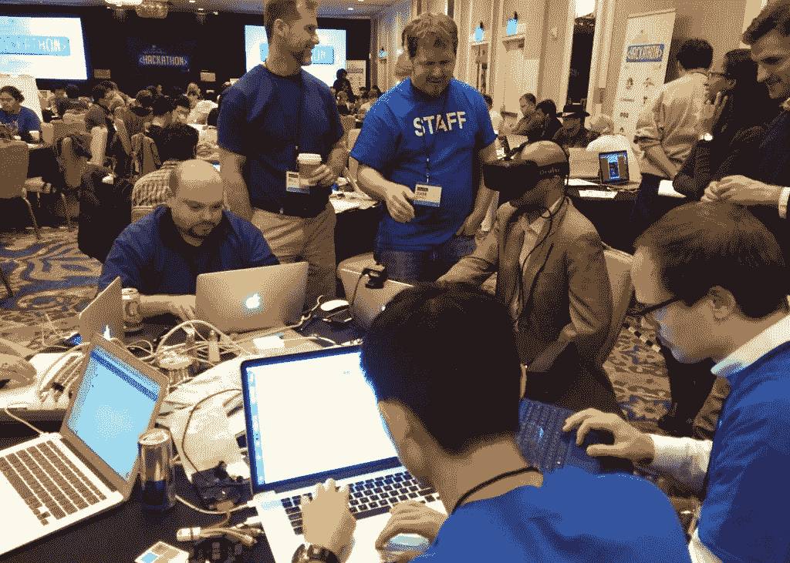

# 不知道怎么编码？去参加黑客马拉松。

> 原文：<https://medium.com/hackernoon/don-t-know-how-to-code-go-to-a-hackathon-6cbe8dd0dda1>

## 开始编写代码的最佳方式

> 黑客马拉松:“通常持续几天的活动，在这种活动中，许多人聚在一起进行协作计算机编程。”-牛津词典

我是一名大二学生，在加拿大西方大学学习数学。上大学的时候，我有 **0%的编码经验**。九个月后，我想分享我从参加黑客马拉松中学到的东西，以及其他人如何充分利用它们。

> **你从为期两天的黑客马拉松中获得的教育胜过任何一天的 CS 入门课程。**

# **我需要知道如何编码吗？**

## 不你不知道。

以下是你在 CS101 课程中最有可能学到的主题(假设你从 Java 开始)。

*   原始类型
*   目标
*   班级

涵盖这些主题为教你如何编写好的软件打下了基础(这很重要)，但对于构建原型应用程序来说并不是必需的。请记住这个微妙的区别。

# 但这真的重要吗？

## **否**

在黑客马拉松上，你通常会和你的朋友一起来或者在开幕式上结交新朋友(甚至是在[黑客马拉松](https://hackernoon.com/tagged/hackathon) FB 组！).无论哪种方式，在黑客马拉松开始时都会有一个头脑风暴会议，以找到一个团队并提出一个黑客马拉松的想法。

> 有趣的故事:我是我们大学唯一一个参加 2015 年 PennApps(UPenn)的学生，我在去黑客马拉松的巴士上交了一些很棒的朋友，我们最终开发了一个很酷的生产力网络应用。
> 
> 我的一个团队成员，马南，写了他独自去参加黑客马拉松的经历。我强烈推荐这本书！

如果你来参加一个没有/很少编程经验的黑客马拉松，这只能意味着一件事:**你将学习如何写代码。**

拥有一些编码经验可以帮助你更快地掌握语言，但这通常只适用于语言之间的共享概念，比如循环和函数。

既然您熟悉这些概念，那么在学习一门新语言时，您只需要熟悉新的语法/编码风格。

## **导师**

每个黑客马拉松都有导师出席。他们的目的是在你的项目中帮助你，并回答你可能有的任何问题。

导师通常是赞助公司(如脸书、谷歌、彭博和 Capital One 等公司)的现任员工。).

## 个人笔记

虽然我带着 4 个月的编码经验参加了我的第一次黑客马拉松，但当我第一次尝试构建 Android 应用程序时，这些知识并没有真正帮助我。

我每 45 分钟就去拜访一次我的导师，因为一开始我完全没有头绪。当你对难题有真正的兴趣，并且表现出你尽了最大努力去解决问题时，导师会感激你。

# 结论

参加黑客马拉松不仅可以结识新朋友(结交新朋友，与来自赞助商公司的导师建立关系)，而且你还可以**学会如何管理**关系，最重要的是你可以**学会如何编写代码**。

学习如何写代码应该不难，因为你有队友和导师的支持。

## 我从哪里开始？

Devpost :一个[平台](https://hackernoon.com/tagged/platform)，在这里你可以看到即将到来的黑客马拉松以及人们之前的黑客马拉松项目。

[大学黑客马拉松](https://mlh.io/seasons/na-2019/events) : MLH 在后勤和运营方面支持大多数大学黑客马拉松，因此这通常是黑客马拉松质量的一个良好标志。

## 关于 Fady 的更多信息

2014 年 9 月，我写了第一行代码，2015 年 2 月，我参加了第一次黑客马拉松。

2015 年夏天，我又参加了 4 次黑客马拉松。在我参加的每一次黑客马拉松中，我都试图学习新的东西。因此，我学会了如何更快地制作产品原型，并从我需要学习的新语言中获取重要的东西。

到那个夏天结束时，我已经被三个黑客马拉松奖选中(两个 IBM Bluemix 和英特尔爱迪生奖)。

如果你有任何问题，给我发信息！

## 承认

感谢[NBC 环球](http://blog.universalorlando.com/inside-uor/nbcu-hackathon-2015/)提供我在导师部分使用的照片，感谢[亚伦·兰德尔](http://Aaron Randall)提供你在脸书黑客马拉松大会上拍摄的文章封面照片。

> [黑客中午](http://bit.ly/Hackernoon)是黑客如何开始他们的下午。我们是 AMI 家庭的一员。我们现在[接受投稿](http://bit.ly/hackernoonsubmission)并乐意[讨论广告&赞助](mailto:partners@amipublications.com)机会。
> 
> 如果你喜欢这个故事，我们推荐你阅读我们的[最新科技故事](http://bit.ly/hackernoonlatestt)和[趋势科技故事](https://hackernoon.com/trending)。直到下一次，不要把世界的现实想当然！

