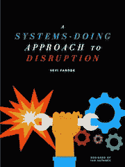

# 不要规划你的职业生涯，而要设计一些场景。

> 原文：<https://medium.com/hackernoon/don-t-plan-your-career-instead-lay-out-scenarios-13b7003fb9e7>

我不会在这件事上隐瞒真相；不要规划你的职业生涯，更好的方法是开发几个你认为你的行业将走向何方的场景，并获得在这些场景中茁壮成长所需的知识和技能。我将解释如何做这件事。

我在 2015 年写了几篇文章([好吧，很多](https://www.linkedin.com/today/author/22065921?trk=prof-sm))，那些获得最多观点/回应的文章都聚焦于一个行业或公司的未来。不出所料，我被质疑我的*预测未来的能力，在一些情况下人们不同意。那很好。我的回答每次都一样；我实际上并不是在预测未来，我只是在规划战略方案。第二个最常见的问题是，为什么我觉得分享我对我所知甚少的行业的未来的看法很舒服？我的回应；当你运用系统思维时很容易，因为一个人应该*警惕* [*那些对未来有把握的人*](https://en.wikipedia.org/wiki/Ken_Olsen) *。**

这都是关于系统思维的。透过[一些永恒不变的系统真理的镜头来看这个行业，不要过于看重我们所处的市场周期之外的短期情况](http://www.amazon.com/Thinking-Systems-Donella-H-Meadows/dp/1603580557)。这是我的电子书[的关键，因为我将它应用于两个行业(教育和能源)。](http://www.asha-labs.com/book/systems-doing-for-disruptive-innovation)

‘Systems Doing’ Book cover

了解基本驱动因素和你所在行业的发展方向，将使你获得在你所在行业取得成功所需的技能，无论你目前所在公司或公司本身的情况如何。这是一个简单的过程

1.  阅读和收集行业内外改变游戏规则的技术的信息。
2.  将一些系统思维应用到你收集的信息中(我在下面给出了一些例子)
3.  为事情可能的发展列出 2-3 个场景
4.  研究一下，更好地了解在你提出的情景中，你需要掌握哪些技能来扮演领导角色
5.  着手获取这些技能。
6.  坚持学习

**应用于场景构建的系统思维概念**

在第五条纪律中，彼得·圣吉提倡学习型组织的价值。同样的学习心态也适用于你对技术进步和所需技能的获取。有些事情永远是正确的，不管一些技术进步是否成为现实，因为一些系统概念(我在这里借用[多内拉·梅多斯](http://www.amazon.com/Thinking-Systems-Donella-H-Meadows/dp/1603580557/ref=sr_1_1?s=books&ie=UTF8&qid=1453910640&sr=1-1&keywords=donella+meadows+thinking+in+systems)的话)永远是正确的。这里有一些你可以用来开发你的场景

*   **尊重、尊重和发布信息**:一些行业(如保险或信用评级)的商业模式基于缺乏透明度和对客户隐瞒信息。这样的行业，以及在这样的行业中蓬勃发展的公司，只能这样做很长时间，因为信息总是会寻找一条“出路”。例如，医疗保健行业将最终拥有属于我们的个人健康记录，而不是属于保险公司或医疗保健系统。开发尊重这个系统概念的场景。
*   **倾听系统的智慧**:与上面的概念类似，在系统周期中处于较高位置的模拟行业将为您提供行业中可能出现的情景。比如说；公用事业行业正在从集中式发电和供电结构转变为分布式发电和供电结构，这与大约 15 年前电信行业的情况类似。倾听系统。这一概念还表明，跨行业的专业知识在你想出的任何场景中都将是至关重要的，因为竞争不仅来自你所在的行业，也来自外部。一个例子是 Myfitnesspal(已被安德玛收购),该公司拥有约 8000 万用户的饮食习惯数据，预计在不久的将来，该公司将与保险或医疗保健数据公司展开竞争。[公司和职业生涯的未来将由那些将几个专业领域的技能结合起来，并用技术增强它们以实现目标的人来主宰](https://www.linkedin.com/pulse/amplified-intelligence-new-buzzword-death-your-job-seyi-fabode?trk=mp-reader-card)。开发认识到这一点的场景。
*   **扩大时间范围**:2013 年有很多关于无人机的讨论。我[2014 年有很多关于无人机](http://bits.blogs.nytimes.com/2014/06/22/smile-a-drone-is-about-to-take-your-picture-2/)的讨论。2015 年有很多关于无人机的讨论。2016 年..你猜对了，会有很多关于无人机的谈论。这并不是因为人们没有话题可谈，而是因为在一项技术变得无处不在之前，我们会一直对其可能性着迷。当开发场景时，扩展你的时间范围，包括今天迷人的技术成为我们生活和工作的一部分的时间框架。

使用其中的一些概念，你将能够预测未来，开发场景，并定义你需要学习什么来覆盖你的#SkillsGaps，这也有助于你培养一种学习心态(由于你将不得不做大量的研究)。即使你的设想没有实现，你也会学到很多东西，获得技能。不管你周围发生什么变化，你都需要它来茁壮成长…

***获取我的*** [***电子书关于系统思维与场景此处***](http://www.asha-labs.com/book/systems-doing-for-disruptive-innovation) ***或为互动版查看*** [***出亚马逊***](http://www.amazon.com/Systems-Doing-Approach-Disruption-ebook/dp/B01B3NBTL6/ref=sr_1_2?ie=UTF8&qid=1453911492&sr=8-2&keywords=Seyi+Fabode) ***。***

> [黑客中午](http://bit.ly/Hackernoon)是黑客如何开始他们的下午。我们是 [@AMI](http://bit.ly/atAMIatAMI) 家庭的一员。我们现在[接受投稿](http://bit.ly/hackernoonsubmission)并乐意[讨论广告&赞助](mailto:partners@amipublications.com)机会。
> 
> 如果你喜欢这个故事，我们推荐你阅读我们的[最新科技故事](http://bit.ly/hackernoonlatestt)和[趋势科技故事](https://hackernoon.com/trending)。直到下一次，不要把世界的现实想当然！

