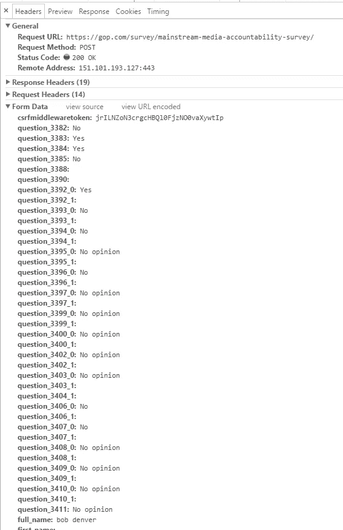
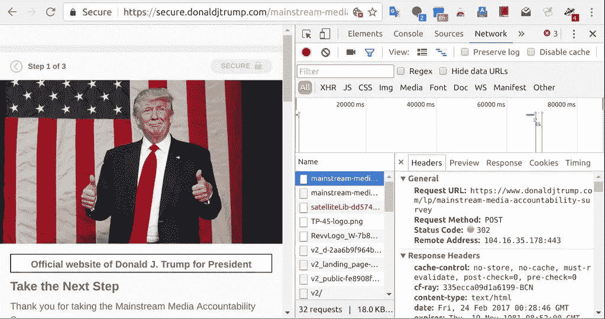
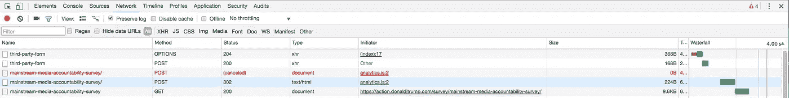
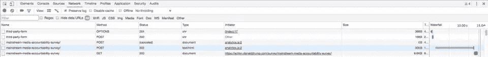
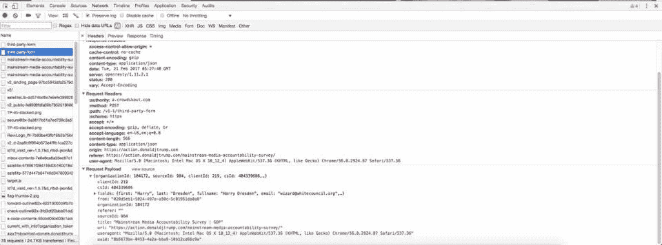
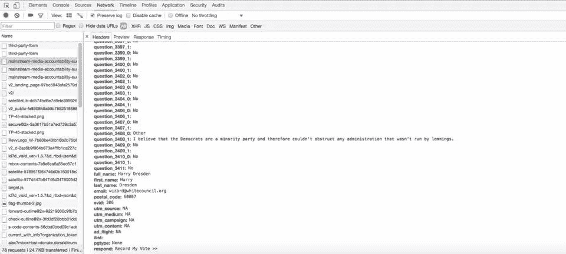
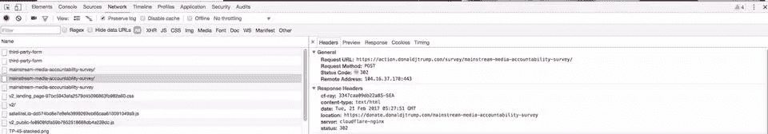

# 唐纳德·特朗普不想要你对媒体的看法……只想要你的钱。

> 原文：<https://medium.com/hackernoon/donald-trump-doesnt-want-your-opinion-on-the-media-just-your-money-47b0b511dcd>

**更新:**在过去的 24 小时里，除了第一个给我发故事创意的人，我已经有七个不同的编码员尝试过调查的[页面编码](https://hackernoon.com/tagged/page-code)。结果是完全令人愤怒的:三个发现了同样的事情我的原始来源，输入到调查中的数据在“提交”时被冲走了。

还有三个人说我满嘴谎言(大多数人用了我最讨厌的词:“假新闻”)，并发送了开发控制台的截图，显示数据被正确捕获并传递到服务器。示例:

好吧。好吧。有一种理论认为，最初的调查发布在 GOP.com，然后被匆忙推送到 DonaldJTrump.com，所有必要的查询挂钩都没有添加到后端。(对于那些不太懂技术的人来说:移植的代码没有正确安装。)然而，其他人发现该调查在两台服务器上都运行良好。

然后，有一个开发者发现结果被发布到安全的 DJT 服务器上，而服务器忽略了它们并重定向到“贡献”页面。

于是:数据**被**传送到服务器。但是看起来服务器实际上并没有**记录**那些数据(可能除了日志)。最肯定的是，它没有把它放在数据库中仔细考虑。认为他们不会保留这些信息用于进一步邮寄的想法似乎很奇怪，但也许他们只是对那些第一次不愿意付钱的人不感兴趣。

“所以:是的，网页传输数据。但是服务器响应的是 HTTP 302(重定向)，意思是“去别的地方”。这通常意味着数据没有被处理，但是如果没有服务器端代码，这是不可能知道的。

“冒烟的枪？是的。弹孔？没有。”

你刚才听到的轻微爆裂声？那是我的大脑，从我的左耳漏出。

即使数据被正确挖掘，我也不相信反对意见会被认真对待。Katie Wohlgenant 就我们为什么应该停止参加调查给出了非常可靠的理由。但是当每次尝试的结果都不一致时——即使是在五分钟内……我就不知道了。

那就说:**请**不要让人说我要传播一个虚假的叙述。我会把这个留给 202 区的其他人。

这是发表的原始故事:

今天晚上早些时候，我和一位 web 开发人员朋友聊天，他中途停了下来。“嘿，你知道共和党正在叫卖的[媒体](https://hackernoon.com/tagged/media)责任调查吗？这是一个骗局。”

我对这种说法并不感到惊讶，但我的朋友不喜欢夸张。“你是什么意思？”

“这个东西的存在只是为了给党的金库筹集资金。没有人会看到轮询数据，因为它从未被发送过。”

当我停止大笑后，我请他解释给我听。我倾向于技术上的，但我有一种感觉，我需要克里夫的笔记。

他从他的开发控制台中抓出了一系列截图，这些截图是他在接受调查时运行的。“您可以自己填写调查问卷，但不要点击“提交”打开 Chrome 的开发者工具，选择网络(获取网络活动)。然后，返回浏览器窗口，提交调查。

这显示了请求的顺序，前五个是最重要的。

“首先，您会注意到一件奇怪的事情——一个帖子(表单提交)被取消了。

“现在，帖子在它被接受和重定向之前。**那个**帖子请求包含您的联系信息。

“那个被取消的帖子？包含了调查数据——基本上，把它扔掉。

"最后，有一个重定向到捐赠页面."

我对它的厚颜无耻感到有点吃惊。“你是在告诉我，整件事是一个特洛伊木马，让人们愤怒到想向共和党战争基金捐款，因为他们不信任自由媒体？”

“嘿，伙计……这对电视福音传道者很有效。”

> [黑客中午](http://bit.ly/Hackernoon)是黑客如何开始他们的下午。我们是 [@AMI](http://bit.ly/atAMIatAMI) 家庭的一员。我们现在[接受投稿](http://bit.ly/hackernoonsubmission)并乐意[讨论广告&赞助](mailto:partners@amipublications.com)机会。
> 
> 如果你喜欢这个故事，我们推荐你阅读我们的[最新科技故事](http://bit.ly/hackernoonlatestt)和[趋势科技故事](https://hackernoon.com/trending)。直到下一次，不要把世界的现实想当然！

