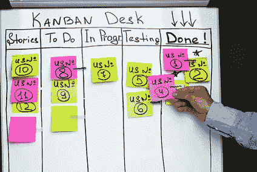

# “完成”界面

> 原文：<https://medium.com/hackernoon/done-interfaces-e326ab95fdc2>

关于 UI 的额外文章，我在这里给出了关于如何确保正确开发用户界面的建议。

和前面的文章一样，我使用了 Scrum 工具:done 的**定义，这是开发团队和产品负责人在开发需求层面上建立的契约。**不尊重**这些要求的特性**不能投入生产**。**

完成的定义可以在项目生命周期中发展，它通常从一个最小的列表开始，随着团队的执行能力而增长。大多数时候，我们会满足于一个最小的列表，而不是生活在太多约束产品交付的规则中。但我认为，当团队的执行能力提高时，提高质量和需求是很重要的。这就是为什么我在这里提出不同的**需求阶梯**。

# UI 部件的 done 定义

## 底座梯子:

**接口规范**受到**的尊重**

*   屏幕布局受到重视
*   尺寸(空间和大小)受到尊重
*   块颜色是指定的颜色
*   块阴影是那些指定的
*   接口组件和它们的样式是那些指定的
*   图像是那些指定的
*   文本是那些指定的
*   使用的字体、字体大小、样式、颜色、阴影都是指定的
*   主流和二次流已经检查过了

已经对不同可能**配置**的**变化**进行了验证

*   dp 中支持的最小和最大屏幕尺寸(适用于小表面和大表面的屏幕布局，参见文章第部分的
*   智能手机和平板电脑(测试多面板等特定布局)
*   最低和最高 Android 版本(所用界面组件的兼容性)
*   2 个屏幕密度，2 个更大的智能手机和平板电脑密度:质量要求最高，非比例因素(检查尺寸计算中的密度考虑)
*   支持的语言

至少在**一台物理设备**上进行了验证

*选择组合不同配置的最小设备集以简化*

## 质量阶梯:

动画片

*   **动画**已经**开发完成**
*   动画是那些指定的

显示是**流畅**在一个中档设备上:恒定**每秒 60 帧**

遵守基本的**可及性**标准

*   向没有显示文本的界面组件添加描述(contentDescription 属性)

**图形设计师验证**集成尊重规范(良好的理解、开发妥协和业务调整)

满足为**接口文件**定义的基础**质量**标准

*   可读性的最大深度 X(待定义)
*   使用样式来重组属性
*   尽可能用 xml 描述接口行为(而不是以编程方式)
*   等等。

## 高级质量阶梯:

界面是“完美的像素”

遵循高级可访问性标准

*   剩余的 [**官方安卓清单**](https://developer.android.com/guide/topics/ui/accessibility/checklist.html) (需要用对讲工具测试)

已经对所有可能的配置进行了验证

*   **所有支持的 Android 版本都已经过测试**
*   **所有的密度都测试过了**
*   **已经测试了有风险的构造设备(检查由于不遵守 Android 规范而导致的异常，例如三星)**

**满足为接口文件定义的**高级质量**标准**

*   **来定义**

**这个**对 done** 的定义是一个命题。请随意根据您的团队环境进行调整。**

*****安卓开发者在***[***jacquesgiraudel.com***](http://jacquesgiraudel.com)**