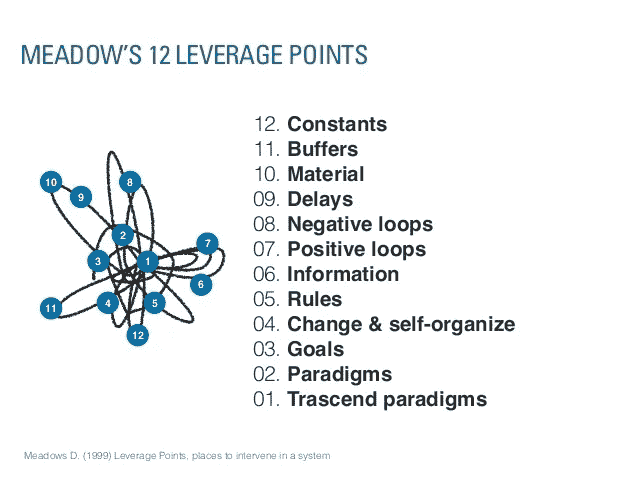

# Donella Meadows 关于如何与系统共舞并干预系统的建议

> 原文：<https://medium.com/hackernoon/donella-meadows-recommendations-for-how-to-dance-with-and-intervene-in-systems-92ace21743fb>

Donella H.Meadows 是 1972 年罗马俱乐部关于增长极限的报告的合著者之一，该报告为将可持续发展问题纳入企业和政府的议程做出了贡献。她是[巴拉顿集团](http://www.balatongroup.org/)的创始人之一，这是一个由来自 50 多个国家的系统导向分析师和活动家组成的国际网络。

Donella Meadows at her farm ([Image](http://hilobrow.com/wp-content/uploads/2010/03/meadows-donella.jpg))

在 2001 年去世前不久，Donella 一直在撰写一本新书的手稿，该书总结了她在将系统思维的概念和工具应用到可持续发展工作中所学到的东西。这项工作的摘录于 2001 年由*全球评论*发表，标题为“[与系统共舞](http://www.donellameadows.org/archives/dancing-with-systems/)”(Meadows，2001)。Donella Meadows 提供了一系列关于如何促进系统积极变化的通用指南。

以下列表总结了 Donella Meadows 在可持续发展咨询、研究和教育领域工作了 30 多年后能够给出的建议。这是一套很好的指导方针，可以帮助你改进你自己的实践，特别是当你在复杂的多利益相关者的情况下工作时，这种情况在我们试图支持系统向增加可持续性的转变时很常见。

# ***Donella Meadows 关于适当参与复杂系统的指导方针***

*(总结并改编自 Meadows，2001 年，第 1-4 页)*

## **跟上节奏。**

在你以任何方式扰乱系统之前，观察它的行为。从系统的行为开始，迫使你关注事实而不是理论。它让你不至于太快陷入自己或他人的信仰或误解中。系统行为引导一个人的思想进行动态的，而不是静态的分析——不仅仅是什么出了问题？还有我们是如何来到这里的？我们会在哪里结束？

## **倾听系统的智慧。**

帮助和鼓励有助于系统自我运行的结构。不要做一个不加思考的干预者，破坏系统自身的自我维护能力。在你开始“让事情变得更好”之前，注意已经存在的东西的价值。

## 将你的心智模型暴露在户外。

永远记住，你所知道的一切，以及每个人都知道的一切，都只是一个模型。把你的模型放在可以射击的地方。邀请他人挑战你的假设，并添加他们自己的假设。不要成为一个可能的解释、假设或模型的拥护者，而是尽可能多地收集。当你生活在一个灵活系统的世界中时，心理灵活性——愿意重新划定界限，注意到一个系统已经转变为一种新的模式，看到如何重新设计结构——是必要的。

## 保持谦逊。坚持学习。

多相信你的直觉，少相信你的理性。尽可能多地使用这两种方式，但还是要为惊喜做好准备。在一个复杂系统的世界里，用僵硬的、不偏离方向的指令向前冲锋是不合适的。当你学习的时候，适当的是小步前进，持续的监控，以及当你发现它的发展方向时愿意改变方向。尊重、促进和保护及时准确的信息！

## **在系统中定位责任。**

寻找系统创造自己行为的方式。一定要注意触发事件，即从系统中产生一种行为而不是另一种行为的外部影响。外界的影响有时候可以控制，有时候不能。内在责任意味着系统被设计成直接、快速和有说服力地向决策者发送关于决策结果的反馈。

## **为反馈系统制定反馈政策。**

你可以想象为什么一个动态的、自我调整的系统不能由静态的、不可变通的政策来管理。设计根据系统状态而变化的策略更容易、更有效，而且通常成本更低。尤其是在存在巨大不确定性的地方，最佳政策不仅包含反馈环，还包含元反馈环——改变、纠正和扩展循环的环。这些是将学习设计到管理过程中的政策。

## 关注重要的东西，而不是可以量化的东西。

我们的文化痴迷于数字，这给了我们一个观念:我们能衡量的比我们不能衡量的更重要。你可以环顾四周，自己决定数量或质量是你所生活的世界的突出特征。

## 如果事情很丑陋，就说出来。

如果某样东西是俗气的、不合适的、不成比例的、不合适的、道德上有辱人格的、生态上贫瘠的或人性上贬低的，不要让它过去。不要被“如果你不能度量它，我就不必关注它”的策略所阻止。没有人能够[精确地]定义或衡量正义、民主、安全、自由、真理或爱。没有人能够[精确地]定义或衡量任何价值。但是如果我们不为它们说话，如果系统不是为生产它们而设计的，如果我们不谈论它们并指出它们的存在或不存在，它们将不复存在。

## 为了整体的利益而努力。

不要忽视整体而最大化系统或子系统的部分。旨在增强整个系统的属性，如[创造力]、稳定性、多样性、弹性和可持续性——无论它们是否容易衡量。当你思考这个系统的时候，花一部分时间从一个有利的角度来看，让你看到整个系统。特别是在短期内，为了整体利益而进行的变革有时似乎与系统中一部分人的利益相违背。它有助于记住，一个系统的各个部分离开整体就无法生存。

## **拓展时间视野。**

工业社会的官方时间范围不会超过下一次选举后会发生什么，也不会超过当前投资的回收期。在严格的系统意义上，没有长期/短期的区别。不同时间尺度的现象相互嵌套。现在采取的行动有一些立竿见影的效果，有些还会辐射到未来几十年。我们现在正在经历昨天、几十年前和几个世纪前开始的行动的后果。你需要同时关注短期和长期——整个系统。

## **拓展思想视野**

藐视纪律。不管教科书上怎么说，或者你认为你是什么方面的专家，无论系统导向哪里，都要跟随它。它肯定会跨越传统的学科界限。为了理解这个系统，你必须能够向经济学家、化学家、心理学家和神学家学习，同时又不受他们的限制。你必须穿透他们的行话，整合他们告诉你的东西，认识到他们可以通过自己特定的镜头诚实地看到什么，并抛弃来自他们镜头的狭隘和不完整的扭曲。只有当有一个真正的问题需要解决时，如果来自不同学科的代表更致力于解决问题而不是学术上的正确时，跨学科的交流才起作用。

## **拓展关爱的边界。**

在一个复杂系统的世界里成功地生活意味着扩展关怀的视野。这样做是有道德原因的，而系统思考提供了支持道德原因的实际理由。真正的系统是相互联系的。人类的任何一部分都不能与他人或全球生态系统相分离。就像系统的其他东西一样，大多数人已经知道了道德和实践规则的内在联系。他们只需要让自己相信他们所知道的。

## 庆祝复杂性。

面对现实吧，宇宙是乱的。它是非线性的、混乱的、无序的。它是动态的。它花时间在其他地方的短暂行为中，而不是在数学上的完美平衡中。它会自我组织和进化。它创造了多样性，而不是一致性。这是世界变得有趣的原因，这是世界变得美丽的原因，这是世界运转的原因。只有我们中的一部分人，最近出现的一部分人，将建筑设计成具有不妥协的直线和平坦表面的盒子。我们的另一部分本能地认识到，大自然在分形中设计，从微观到宏观的每个尺度上都有有趣的细节。

## **坚持向善的目标。**

不良行为的例子被树立起来，被媒体放大，被文化确认为典型。正如你所料。毕竟，我们只是凡人。人类善良的更多例子很少被注意到。他们不是新闻。很少采取行动去肯定和

上面列出的准则特别有用，因为它们用一种语言表达，让你体会到在多利益主体对话和文化变革过程中人类互动的微妙之处。Meadows 没有使用生硬的系统语言，而是用一种更加诗意的方式来提醒我们一些关键的态度和做法，这些态度和做法可以帮助我们走出自己的路，让团队的智慧来指导寻找更可持续的解决方案的过程。

[Source](https://image.slidesharecdn.com/davide-socialexperiencedesign20130127-130129235326-phpapp02-130711104707-phpapp01/95/davide-casali-social-experience-design-shifting-the-focus-where-really-matters-11-638.jpg?cb=1373546936)

Donella Meadows 的另一个重要的早期出版物向你介绍了“[杠杆点:干预系统的地方](http://www.donellameadows.org/archives/leverage-points-places-to-intervene-in-a-system/)”也很值得一读。这篇短文从整个系统的角度提供了一个系统中不同干预点的列表。

在书中，Donella 提出了至关重要的一点，即最具变革性和最有效的杠杆点是通过在范式变革层面采取行动来解决的，通过解决文化变革来改变对系统的主导信念。根据 Meadows 的说法，更有效的是能够超越范式并承认不同的、甚至可能是相互冲突的观点可以给一种情况带来的智慧，同时充分认识到每种范式也带来了它自己的局限性和盲点。

# ***多内拉·梅多斯*** 对一个系统进行干预的地方(按效力递增的顺序)

(来源:【www.donellameadows.org )

## 12。常数、参数、数字(如补贴、税收、标准)。

## **11。缓冲和其他稳定库存的规模，相对于它们的流量。**

## **10。物质存量和流量的结构(如运输网络、人口年龄结构)。**

## **9。相对于系统变化率的延迟长度。**

## **8。相对于他们试图纠正的影响，负反馈循环的强度。**

## **7。围绕驱动正反馈回路的增益。**

## **6。信息流的结构(谁有权访问信息，谁无权访问信息)。**

## **5。制度的规则(如激励、惩罚、约束)。**

## **4。增加、改变、发展或自我组织系统结构的能力。**

## **3。系统的目标。**

## **2。系统——它的目标、结构、规则、延迟、参数——产生的心态或范式。**

## **1。超越范式的力量。**

—

如果你喜欢这个帖子，**请鼓掌**记住，如果你非常喜欢，你最多可以鼓掌**50 次**；-)!

**丹尼尔·克里斯蒂安·瓦尔**——在面临多重危机的情况下催化变革性创新，就再生整体系统设计、再生领导力以及再生发展和生物区域再生教育提供建议。

国际知名书籍[设计再生文化](https://www.triarchypress.net/drc.html?source=post_page---------------------------)的作者