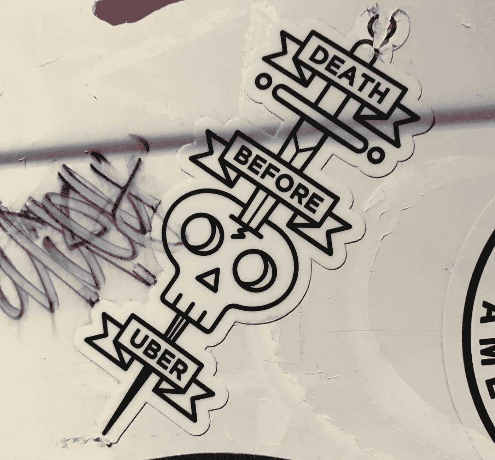

# 不要成为“我也是”的公司(除非你真的是)

> 原文：<https://medium.com/hackernoon/dont-be-a-me-too-company-unless-you-really-are-71ecc45a6c6a>

## 不了解你的同类的危险

> [最初发表于美国天才](https://theamericangenius.com/business-marketing/analog/)

电梯推销是对你的[公司](https://hackernoon.com/tagged/company)所做工作的快速描述。它之所以如此命名，是因为它应该足够短，一接到通知就可以吐出来，而且不会比乘电梯在楼层间穿行的时间更长。这种微型推销的目的不是告诉你的听众关于你公司的一切，而是与**分享足以让他们想知道更多的信息。**

有几种方法可以做到这一点——我在本帖中讨论的[——但最有效的方法必须是模拟方法。用一个众所周知的类比在你的餐巾纸创意和一家现有的知名公司之间建立联系是一种方便的速记，可以说很多而不必解释很多:“ *Litr.ly(一家虚构的公司)就像作家的 Dribbble 和 Google docs 允许社会反馈、编辑和协作创作。*”](http://compl.ai/how-to-describe-your-startup/)

# 了解你的受众

作为一名潜在的投资者、团队成员或电梯乘客，我现在知道，像专注于设计的投资组合网站一样，Dribbble，Litr.ly 将创意作品的分享与同行社区相结合。我也知道像谷歌文档一样，Litr.ly 允许实时投稿和编辑。正如你所看到的，**为你的新想法画一个类比会非常有帮助，尤其是在和一个老练的或者相关的观众交谈的时候**(我妈妈不知道 Dribbble 和 Google Docs 是做什么的)。但它可能会被过度使用，而且经常做得非常懒散。

# 不要过分

许多企业家没有真正了解他们所依附的公司，而是简单地挑选一些流行的东西，强行进行痛苦的比较，以使他们的潜力看起来像伟人一样伟大。如今，最被滥用和误解的例子是，“*我们是床垫/音乐家/摄影师/音乐发现/婚礼策划/割草机等的优步。*“如果你没有通过技术实现共享经济或按需服务，这种类比可能是错误的。

**不是每个人都可以也不应该成为【填空】的汤姆之鞋、AirBnB 或者 Spotify。**除非是真的，否则就是好逸恶劳，弊大于利。

# 不要隐藏你的与众不同

选择科技领域或你所在市场最知名的公司的另一个问题是，其他人也在这么做。如果五分之三的音乐科技创业公司是“*音乐发现的脸书*”，那么他们中的哪一个是真正的创新？**如果你对你的类比很懒惰，而其他人也一样，那么你实际上隐藏了你的与众不同。**听到第三个，“*我们是种薯的文字记者*”后的自然反应是不听了。即使听不到你的想法，你的模拟也能立刻做出“*又来了…* ”的反应。

# 具体点

**另一个常见的错误是忽略了指定你渴望成为大公司产品的哪一部分。**

说你是“*谷歌的*”任何事情都会留下更多的问题，而不是答案，因为谷歌(或 Alphabet)是很多东西:物联网(像 Nest 一样的物联网)、搜索引擎(Google.com)、电子邮件(Gmail)、社交网络(Wave 或 Plus)、自动驾驶汽车(Waymo)、增强现实(Glass)、地图(maps 或 Waze)或这个 6000 亿美元巨头涉足的任何其他馅饼。具体而相关——如果你指的是 Wave、Glass 或 Plus，你可能不了解这些产品的当前状态(尽管 Glass 会回来，尽管可能会更名和重新设计)。

# 了解你比较的多个方面

关于跟上时代的话题，**在不了解一家知名公司的商业模式、当前新闻和/或收入数字的情况下，要小心不要搭乘这家公司的顺风车**。当你试图将成功植入你的听众的脑海时，你也可能会引发意想不到的风险。你可能指的是一个讨人喜欢的特征，“*这是一个普遍的市场，就像服用了类固醇的亚马逊，*”但错误的人可能会关注这样一个事实，即亚马逊在许多硬件产品上使用亏损领先战略(首次购买时赔钱)，并期望它可以通过让你迷上电子书和卫生纸订阅来弥补。**因此，如果需要的话，随时准备绘制新的模拟图。**

# 了解您的模拟电流

同样，如果你选择了一家类似的公司，你需要尽你所能地跟踪这家公司，以确保一个好的模拟产品不会变坏。公司被起诉，发令人不快的微博，支持不受欢迎的事业(或总统候选人)，不公正地解雇员工，股票贬值或一夜之间被错误的公司收购。

你不会想在他们因渎职被送上法庭后的一周内成为…****的员工。尽管他们无处不在，但在各自的首席执行官最近因丑闻和不当行为下台后，现在可能是称自己为“[*【SoFi】*](https://www.nytimes.com/2017/09/12/technology/sofi-chief-executive-toxic-workplace.html?mcubz=1)”或“ [*【优步】*](http://www.cnbc.com/2017/06/21/uber-timeline-why-did-ceo-travis-kalanick-leave.html) *…* 的最糟糕的时候。其中一些事情最终会烟消云散或者反弹回来，但是如果你所指的成功的万神殿只是一个笑点，你会被抓个正着。****

********

# ****不要只看大牌，寻找更合适的****

******如果你在市场之外寻找模拟产品，请确保手套合适。Lyft 模式在汽车领域的效果惊人地好，而在其他垂直领域可能就不行了。虽然“Lyft for massage”初创公司、 [Zeel](https://www.zeel.com/) 和[asure](https://www.soothe.com/https://www.soothe.com/)都是极具增长潜力的公司，但邀请陌生人进入你的房子，把手放在你半裸的身体上，比进入一辆陌生人的 GPS 跟踪汽车风险更大。虽然这可能是一个很好的比较，但你推销的人可能会同意 Inc. Magazine 的 **Will Jacovitz** 在 Inc. Podcast 上说的话:“*除了汽车，任何东西的优步化都会令人毛骨悚然。*******

**抛开所有这些负面因素，为快速电梯推介选择一个公司榜样并不都是潜在的陷阱。**

****画一个模拟图仍然是一种很好的方式，可以让你的公司在你的观众心目中留下深刻的印象，并简洁地解释你将如何主导你的市场****

**你只需要确保:**

> **–了解你的受众
> –不要做过头的人
> –不要做一个“[我也是](https://hackernoon.com/tagged/me-too)”的公司
> –具体说明你喜欢大公司产品组合中的哪种产品/功能
> –准备好在适当的时候画一个新的模拟
> –了解你的模拟公司的当前新闻和过去的奋斗。超越最大的创业公司和公司，寻找更合适的**

**所以，去为餐具打造下一个伟大的 Warby Parker 或为 bronies 打造 AirBnB 吧，只是不要让你的描述成为类似的泰坦尼克号**

****#有多有****

***如果您喜欢它，请考虑推荐它，以便其他人可以通过点击*找到它👏*拍手图标。***

****可以关注:** *大牛上* [*中*](/@dsenyard) *，* [*推特*](http://www.twitter.com/dsenyard) *，*[*insta gram*](https://www.instagram.com/dsenyard/)*或者*[*AngelList*](https://angel.co/dsenyard)*。
compl . ai on*[*Medium*](http://medium.com/complai)*，*[*Twitter*](http://twitter.com/complaibot)*或*[*AngelList*](http://angel.co/compl-ai)*。***