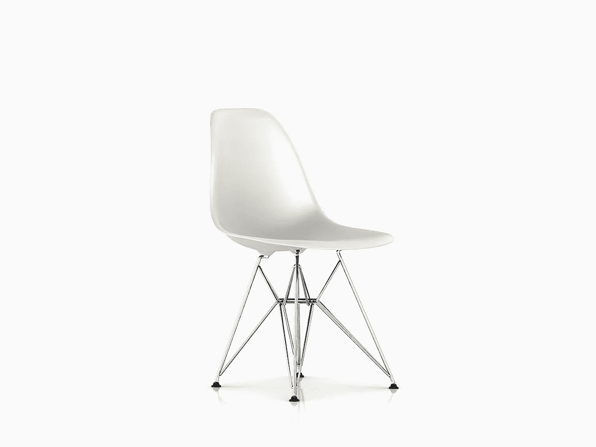

# 不要做软件工程师，要做软件艺术家

> 原文：<https://medium.com/hackernoon/dont-be-a-software-engineer-be-a-software-artist-204dbd47e8ca>

偶尔，新的软件工程师会对我说他们的设计或代码“不够好”感到困惑，他们的问题/回答通常是这样的:

1.  这个代码有效，我为什么要不停地修改它？
2.  这个设计是可行的，为什么要简单一点？
3.  让我给你解释一下这个代码，你会明白的。

“不够好”在这里是一个非常模糊的术语。通常我会使用一些不那么模糊但仍然非常模糊的术语，比如“不够简单”、“不容易理解”、“不便于用户使用”、“不能自我解释”等等。通常我会和这位工程师聊一聊为什么我们需要设计一个简单的架构，为什么你应该写简单易懂的代码，为什么你应该格式化你的代码，为什么你应该在这两个符号之间留一个额外的空间…

如果你已经在软件行业工作了几年，或者足够关心阅读一些关于如何编写好的代码和如何设计好的架构的书籍，你可能会有同样的感觉。这些是每个新的软件工程师都应该掌握的基本概念，但不幸的是，并不是每个人都理解这些概念的必要性。

不仅一些新工程师不坚持设计和代码质量的最高标准，一些已经在软件行业工作了一段时间的工程师也有这个问题。你可以让他们阅读[代码完整 2](https://www.amazon.com/Code-Complete-Practical-Handbook-Construction/dp/0735619670) 、[干净代码](https://www.amazon.com/Clean-Code-Handbook-Software-Craftsmanship/dp/0132350882)、[Unix 编程的艺术](https://www.amazon.com/UNIX-Programming-Addison-Wesley-Professional-Computng/dp/0131429019)，以及其他 10 种不同的编程书籍(你说吧)，其中有些会提高他们的工程质量，有些还是不会。

# 软件工程师与软件艺术家

为什么不是每个软件工程师都生产高质量的代码和高质量的设计？也许他们中的一些人没有经验；也许他们中的一些人不知道如何概括他们已经从那些书和过去的经验中学到的东西；也许他们中的一些人只是想完成他们的工作，对他们来说，成为一名软件工程师只是一份工作。但从根本上说，是因为**他们认为自己是软件工程师，而不是软件艺术家。**

成为软件工程师的要求是:

*   知道如何写代码和测试代码；
*   知道如何识别业务问题，收集用户需求，设计项目并发布；
*   以及软件工程师工作描述中的任何东西。

通常，不需要编写易于理解的代码，也不需要设计易于使用的项目。

那么做软件美工的要求是什么呢？要回答这个问题，我们应该看看软件艺术家的设计是什么样的；或者更概括地说，艺术家设计作品是什么样子。

几年前，当我第一次看到查理斯和雷·伊姆斯的塑料边椅时，我对它的简单和这种简单设计带来的不合理的舒适感到惊讶。这把椅子是 1950 年设计的，从那以后一直非常有名。作为一名软件开发人员，我自然想到的是:我们如何才能构建一个像这把椅子这样的软件？

Eames Modeld Plastic Side Chair Wire Base (Picture Taken from [Herman Miller Website](http://www.hermanmiller.com))

三年多来，我每天都在使用这把椅子，以下是我喜欢这把椅子的地方:

*   看着很惬意。
*   每个人都能立即认出这是一把椅子及其功能。这可能是一个愚蠢的例子，但是想想你看到的但是你不知道它是什么或者它有什么作用。
*   座位和靠背被模制成一个塑料件；底座增加了它自身的复杂性，因为它看起来没有传统椅子那么无聊。
*   因为这个塑料片，当你坐在上面的时候，它会根据你的坐姿稍微调整支撑。我个人认为这很巧妙。许多椅子使用复杂的结构来提供良好的支撑，但这种椅子利用材料来做同样的事情，而不增加额外的组件。
*   它适合任何地方:卧室，办公室，客厅，餐厅等。
*   它是环保的。它由 100%可回收聚丙烯制成。从历史上看，这种椅子也是由玻璃纤维制成的，但在发现一种环保的玻璃纤维生产方法之前，生产暂停了。

那么，如果我们应该在软件行业建立一个“埃姆斯塑料椅”,这个项目/产品会是什么样的呢？

*   代码、设计和架构看起来应该非常令人愉快。
*   无论是谁阅读了代码片段、方法、类、设计文档、架构文档，他们都应该能够立即认识到这个实体的用途，并知道如何使用它。
*   代码/组件/设计/架构应该尽可能简单。但不会简单到不必要的程度。
*   该项目利用现有的产品、库、代码等。为了简化设计。
*   设计应该灵活，以便能够应对未来的政策变化。这是机制和政策之间的分离。
*   这个项目应该是环保的。它不应该花费不必要的硬件资源；它也不应该花费不必要的人力资源。

无论谁能设计这样的项目/产品，都应该被认为是软件艺术家，而不是软件工程师。他们确实坚持项目设计、架构和实现的最高标准。

## 如何量化

读者可能会认为量化这些需求是极其困难的。比如如何定义“越简单越好”？一些人试图通过检查一个“长方法”是否适合计算机屏幕来对其进行分类。有些人建议计算一个对象在系统的生命周期中可以有多少种状态。

我认为作为软件艺术家的真正价值在于**你不量化，你不断改进**。当你设计一个项目的时候，不断的问自己:这个项目还能设计的更好吗？当你写代码的时候，在测试了所有的功能之后，坐下来，看看它，问问你自己:作为你见过的最好的艺术品，这段代码的结构是不是很漂亮？

一旦软件工程师勾选了所有的复选框，他们将停止改进他们的项目，软件艺术家没有这些复选框，因为他们的工作已经超出了标准。作为一名软件艺术家，一旦你决定用一些基线来衡量你的项目，你的项目就不再是艺术品了，因为你不会再挑战自己了。

当然，你会发布当前的项目，但是你总是会回去改进它，因为你是一个软件艺术家。

# 不仅仅是一个软件构建者

软件艺术家肯定能以最高标准构建软件。但是，成为一名软件艺术家不仅仅是成为一名优秀的软件工程师，能够写出好的代码，设计出好的架构。成为软件行业的艺术家需要你:

1.  了解你的客户
2.  做一名教师和影响者

## 了解你的客户

我刚来软件行业的时候，只想着在给定的业务领域里，如何写出好的代码来解决客户的问题。当我开始与我们的客户交谈时，我意识到客户知道他们不喜欢什么，或者有时知道他们想要什么。但是他们很少知道具体的要求。

我始终相信“客户想要的并不是他们实际想要的”。大多数客户都非常擅长通过观察您的竞争对手，根据他们的所见所闻提出解决方案。但是如果你接受了他们的提议者，你会意识到你的客户正在把你转变成你的竞争对手。

与你的客户一起工作去理解他们真正想要的比优化一个缓慢的算法让它运行得更快要困难得多。如果他们想出售他们的艺术品，艺术家需要了解他们的客户。这真的很难，因为他们的顾客想要可以挂在客厅的漂亮画作。画家需要弄清楚这幅画的具体要求。

我们的客户有时抱怨我们网站的搜索结果只包含前 200 个实体。新的软件工程师通常会通过改变配置来增加显示的搜索结果的数量，如果搜索很慢，则添加更多的机器等。软件艺术家试图理解客户的问题，并找出他们真正想要的。向我们的客户提出的问题可能是:

*   为什么需要更多的结果？(200 个实体在我们的问题域中确实很多。)
*   如果我们给你 2000 个实体，你会如何使用这些结果？
*   我们把所有的实体分类，每个类别可以有 200 个实体，怎么样？

## 长期影响

艺术家通常通过他们的所作所为和/或他们的作品来影响他人。查理斯和雷·伊姆斯设计的家具影响了二战后的整个家具设计行业。克劳德·德彪西的印象主义音乐让人们重新思考如何用更抽象的方式用音乐来传达情绪和情感。

当构建一个设计时，考虑这个设计是否能经受住时间的考验，或者这个项目只是一个*时尚*。在以下情况下，设计能够经受住时间的考验:

*   相似业务领域的其他人、其他团队可以重用你的设计。
*   您的设计可以应对一些政策变化。([分离法则](http://www.catb.org/esr/writings/taoup/html/ch01s06.html#id2877777))

成为一名软件艺术家也意味着成为一名教师。你需要教其他软件工程师成为软件艺术家。有一些影响他人的典型方式:

*   记录下你所做的一切。如果你做了一些伟大的事情，其他人应该能够使用你的文档来重复成功。
*   指导其他工程师。
*   偶尔，在你的团队，组织，甚至你的公司里做一次演讲。
*   发布您的作品。

# 承认

*   [友川横山](https://medium.com/u/6b1efd342366?source=post_page-----204dbd47e8ca--------------------------------)启发我写**多过软件构建者**一节。