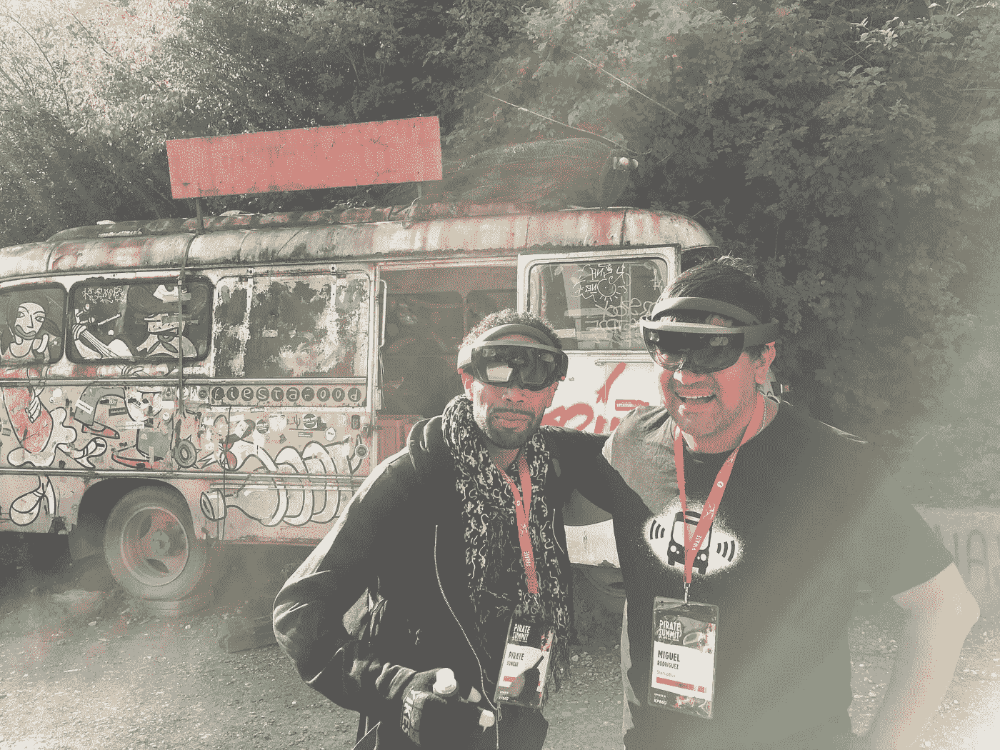
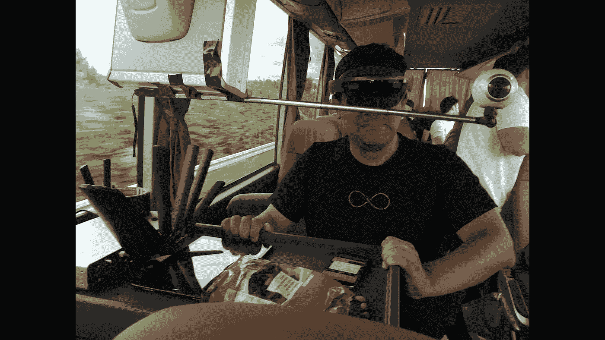
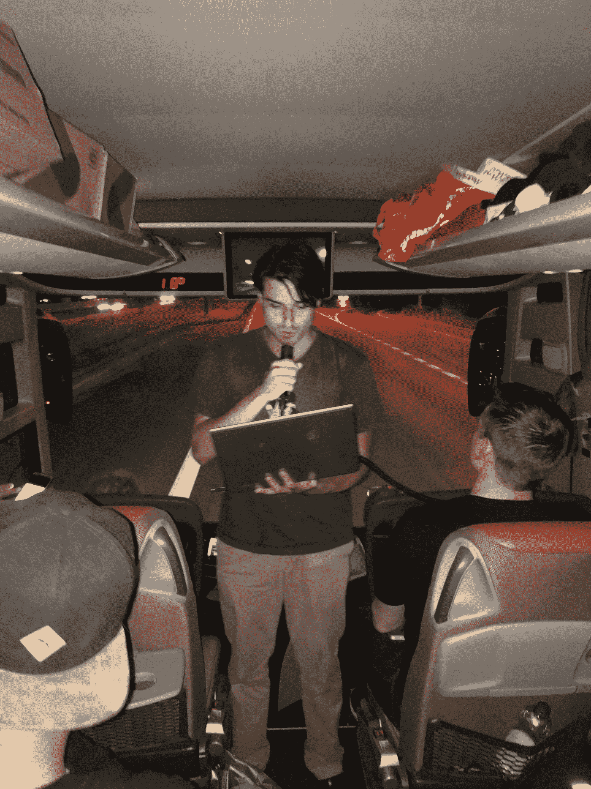
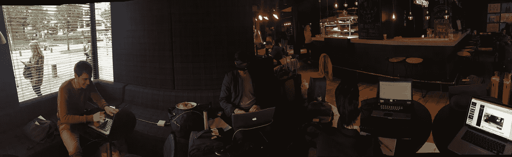
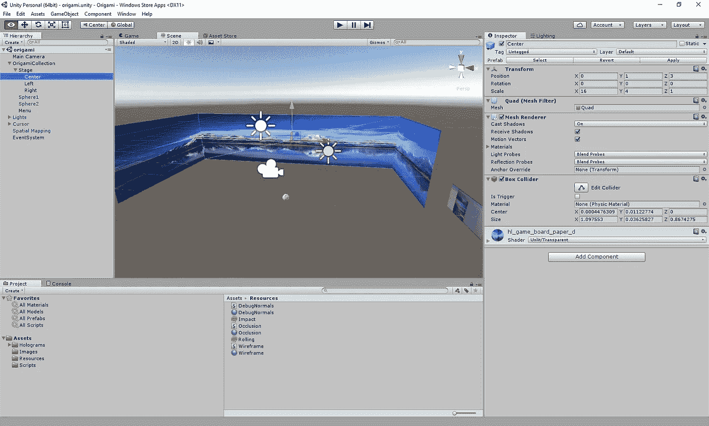
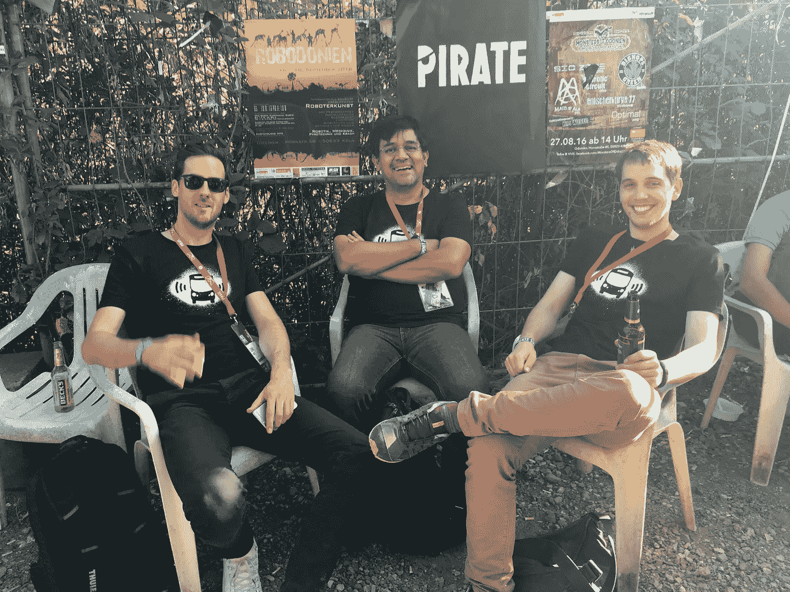

# 别叫我布鲁姆兄弟！，或者在 3 天内编写一个 Hololens 应用

> 原文：<https://medium.com/hackernoon/dont-bloom-me-bro-or-writing-a-hololens-application-in-3-days-7c9589b8408a>

Two Hololens wearing guys. Me and my friend Ptah Dunbar at the Pirate Summit in Cologne, Germany

两周前我参加了欧洲 StartupBus 竞赛。对于那些没有听说过它的人来说，这是一个 72 小时穿越欧洲的黑客马拉松，在科隆为期两天的海盗峰会上结束。它的形式和大多数黑客马拉松一样:在活动开始时，人们会提出他们想要研究的想法。参与者选出最好的想法，并组成团队来实现它们。理想的团队有开发人员、设计人员和业务人员。

我们的大巴从苏黎世到莱比锡，然后去了柏林、汉堡、阿姆斯特丹，最后去了比利时哈瑟尔特的展示日。在苏黎世，我们从[瑞士创业工厂](https://www.swissstartupfactory.com/)开始。在莱比锡，我们受到了[自旋实验室](http://www.spinlab.co/)人员的接待。在柏林，我们参观了[项目 A](https://www.project-a.com/en) ，在汉诺威，来自 [Mindspace](http://mindspace.me/hamburg/) 的人们得知我们晚上没有预订酒店时，让我们睡在他们的沙发上。在阿姆斯特丹我们由 [TQ](http://tq.co/) 主持，在哈瑟尔特的决赛由 [Corda](http://www.cordacampus.com/en/corda-incubator/welcome) 主持。普通的黑客马拉松和移动黑客马拉松有一些不同。首先是上网。当我们的互联网连接停止工作时，我们知道我们已经跨越了一个国家的边界。

Augmented reality on the road

另一个不同之处是强调推销和提炼想法。在我参加和组织的大多数黑客马拉松中，重点是技术解决方案，演示幻灯片在最后匆忙完成。在公共汽车上，你有足够的时间练习推销，而且在路上也没有别的事可做。

Pitch, Pitch, Pitch.

> 就像父母希望让他们的孩子在旅途中忙碌一样，我们的指挥通过让团队一路上完善他们的球场来让我们忙碌

我在虚拟现实(VR)领域工作，希望获得为 [Hololens](https://www.youtube.com/watch?v=aThCr0PsyuA) 编程的经验，这是一种增强现实(AR)设备。VR 和 AR 的主要区别在于，在 VR 中，用户只能看到她眼前的屏幕，而在 AR 中，这些屏幕是半透明的，用户可以与她的周围环境进行交互。

理论上，AR 设备可以检测你看到的面孔，并显示一个标有他们名字的标签。或者它可以向你展示你旁边虚拟物体的投影。这些物体，在 Hololens 术语中称为全息图，也可以与你互动。

Hackers at work

与 Hololens 互动的方式是将你的目光聚焦在一个物体上，然后使用语音命令或做手势。有点击手势、拖动手势和退出手势。这个手势被称为 bloom，因为它看起来好像是一朵盛开的花。

回到比赛，我们的团队 Immerse 设定的目标是将图像投射到用户可以定义的虚拟墙壁上。在世界各地的许多古代遗迹中，你可以看到人们会在墙上绘画来描绘场景。这是他们把自己传送到另一个世界，或者讲故事的一种方式。使用 AR 设备，每个用户都可以选择在他们的房间里拥有不同的背景。如果你的女朋友更喜欢在海滩上，而你喜欢在山上的湖边，你们可以在 AR 设备中把自己传送到这些虚拟环境中，同时仍然意识到房间中的另一个人。

在这三天里，我学到了一些与全息透镜相关的东西:

*   团结是你的朋友。Unity 是一个游戏开发环境，可以开发出在多种平台上运行的程序。如果使用得当，这个平台可以让你与物体互动，而不必考虑它们的物理(重力)或光效
*   在全息透镜中，你不需要灯光效果
*   Hololens 设备网页是解决问题的地方。

*   设备仿真程序只能带你到这里。
*   在颠簸的公交车内，Hololens 有时无法锁定背景墙。

经过 3 天的开发，短暂的夜晚，绝望和希望的过山车，我们有了我们的原型工作。在演示的那天，当我们为演示做准备时，电视摄制组跟着我们。我们的幻灯片已经准备好了，我们已经练习了十几次舞蹈动作。一个人戴着全息眼镜，另一个人操作电脑，还有一个人做演示。很顺利，我们也很开心。一位技术评委告诉我，他认为我们在活动期间开发的技术排在前 3 位。我们仍然没有进入决赛。陪审团只是没有看到背后的商业案例。老实说，他们是对的。正如比尔·盖茨所说:我们倾向于高估 6 个月后会发生什么，低估 5 年后会发生什么。

我们去了科隆的海盗峰会。那里有一套关于全息透镜的新知识在等着我:

*   戴上设备会吸引那些想看你在做什么的人的注意。
*   这个装置足够亮，可以在白天看到东西。当然，更暗的地方更容易看到所有细节。
*   随身携带一个绑在设备上的电池组比一直开关它要好
*   长时间佩戴该设备会让你头疼。是的，它很重

A bunch of pirates having the “are we living in a simulation” discussion

*   佩戴 Hololens 的人的手势会影响你的设备。我的好朋友 Ptar Dunbar 曾经给我开过花。

黑客马拉松一直是真正了解软件开发人员或设计人员的好机会。时间的减少和环境的压力带来了最好的人。你可以在几个小时内弄清楚一个人对挫折的反应。在一次黑客马拉松之后，你和你交往过的人建立了更深的关系。启动总线将这种体验提升了一个层次。这是一个密集的工作，密集的聚会伊比沙岛风格，与志同道合的人深入接触的组合。我知道我已经获得了一群一生的朋友。我可以把 [Startupbus](http://europe.startupbus.com/) 的体验推荐给大家。

> [黑客中午](http://bit.ly/Hackernoon)是黑客如何开始他们的下午。我们是 [@AMI](http://bit.ly/atAMIatAMI) 家庭的一员。我们现在[接受投稿](http://bit.ly/hackernoonsubmission)并乐意[讨论广告&赞助](mailto:partners@amipublications.com)机会。
> 
> 如果你喜欢这个故事，我们推荐你阅读我们的[最新科技故事](http://bit.ly/hackernoonlatestt)和[趋势科技故事](https://hackernoon.com/trending)。直到下一次，不要把世界的现实想当然！

