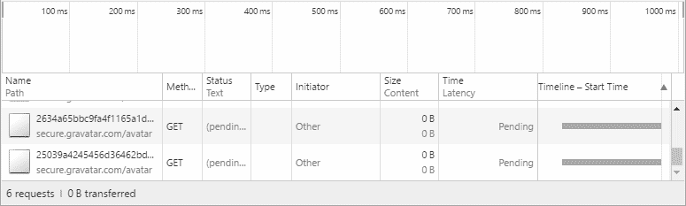
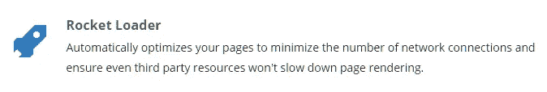

# 不要为字体刹车:快速显示内容的 3 种网络表现技巧

> 原文：<https://medium.com/hackernoon/dont-brake-for-fonts-3-web-performance-techniques-to-show-content-quickly-fdefcd0d2028>

Load the base of your content first ([Wikipedia](https://en.wikipedia.org/wiki/Eiffel_Tower))

如果你能看到一个网站的布局，你应该同时看到它的文字。如果没有，把这篇文章发给他们。

如果你以前见过这种情况，请阻止我:你点击一篇文章，它似乎已经加载，包括布局和颜色，但你看不到你想阅读的文本。原来，你在等待字体加载。好消息:我将解释出版商如何避免建立这样的网站，除非他们希望访问者放弃，关闭页面，回到脸书。

快速网站胜出:它们有利于用户体验，有利于商业目标，包括搜索排名。我建议的技术可能会使网页分阶段出现，而不是等到完整的设计下载，但这就是媒体的本质:实时网站不像纸质手册。

# 学习减少网络请求

最近，我在[智能博客](https://smartblogger.com/)致力于提高网页性能。通过使用 webpagetest.org 和 T4[等工具，蒂姆·加里](https://twitter.com/mindcue)和我开始减少启动页面渲染的时间。在这种情况下，一旦你少于 5 秒，每减少十分之一秒(0.1 秒)就算作进步。

在尝试各种优化的过程中，我学到了一些新东西:HTTP 资源的数量很重要，而不仅仅是它们的文件大小。换句话说，页面速度取决于网络拥塞，而不仅仅是带宽。即使给定 HTTP/2 和保持活动连接，这仍然是正确的。

例如，智能博客上的文章带有被称为 Gravatars 的个人资料图片。我们使用开发人员工具观察到，打开一篇文章会引发对 Gravatars 的大量网络请求，这降低了获取呈现阻塞资源的速度，比如文档头中的样式表。这毫无意义:低优先级的图片只有在滚动几屏后才可见，不应该延迟文章标题的显示。

鉴于这种经历，我在本文中的重点是通过减少初始网络请求来加速内容。Web 性能是一个广阔的领域，涵盖了 web 开发的所有领域，包括服务器、网络和浏览器，但是我相信这些技术在与任何其他提高页面速度的努力相结合时会非常有效。

# 1.惰性装载

## 字体

多亏了网络字体，这十年的在线排版已经远远超出了乔治亚州和 Verdana。今天，《纽约客》的网站看起来几乎像一本杂志。然而，这一进步的代价却引起了激烈的争论:字体加载时“看不见的文字一闪而过”的糟糕体验。

这种冲突是不必要的。通过异步字体加载，我们可以同时实现良好的排版和快速的页面:新访问者在网页字体加载之前会得到后备字体，而回访者会立即从浏览器缓存中得到网页字体。

异步加载代码可以从流行的 web 字体提供商那里获得。

*   TypeKit 的[嵌入代码](https://helpx.adobe.com/typekit/using/embed-codes.html)
*   谷歌字体使用[网络字体加载器](https://github.com/typekit/webfontloader)。
*   字体 Awesome，流行的图标字体，提供了[异步代码](http://fontawesome.io/get-started/)。

网络字体加载器可用于托管在不同位置的字体:'[使用网络字体加载器加载网络字体](https://css-tricks.com/loading-web-fonts-with-the-web-font-loader/)'。另一种选择是使用[字体外观观察者](https://fontfaceobserver.com/)库，如“字体事件重新访问[字体加载”中所述。](https://www.filamentgroup.com/lab/font-events.html)

更多信息:'[分析 Web 字体性能](https://www.keycdn.com/blog/web-font-performance/)'。

## 形象

大多数图像延迟加载技术背后的概念是在标记中创建一个占位符图像，当页面的该部分滚动到视区时，该图像将被预期的图像替换。占位符有一个临时的 *src* 属性，这个属性稍后会被目标图像的 URL 覆盖，这会提示浏览器在该点获取新图像。

要使用的代码取决于您的具体设置，但网上有各种示例。对于 WordPress，我们使用了 [a3 惰性加载](https://wordpress.org/plugins/a3-lazy-load/)插件。

*注意:*由于惰性加载依赖于 JavaScript，所以使用 *noscript* 标签为搜索引擎机器人之类的非 JavaScript 客户端提供带有预期 URL*的图像标签。a3 惰性加载插件在我们的例子中处理了这个问题。*

# 2.组合多个 CSS 和 JavaScript 文件

Send them together ([wikimedia](https://commons.wikimedia.org/wiki/File:Volkswagen_Titan_Tractor_(8861446739).jpg))

减少 HTTP 请求数量的一个简单方法是将多个相同类型的文件合并成一个文件。在复杂的站点上，这通常由捆扎机和其他工作流工具自动管理，但在简单的站点上，这可能是手动处理的偶然优化。

我们为 WordPress 使用了[自动优化](https://wordpress.org/plugins/autoptimize/)插件。它有许多特点；我们只用它来组合 CSS 文件。

*注意:*合并文件时要小心，确保不会引入 bug。例如，CSS 级联和 JavaScript 程序都可以依赖于特定顺序的代码。此外，如果 CSS 或 JS 在站点的不同页面上是不同的，您可能更喜欢将一些文件分开，这样它们可以被缓存以供重复访问者使用，而不是创建各种组合。

# 3.CloudFlare 火箭装载器

大多数 web 性能技术就像一把手术刀，错综复杂地调整你的代码和资源，[火箭加载器](https://support.cloudflare.com/hc/en-us/articles/200168056-What-does-Rocket-Loader-do-)是一把锤子。它几乎停止了所有的 JavaScript，直到初始页面加载完成。如果你的页面包括像分析、社交分享按钮和注册表单这样的外部小部件，Rocket Loader 可能会非常有效，并且可以减少几秒钟的首次渲染时间。

Rocket Loader 可以被指示[忽略特定的脚本](https://support.cloudflare.com/hc/en-us/articles/200169436-How-can-I-have-Rocket-Loader-ignore-my-script-s-in-Automatic-Mode-)，我们必须为字体加载脚本和其他代码指定这些脚本。

您必须设置您的网站以使用 CloudFlare，这是一个具有战略和技术层面的决定。

*注意:*你可能不希望在只呈现客户端标记的网页上使用 Rocket Loader，比如 React、Angular 或 Ember 等 JavaScript 框架支持的单页应用。

# 潜在问题

## 回流

When you can’t use a website because the layout reflows ([Jamiroquai — Virtual Insanity](https://www.youtube.com/watch?v=4JkIs37a2JE))

延迟加载的一个主要问题是它会导致页面布局重排。如果你在一个页面中插入一个元素，并且布局改变以适应它，那么新元素周围的任何内容都会突然移动，这对于在手机上使用该网站的人来说尤其糟糕。注意让占位符元素具有适当的尺寸，以最小化这种布局调整。

这个问题在文章中有详细介绍:“我们的最佳实践正在扼杀移动网络性能”

## 浏览器应该支持本地延迟加载

当前的延迟加载技术使用 JavaScript 工作区。这增加了复杂性，因为没有标准代码或方法，如果您希望惰性加载的元素也存在于无脚本的 HTML 文档中，您需要在 *noscript* 标记中提供替代标记。

我建议浏览器供应商在像 *img* 、*脚本*和*链接*这样的元素上支持像 *lazyload* 这样的属性，以便在初始文档加载后只获取用该属性指定的资源。(*脚本*元素具有 *defer* 和 *async* 属性，但是它们实际上并不延迟获取脚本的 HTTP 请求。)

# 摘要

Web 性能是一个复杂的话题，但是非常值得一试。通过渐进式增强和延迟加载来减少初始网络请求有助于尽可能快地进行初始渲染。首先显示基本内容，然后加载增强功能，如字体、媒体和脚本，使用户体验与美学设计和业务目标相协调。

# 后续步骤

如果你觉得这篇文章有价值，Paypal 提示[非常感谢。](https://www.paypal.me/FirasDurri/10)

如果你的网站或组织需要提高网站性能，请联系我(gmail 的 firasd)——我和我的同事可以帮忙。

*问题或反馈？请在评论中告诉我。*

这篇文章有帮助吗？ [*支付宝提示*](https://www.paypal.me/FirasDurri/10) *都很感谢。*

我正在开发一款播客探索应用。在 [*报名更新 niceasthis.com*](http://niceasthis.com/)*或者关注*[*twitter.com/niceasthis*](https://twitter.com/niceasthis)*和*[*facebook.com/niceasthis*](https://www.facebook.com/niceasthis)

*我也在找 web 开发项目，最好是 WordPress 或者 React 相关的；*[*LinkedIn*](https://www.linkedin.com/in/firasd)*上关于我背景的一些信息。*

*你可以在*[*Twitter*](https://twitter.com/firasd)*、*[*LinkedIn*](https://www.linkedin.com/in/firasd)*或 firasd at gmail* 上与我联系

*我写的其他东西你可能会喜欢:*

*   [*iTunes 永远不会好用*](/@firasd/itunes-will-never-work-well-973674420fa4)
*   [*不同意贾森·卡拉卡尼斯关于平台的观点*](/@firasd/disagreeing-with-jason-calacanis-about-platforms-60807f7575c2)
*   [*软件上有先见之明的乔尔*](/@firasd/things-i-read-on-joel-on-software-that-came-true-cd201c03cf58) *:我读到的想法在我的职业生涯中实现了*
*   [*快速入门教程:通用 React，带服务器端渲染*](/@firasd/quick-start-tutorial-universal-react-with-server-side-rendering-76fe5363d6e)
*   [*数据接口:使用 React 跨设备同步更新和离线活动*](/@firasd/interface-from-data-using-react-to-sync-updates-and-offline-activity-across-devices-f672b213701c)
*   [*印度移动钱包:增长机遇*](/@firasd/mobile-wallets-in-india-growth-opportunities-slide-deck-70539cc003c8) *【幻灯片】*

> [黑客中午](http://bit.ly/Hackernoon)是黑客如何开始他们的下午。我们是 [@AMI](http://bit.ly/atAMIatAMI) 家庭的一员。我们现在[接受投稿](http://bit.ly/hackernoonsubmission)并乐意[讨论广告&赞助](mailto:partners@amipublications.com)机会。
> 
> 如果你喜欢这个故事，我们推荐你阅读我们的[最新科技故事](http://bit.ly/hackernoonlatestt)和[趋势科技故事](https://hackernoon.com/trending)。直到下一次，不要把世界的现实想当然！

