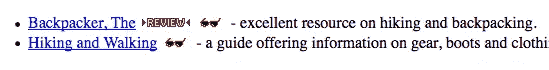

# 不要做 App，要做业务

> 原文：<https://medium.com/hackernoon/dont-build-an-app-build-a-business-de1ec9742a63>

第一，历史重演。第二,“有一个应用程序”的日子已经过去了。因为第一点，我可以证明第二点。让我解释一下。

photo Rami Al-zayat

# **一点历史**

我从 90 年代中期开始建立网页(是的，实际上是上个世纪)。当时，没有 ie 浏览器，没有 CSS，甚至没有烦人的<blink>或<marquee>标签。网络世界最大的发展是引入了标签。这意味着我们实际上可以在网页中拥有多栏文本！</marquee></blink> 

人们花数小时“浏览网页”寻找任何和所有的东西。为什么？因为互联网是新生事物，人们对如此多的网页着迷。你带着一种冒险的感觉开始了你的浏览，不确定你会发现什么。

这个互联网的东西看起来很酷，所以我决定最好的方式就是实际做点东西。我创建了一个关于野外背包旅行的网页，贴了几张我旅途中的照片，并把它放在我大学的服务器上。这是我的爱好，我玩得很开心。

很快我注意到来自世界各地的人都在看这个网站，所以我决定更认真地对待这件事。我买了一个域名，thebackpacker.com，把这个网站变成了所有背包客的通用资源。

我花了很多时间在网站上工作，我的流量开始增长。我把这种早期的成功很大程度上归功于先行者的优势。当时没有太多的竞争，所以 thebackpacker.com 被列在网络目录中作为背包旅行的顶级资源。我甚至在雅虎目录中找到了梦寐以求的太阳镜，因为它是一个“酷”的网站。

It always bugged me that Yahoo spelled my site “Backpacker, The”

*快速补充说明*:我非常努力地让 thebackpacker.com 成为一个提供有用内容的“严肃”网站。但是有一天《今日美国》报道了仓鼠舞的网页，我简直想尖叫。真的吗？！一堆动画仓鼠的 gif 和令人讨厌的令人上瘾的背景主题曲被视为国家新闻？好吧，咆哮结束。

当 21 世纪初的互联网泡沫发生时，投资者终于意识到这些疯狂的网页实际上并没有赚很多钱。人们开始厌倦只是“浏览”看看外面有什么。公司意识到他们的网站需要有一个目的；他们需要为消费者提供真正的价值，而不仅仅是华而不实的小册子。由此衍生出许多我们今天认为理所当然的东西:网上银行、在线旅游预订，以及亚马逊销售的不仅仅是书籍。

这些企业的成功仅仅是因为他们的网站吗？不。他们利用他们的网站作为扩大业务范围的一种方式。

# **进入智能手机**

几年后，智能手机时代开始了。我必须承认，我不是一个早期采用者，我更是一个怀疑论者。但我很快开始摆弄制作移动应用程序，我的公司开发了一些游戏，作为进入应用程序领域的一种方式。当[私酒赛跑者](https://itunes.apple.com/us/app/moonshine-runners/id600897197?mt=8)在 iTunes 中被编辑选为“最新动态”时，我们感到惊喜。

我不会把这种成功称为先发优势，当时 app store 中有大量的应用程序，但 Moonshine Runners 是在 app store 还处于早期增长期时推出的。这是我称之为“有一个应用程序”的时期。

就像早期的互联网一样，人们渴望看到外面有什么。他们会下载任何一个应用程序，只是为了检验一下。这导致了“放屁按钮”应用的兴起。你知道这些应用程序。那些用一些愚蠢的前提吸引你的应用程序，本质上没有长期价值。你甚至可以称之为智能手机时代的仓鼠舞。

在推出 Moonshine Runners 后不久，应用商店中的应用数量激增，苹果开始采取行动打击无聊的应用，人们厌倦了下载应用。

现在，成为苹果的特色是非常困难的，仅仅发布一个应用程序并不意味着任何人都能找到它。像脸书和谷歌这样的主要玩家占据了下载排行榜的前列。“有专门的应用程序”的日子已经过去了。再见了，愚蠢的放屁按钮。

如今，人们希望应用程序能够为他们提供真正的价值，让他们的日常生活更加轻松。听起来熟悉吗？网站在 21 世纪初经历了同样的转变。移动应用程序现在正在经历同样的转变。

# **应用程序死了吗？**

网站没有在早期互联网泡沫后消亡，移动应用也不会很快消亡。我们只需要调整我们对开发什么类型的新应用的想法。展望未来，成功的移动应用将为企业提供一种以有价值的方式接触客户的方式。

作为一名移动应用程序开发人员，人们总是向我提出他们关于新应用程序的伟大想法。当他们描述他们的想法时，我真正倾听的是应用程序背后的业务。

一个追踪自由职业者工作时间的 app，并不是一个考勤表 app。这是一家开账单和发票的公司，碰巧有一款应用程序可以用来输入时间。

卡路里计算应用不仅仅是每日食物日志。这是健身公司每天与客户保持联系的一种方式。

移动应用应该帮助企业实现其目标。首先关注你的业务。你想达到什么目标？然后思考什么技术可以帮助你实现这些目标。有些公司可能不需要应用程序。其他人可能需要非常复杂的应用程序。

> 让您的业务目标决定您的技术，而不是您的技术决定您的业务目标。

如果你真的创作了像仓鼠舞这样令人讨厌地上瘾的东西，20 年后人们可能还会谈论它。([看仓鼠跳舞](https://www.youtube.com/watch?v=6WpMlwVwydo)

如果你正在寻找一个数字项目的帮助，看看我们的公司**。我们还通过我们的 [**用户挂钩**](http://userhook.com) 服务，帮助移动应用获得用户参与和反馈。**

************

> **[黑客中午](http://bit.ly/Hackernoon)是黑客如何开始他们的下午。我们是阿妹家庭的一员。我们现在[接受投稿](http://bit.ly/hackernoonsubmission)并乐意[讨论广告&赞助](mailto:partners@amipublications.com)机会。**
> 
> **如果你喜欢这个故事，我们推荐你阅读我们的[最新科技故事](http://bit.ly/hackernoonlatestt)和[趋势科技故事](https://hackernoon.com/trending)。直到下一次，不要把世界的现实想当然！**

****