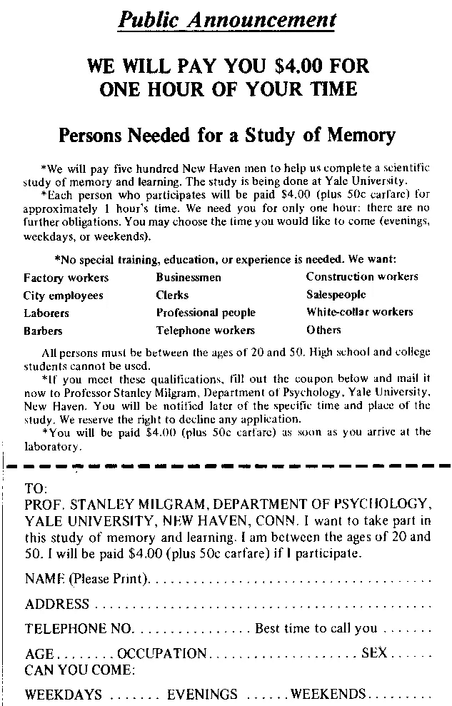

# 不要吃冰淇淋:赞扬不服从物联网(以及设备和其他连接的东西发出的命令)

> 原文：<https://medium.com/hackernoon/dont-eat-the-ice-cream-in-praise-disobedience-to-iot-f4024b60dcdb>

每天我们都被订单轰炸。一些大的，一些小的，一些来自我们的思想，一些来自其他人的思想，最近，一些来自厨房或办公室桌子上的设备，看起来无害且出乎意料地安静。

正如我们喜欢认为我们对人发出的命令非常熟悉一样，我们应该如何接受设备发出的命令呢？

当我第一次听说米尔格拉姆的研究时，我没有意识到它会给我留下持久的印象。1961 年，在纽伦堡审判后——主要罪犯使用他们“只是服从命令”的论点来证明二战中的大规模杀戮是正当的——耶鲁大学教授米尔格拉姆进行了一项研究，研究人们在服从涉及伤害他人的指令方面能走多远。

为了做到这一点，他邀请普通人和不知情的人作为志愿者参与一项与现实中不同的实验。他让一些工作人员扮演“实验者”的角色——每当参与者对单词配对问题的回答错误时，这个人就会命令参与者对其他人实施电击(在这种情况下，演员会模仿疼痛的声音)。

Invitation for the study

这项研究的设置中有许多有趣的细节，我认为更多地了解它对所有人都有好处(你可以很容易地在网上找到这篇论文和大量其他信息)，但长话短说，令人惊讶和有些震惊的结果是，尽管被警告随着电击在问卷和电压表上的进展，电击会引起逐渐增加的疼痛，参与者仍然服从命令服用它们(实验者没有提供更多关于他们为什么应该这样做的详细说明)。

事实上，65%的人继续实施电击，直到放电达到最高水平，这意味着比最初预期的少得多的人提供了某种抵抗和拒绝继续下去。

**这揭示了人性中对权威的某种自动服从反应，我发现这非常令人不安，并且一直持续到今天。**

我相信，正是从那时起，我对权威有所保留，特别是那种通过提高声音来维护自己的权威，而不提供任何理由来解释为什么它的命令应该被服从的权威。(在青少年时期，Greenday 的歌曲“Minority”的歌词进一步助长了这种情绪，一遍又一遍地重播，哦耶🤘).

> “我不需要你的权威/与道德上的大多数人一起走/因为我想成为少数派”

原则上，如果人们培养出对权威的健康的不尊重，遵守他们并不完全理解的命令，历史似乎在某些方面会更好。也许作为个人，面对一些压力仍然很难，但如果大众选择这种质疑权威的行为，有些事情可能会以其他方式进行。好吧，我承认，当涉及到历史时，“如果…会怎样”的练习总是有些多余，是的，事后诸葛亮可能特别烦人…

这让我想起了那个特殊的日子，当时我的手表给了我一个闪烁的命令:“让你的一天充满体育活动”……如果 facebook 没有在几天前给我一个有点相反的命令“更有规律地发帖”，那就太好了。

**做什么？**

**人们突然意识到，如果设备变得越来越聪明，识别出有时甚至对我们自己都不明显的模式，并大声喊出命令，那么我们作为人类，能够从不太好的命令中挑选出好的命令，而不是像米尔格拉姆研究的志愿者那样怯懦地服从一切，冒着危险，愿意通过这样做来伤害他人和自己，这是绝对重要的。**

如果机器对我们现在不那么亲密的想法变得越来越聪明，那么我们一定不能忘记，大多数机器都是为他人服务的，它们的创造者，我们的健康和福祉是否是它们最终优化的目标还不清楚。

## 不要吃冰淇淋(除非它对你有好处并且你想吃)

在新的一年即将到来之际，我敢说，如果不是以前的话，也许人类前进的关键技能之一是能够将命令分解为基本组成部分，试图评估什么对我们最有帮助，并意识到(很高兴)现在机器根本不能(也许还不能)强迫我们做它们想让我们做的任何事情——它们大多可以像其他人一样大声喊出命令。这仍然是我们自己的事情，决定是否遵从，参与到我们身上。

冰淇淋品牌 Halo Top 的《广告周刊》2017 年 10 大最佳广告之一(或许也是最令人毛骨悚然的广告之一的有力竞争者)中，一个女人被一台机器喂冰淇淋，这台机器令人讨厌地决定什么对她最好，似乎完全无法拒绝这种供应，与此不同，我们对此仍然有发言权。

说到广告，几乎每个人都熟悉这样一种技巧:让某人穿上实验服，利用他/她的临时“权力”向我们推销更多的牙刷或洗衣粉。这已经被使用了几十年，并且是权威对我们说话的形式之一，再次触发我们相信和服从它的本能。

也许比人们谈论的工作会被机器偷走等等更紧迫的是，我们主要关心的应该是已经由成千上万的设备和应用程序发出的成千上万的订单，这些订单在某种程度上并不符合我们的最佳利益，尽管肯定符合其他人的利益。

这让我想到了另一点，如果有一天机器能够比我们更好地了解我们自己——我非常惊讶地看到，机器能够识别算法图像中的人，而人眼无法识别——当它们知道所有要按的按钮和我们用来完成某件事情的单词时，会发生什么？

只有观察和批判性思维技能的发展，也许还有一点历史知识，才能阻止我们自动同意对我们的要求。或者，只考虑我们最大利益的最终系统的价格会是多少？在这个时代，谁会愿意卖掉它，当他们可以收到每日租金，优化他们的利益第一？

在熟悉了布拉德伯里、赫胥黎和奥威尔的经典反乌托邦作品，并观察到它们在今年如何与《黑镜》系列一起被引用，作为一个不太遥远的[未来](https://hackernoon.com/tagged/future)的真实写照，这些是我的新年愿望:

**这样你就可以拒绝冰淇淋，除非它对你有好处，而且你真的想吃。**

更新:就在昨天，1 月 13 日，我去看了戈特霍尔德·埃夫莱姆·莱辛的戏剧《智者内森》(1779)。对话中的一句话引起了共鸣，似乎特别及时，与这次讨论相关……如此巧合，写于 200 多年前:

“这么说，你毫无顾忌地服从了？

修士。

是服从吗，好先生？

圣殿骑士。"