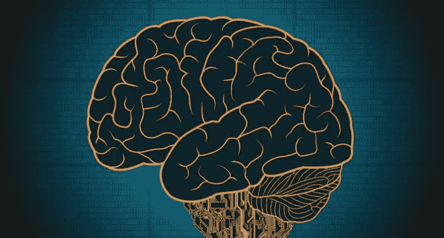

# 不要害怕 AI，害怕人类的愚蠢

> 原文：<https://medium.com/hackernoon/dont-fear-ai-fear-human-stupidity-437fd22e1a93>

去年，著名的理论物理学家斯蒂芬·霍金打趣说[人工智能](https://hackernoon.com/tagged/artificial-intelligence)是“人类有史以来最好或最糟糕的事情。”

有这种想法的不止他一个人。对于人工智能算法将使世界变得更好的每一个宣告，似乎都有一个反乌托邦的反驳[技术](https://hackernoon.com/tagged/technology)将毁灭人类。后一种观点的支持者经常援引终结者般的形象来说明超级智能机器人霸主将很快给人类带来的风险。然而，这一观点与玛丽·雪莱于 1818 年首次出版的《弗兰肯斯坦》有着几乎相同的地方。主要区别在于，它用人工智能机器人取代了科学怪人。

然而，这些场景中的大多数都经不起更仔细的审视。为什么人工智能机器人想要灭绝人类——特别是如果它们是智能的话？这种担心本身是理性的吗？“我担心的不是人工智能，而是人类的愚蠢，”未来学家彼得·迪亚曼迪斯在他的[指数智慧播客第 33 集](http://www.abundance360summit.com/podcast/2017/03/31/episode-33-evolution-of-humanity-with-ai/)中引用了他的同事尼尔·雅各布斯坦的话，他是奇点大学人工智能部门的负责人。

我们最好关注人类的非理性思维模式，而不是害怕一些人工智能怪物。这样做将揭示我们不合逻辑的偏见和思维模式，这些偏见和思维模式可能会侵入人工智能算法。这也将有助于理解人工智能如何克服我们固有的智力障碍并提高生产率。

丹尼尔·卡内曼的《思考快慢》一书是这方面的宝贵资源。这本书总结了导致卡尼曼 2002 年诺贝尔经济学奖的几十年的研究。它触及偏见的心理学基础，同时也探索行为经济学。他的发现也挑战了现代经济理论中人类理性的假设。

大脑的两个系统

以下是一个概述:

忙碌系统和懒惰系统

系统 1(快速)是不由自主地、自动地、快速地运行，很少或没有努力，也没有自主控制的感觉。这个系统负责我们的直觉、感觉和印象。相反，系统 2(慢)将注意力分配给需要它的费力的脑力活动，包括复杂的计算。系统 2 要求专注，并形成我们的信念。系统 2 的运作与代理、选择和集中的主观体验相联系。系统 2 可以在我们所谓的“自我控制”下在一定程度上改变系统 1。然而，在多任务处理过程中，事情变得更加棘手。

注意力和努力或认知放松和认知紧张

系统 1 永远在线，永远忙碌，永远在寻找答案。它控制着我们所做的一切都是自动的、无意识的和本能的。无论我们是否寻找，它都会给我们提供信息，制造偏见，告诉我们是“喜欢”还是“不喜欢”事物。系统 2 执行系统 1 不能执行的任务。因此，这两个系统必须共同创造一个功能良好的头脑。系统 2 又慢又懒。根据体力消耗最小的法则，这个系统寻求做尽可能少的事情。因此，我们天生懒惰，这就是为什么我们的大脑使用启发式方法来完成工作。

系统 1 总是在计算，如果需要更多的努力，就点击系统 2。如果我们的大脑感觉一切都很好，我们就会受益于认知上的轻松和愉悦(我们喜欢我们所看到的，感到舒适，等等)。).如果我们的大脑识别新信息，检测潜在威胁，重要数据，或未满足的需求，我们就会经历认知压力。在这种状态下，我们不太舒服，但往往会犯更少的错误。这些概念只是指处理信息所需的努力程度。人类试图避免认知紧张，这让我们特别容易受到偏见的影响。我们试图通过懒惰来证实那些导致糟糕决策的偏见。

启发式，精神散弹枪

系统 1 的功能是通过妄下结论，而不是仔细权衡，得出的答案几乎是基于以前的经验。系统 1 在直觉思维中使用这种有限的经验，并仅基于该证据得出结论，这在决策时并不理想。

当头脑遇到一个困难的问题或概念，并且没有立即的答案出现时，系统 1 参与替换，搜索一个相关的、更简单的问题，而不是回答出现的更困难的问题。这个概念也被称为“精神猎枪”这个原理解释了为什么人类会有如此强烈的偏见，并且可以完全意识不到。我们可以否认那些偏见的存在，即使被其他人指出，如视错觉、种族刻板印象、对什么是公平的快速判断和因果判断。

规划谬误

卡尼曼描述的启发式和偏见包括锚定、可用性、叙事谬误和结果偏见。当过去有缺陷的故事塑造了我们看待世界的方式和我们对未来的期望时，叙事谬误就出现了。当我们基于结果而不是独特的环境来判断过去时，就会产生结果偏差。后见之明偏差是另一种谬误，它倾向于认为你一直都知道一些事情，而实际上你可能并不知道。

规避风险和损失

这种偏见是指我们低估了未来任务的时间、风险和成本，高估了收益，即使我们应该更清楚。

沉没成本谬误和对后悔的恐惧

风险厌恶指的是当暴露于不确定性时，我们以试图减少不确定性的方式行事，我们回避风险，即使确定的结果远不如在冒险的行动过程中有利。

体验自我和记忆自我

沉没成本是我们已经发生的成本，但由于我们对风险的厌恶，它会影响我们当前的决策。我们支付的价格是潜在现值的衡量标准。

算法的准确性

体验自我凭直觉快速运作，随后被记忆自我找回，但经常被大脑改变和着色。

这一切意味着什么

在预测未来时，算法几乎总是比人更准确——即使是专家。人类，即使是受过高等教育的人，也是不一致的，经常错误地相信他们的直觉或“直觉”。通过算法传递的数据远比人类的解释更加一致和公正。算法是执行特定功能的一步一步的过程，如果正确遵循，最终会得到相同的结果。如果给定相同的输出，算法将总是执行相同的输出，并且可以创建简短的算法来执行复杂的任务。这就像一个食谱。

由于错误的偏见、启发、谬误和厌恶，我们不能总是相信自己的想法和直觉。我们应该试着用缓慢的思维和系统的方法来处理问题，试着避免匆忙下结论和解决那些似乎有简单答案的问题。认识到我们容易受偏见、成见、成见和谬误影响的自然倾向。试着去探索，不要用懒惰的决策，我们并不像自己认为的那样了解这个世界。我们应该尽可能仔细地、慢慢地思考。卡尼曼说要怀疑我们的判断和直觉，花时间去评估我们脑海中出现的想法。我们的大脑生来就会犯错，夸大事实，并渴望忽视自己的无知。也许这可以帮助我们有效地处理种族主义、贫困、暴力和不平等等问题，同时还可以开发出可以推动物联网实施的算法。

算法并不完美，凯茜·奥尼尔的《数学毁灭武器》是一个警示故事，讲述了错误的变量设计和基于人类偏见的强化模型。然而，从整体来看，数据科学、算法和人工智能可以帮助人类决策和寻找真相。我们必须认识到，许多人工智能将建立在机器对机器的输入和输出上，例如，传感器阈值来产生行动，而不是人类的感叹。基于证据、数据驱动的人员、组织和任务有助于避免误解、冲突或做出更好的决策。

*原载于 2017 年 5 月 4 日*[*【https://www.linkedin.com*](https://www.linkedin.com/pulse/dont-fear-ai-human-stupidity-dan-yarmoluk)*。*

> [黑客中午](http://bit.ly/Hackernoon)是黑客如何开始他们的下午。我们是阿妹家庭的一员。我们现在[接受投稿](http://bit.ly/hackernoonsubmission)并乐意[讨论广告&赞助](mailto:partners@amipublications.com)机会。
> 
> 如果你喜欢这个故事，我们推荐你阅读我们的[最新科技故事](http://bit.ly/hackernoonlatestt)和[趋势科技故事](https://hackernoon.com/trending)。直到下一次，不要把世界的现实想当然！

