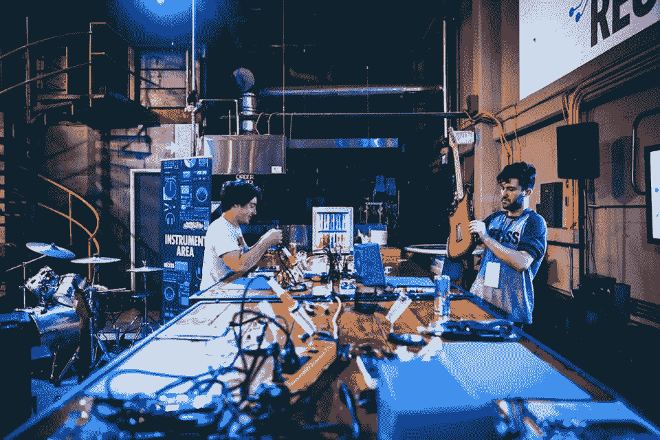
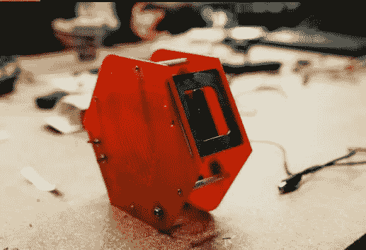
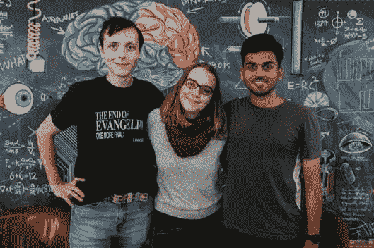
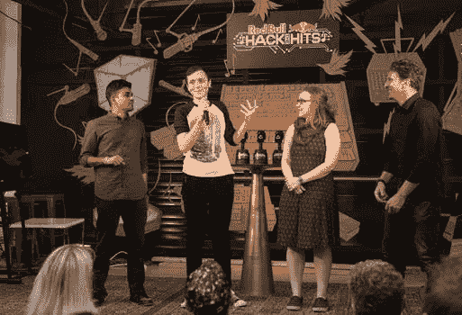

# 不知道音乐技术会有什么发展？了解如何破解声音的未来

> 原文：<https://medium.com/hackernoon/dont-know-what-s-coming-in-music-technology-learn-how-to-hack-the-future-of-sound-263a1e35dcb8>

你知道，我非常喜欢黑客马拉松和围绕着它们的强大能量。更酷的是，黑客马拉松可以有自己的主题或氛围(你知道我非常喜欢公民黑客马拉松)。我想发表一篇文章来阐明音乐和技术领域正在酝酿的创新。音乐已经被证明可以帮助人们度过创伤，在教育平台上被用来帮助年轻人学习，但是音乐到底走向何方？

**不要脸的 plug:** [红牛 Hack the Hit](http://hackthehits.redbull.com/) s 挑战音乐技术的界限，为未来的工程和编程领导者提供在独特的 48 小时黑客马拉松中创造、合作和学习的机会。

Courtesy of Red Bull

来自全国各地的大学生来设计下一个值得关注的音乐技术创新，今年的活动有红牛历史上最高的女性参与人数，这是多么令人惊讶？

今年的冠军团队“梦之队”(如下图所示:从左至右，纽约市立大学布鲁克林分校一年级研究生格兰特·布维耶，西雅图大学大四学生克莱尔·梅森，卡内基梅隆大学大二学生阿尼鲁德·马尼)，开发了机器精灵，这是一种回转合成器和 MIDI 控制器。

The Machine Elf — Courtesy of Red Bull

当您四处移动六边形模拟演奏乐器时，它会通过感应 3D 空间中的倾斜和角度来改变其声音输出(音高和音调)。它还能够通过蓝牙连接到其他音乐设备和软件，实现无限的声音表达。很整洁，是吧？

(Winners: Grant, Clare, and Anirudh) —Courtesy of Red Bull

我很幸运地跟进了这个团队，亲自询问了他们更多关于未来的愿景。

**莎拉:像这样的活动中有很多令人惊叹的创新，但你会推荐什么样的创新才能不被落下呢？让我们来谈谈你最初是如何选择参加哪个黑客马拉松的，以及你是如何参加“红牛黑客大会”的？**

在“红牛黑客攻击”发生之前，我参加过几次黑客马拉松。我会考虑各种因素——谁在组织黑客马拉松，黑客马拉松的主题和重点，当然还有后勤问题。在一天结束的时候，我认为这些活动是一个在有限的时间内实现一个有趣想法的绝佳机会，可以建立关系网，还可以结识其他有相似兴趣的了不起的人！例如，当我还在印度收拾行李准备去 CMU 的时候，我就知道了这个每月一次的音乐黑客马拉松@ Spotify，NYC。我立即申请了，在我第一次抵达美国的第二天，我就在 Spotify 总部，与所有这些有着共同兴趣的优秀人士会面和合作！这是一次很棒的经历。

格兰特:我相对来说是黑客马拉松的新手。虽然我已经知道他们的存在很多年了，但这是我第一次。我的背景主要是通过模拟媒介的声音艺术和音乐技术，所以我一直有点担心参加黑客马拉松，因为我认为他们更面向软件/代码。我目前订阅了太多的时事通讯，我不知道如何跟上，我通常会通过它们找到关于黑客马拉松和类似活动的信息…永远不要低估互联网上志同道合的人组成的随机群体的知识库。

**克莱尔:**我很幸运住在西雅图，在那里我可以参加更多的科技活动和黑客马拉松。对我来说，我尽量把事件限制在我感兴趣的事情上。人们很容易觉得你必须去做一些事情，因为你“应该”去做，而我有一段时间陷入了这种心态，筋疲力尽。为了不被落下，我很幸运有很多技术朋友让我了解最新情况。

**莎拉:我们换个话题，谈谈声音的未来。我是一个超级 EDM(电子舞曲)迷，我对它实际上是如何产生的知之甚少，所以当我们谈论音乐的未来时…技术真正适合在哪里？**

> **定义**
> 
> [**音乐技术**](https://en.wikipedia.org/wiki/Music_technology) **:** 是指音乐家或作曲家使用任何装置、机械、机器或工具制作或演奏音乐；创作、标注、回放或录制歌曲或作品；或者分析或编辑音乐。

我认为技术是无处不在的，通过观察它在其他领域的存在，我们可以了解技术在音乐中的未来。人机交互现在比以往任何时候都更加重要，因为我们正在走向模糊人类和机器之间的界限。在每天使用新技术之前，我们希望以比以往任何时候都更好、更多的方式来表达，以一种超越我们自身身体进化的方式。我认为技术将使我们能够以更具创造性和个性化的方式表达自己——创造一种新的声音，以新的方式控制和调节这种声音，等等。作为卡内基梅隆大学的一名研究生，我专注于音乐领域的机器学习，我个人希望看到智能技术不仅能帮助我们探索、发现和聆听一些伟大的音乐，还能创造音乐，激发以前可能从未有过的想法。

格兰特:我认为我们生活在音乐技术的黄金时代。从未有过如此多的设备和软件让消费者触手可及。话虽如此，但就新音乐技术而言，我自己的经历让我坚定地站在“模拟复兴”阵营。我认为，越来越多的艺术家和音乐家希望摆脱背光屏幕，尝试具有超越仿真或原始数字信号处理的内在美学价值的技术……像制造商文化和磁带作为一种可行的格式和艺术工具的复兴也清楚地表明，至少对我来说，事情正在朝着 DIY 的方向发展。

Courtesy of Red Bull

**莎拉:那么获取技术来制作我们未来将要听到的音乐呢？当你创作《机器精灵》时，你想到了谁？**

**阿尼鲁德:**首先，对我个人来说，轻松地学习一种新乐器非常重要。掌握可能还很遥远，但需要开始，为此，乐器应该有趣、令人兴奋且易于演奏。因此，重要的是我们的乐器是一个独立的设备，人们可以拿起它演奏。第二，人类喜欢在 3D 空间中用身体动作、手势等来表达自己。记住这一点，我们也想在 3D 空间中通过手势来控制声音。在 Machine Elf(我们建造的仪器)的开发过程中，我们总是用这些思想来指导我们的设计。

克莱尔:无论如何，我都不是工程师，但是有这么多的资源，所以我可以在空闲时间学习如何编写微控制器。同样，我认为以前从未创作过电子音乐的人将能够创作电子音乐，这非常棒。

Grant: 我非常相信开源和有用信息的自由交换。我开始建造和设计自己的模块化合成器设备，这不是出于爱好，而是出于需要，因为我买不起新的。我认为，随着互联网的发展，任何真正想要一件设备或真正想要一种特定声音的音乐家或艺术家都可以出去用廉价的组件构建它，或者用任何数量的语言编写它(其中大多数是免费的)。

机器精灵是我和我的团队制造的仪器的名字，也是以类似的方式精心设计的。它完全基于代码和电子电路，任何人都可以出去自己研究，在家里重现。所以，简而言之，我想我们创造我们的产品是为了 DIYer。这不仅仅是一个工具，而是一个通过开源技术和信息的可能性的展示。

我从与这些了不起的黑客的交谈中得到了一些启示:

1.  参与并报名参加下一次音乐黑客马拉松。不管是你的第一个还是第 50 个，不管你是不是工程师，都没关系。谁都可以黑。如果你喜欢音乐，那就加入吧！
2.  梦想远大。未来我们和音乐的关系应该是什么样子？你有想法吗？带上他们。
3.  利用你的开源社区，不要忘记回馈社会，我们需要彼此来创新。

艺术家大喊:我一直喜欢伊莫金·希普，我记得她展示电子手套的场景。阿尼鲁德认为，我们正在快速接近一个时代，我们与技术的共生关系将会发展……让我们看看我们可以共同建设什么。这当然是一个激动人心的时刻！

如果你不想在所有围绕音乐和技术的创新中落后，请关注这个团队的工作以及那个周末不知疲倦工作的其他人。此外，保持你的眼睛(和耳朵)关注即将到来的事件。我们希望在明年的"[红牛 Hack the Hits](http://hackthehits.redbull.com/) 上见到你。

一如既往的读者们，如果你们对我分享的内容有任何问题或评论，请随时通过 [experimentalcivics.io](http://experimentalcivics.io/) 联系我。想举办自己的音乐黑客马拉松吗？我下来了，我们谈谈吧。