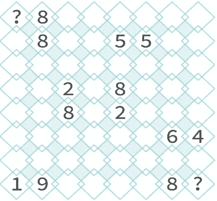

# 不知道这个圣诞节和爷爷奶奶做什么？让我用他们的大脑进行科学研究！

> 原文：<https://medium.com/hackernoon/dont-know-what-to-do-with-your-grandparents-this-christmas-let-me-use-their-brain-for-science-807f20830b6a>

## 给父母和祖父母的礼物。别担心。他们甚至可能会喜欢它！

我们生活中的电脑功能非常强大。在人类历史的任何其他时期，一部简单智能手机的计算能力都足以引发一场全球性的科学革命。但现在他们大多只是坐在我们的口袋里，偶尔模拟一个屁的声音。

让我们的计算机变得更有用的一个方法是参加一个分布式计算项目。这些软件将需要大量[计算能力的大问题分解成小块，然后发送给任何注册用户的闲置家用电脑进行处理。](https://hackernoon.com/tagged/computing)

我们拥有的另一个了不起的计算设备是我们的大脑。我们可以利用两耳之间的神经细胞做很多事情。但有时我们只需要让自己忙起来，不去想那些有压力的事情。所以我们用电视来填充它。或者运动。或者超级马里奥快跑。或者数独。

当这些活动做一些有用的事情时，总是很好的。还不清楚超级马里奥 Run 到底做了什么有用的东西，但数独似乎应该做点什么。这是一个基于数字网格的谜题。是数学。数学是有用的，尽管你在学校的经历可能会告诉你。

问题是数独中的[谜题](https://hackernoon.com/tagged/puzzle)实际上并不对应世界上任何有用的问题。玩数独不会神奇地让你的财务变得井然有序，也不会有助于治愈癌症。它让你忙碌，并可能让你聪明。但其他的就不多了。

这有点可惜。想象一下，人类每天要花费多少时间来解决报纸上的数独问题。还有填字游戏。以及所有其他看似有用但最终无用的脑筋急转弯。

如果我们能改变这一切呢？我们可以为大脑做什么样的分布式计算项目？因此，当我们想让自己不去反思存在的荒谬时，我们可以给他们一个有趣的任务，实际上有助于科学。

这实际上已经做到了！从[银河动物园](https://www.galaxyzoo.org/)开始，到[动物园](https://www.zooniverse.org/)你可以用你的大脑对星系、企鹅甚至土狼(无论它们是什么)的图像进行分类。

但是对图片进行分类，尽管可能很有趣，并不能吸引所有人。那么那些痴迷于数独等谜题的人呢？那些痴迷于做报纸上的文章，然后去买满是这些文章的大书的人？我们能利用他们的大脑进行科学研究吗？

这就是我正在尝试做的一个项目，我称之为 [Decodoku](http://decodoku.com) 。我们从量子力学中取出一个实际问题，即量子纠错解码算法的设计。然后，我们去掉所有看起来复杂的东西，直到我们剩下一个基于数字网格的简单谜题。就像数独一样。

The numbers come in groups that add up to a multiple of 10\. Work out what’s in the ? squares. That’s all there is too it!

所以，如果你想在圣诞节给你爱猜谜的亲戚一个新的挑战，给他们我做的免费书。你可以在这里下载(我说过它是免费的吗？)，然后用通常的方法(不是免费的)把它变成一堆纸和墨水。

为了帮助科学，那些解谜的人只需要给我们一些应该如何做的提示。如果他们在年底前帮忙，他们甚至可以在我们的[比赛](http://decodoku.com/competition)中获奖。

所以你走吧。给你一些亲戚的礼物。这只会花费你一点打印机墨粉，而且会有助于科学。

*圣诞快乐！*

> [黑客中午](http://bit.ly/Hackernoon)是黑客如何开始他们的下午。我们是 [@AMI](http://bit.ly/atAMIatAMI) 家庭的一员。我们现在[接受投稿](http://bit.ly/hackernoonsubmission)并乐意[讨论广告&赞助](mailto:partners@amipublications.com)机会。
> 
> 如果你喜欢这个故事，我们推荐你阅读我们的[最新科技故事](http://bit.ly/hackernoonlatestt)和[趋势科技故事](https://hackernoon.com/trending)。直到下一次，不要把世界的现实想当然！

