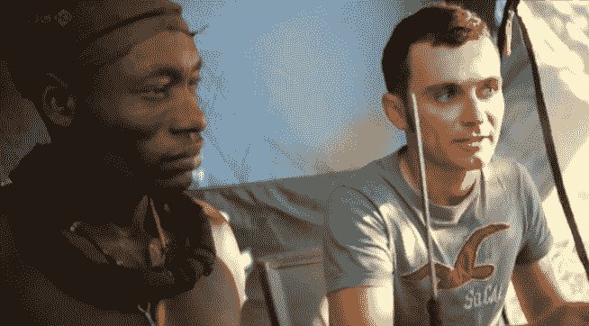
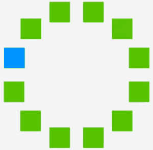
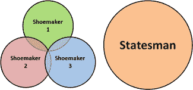
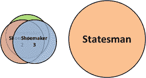
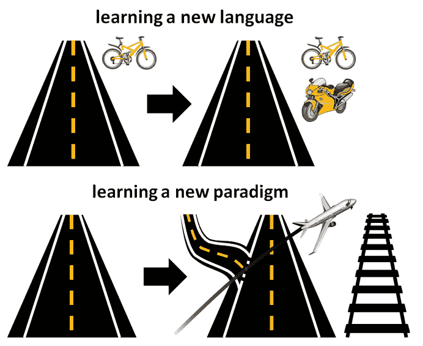

# 不要学语法，要学会改变你的思维方式

> 原文：<https://medium.com/hackernoon/dont-learn-a-syntax-learn-to-change-the-way-you-think-18436807012d>

> “一门不影响你思考编程的语言是不值得了解的。”
> 
> *–艾伦·珀利斯*

在我的[上一篇文章](/@theburningmonk/learn-to-learn-286558241fd6)中，我概述了我从[乔希·考夫曼的 TEDx 演讲](https://www.youtube.com/watch?v=5MgBikgcWnY)中学到的学习技巧。我简单地提到了人们应该学习一种新的范式，而不是一种语法略有不同的语言(例如 C# < = > Java，ActionScript < = > Haxe)，但没有充分强调这样做的重要性。

正如数学家理查德·海明曾经说过的，有可能存在我们无法拥有的思想:

> 正如有些气味狗能闻到而我们闻不到，有些声音狗能听到而我们闻不到，同样，有些波长的光我们看不见，有些味道我们尝不到。那么，既然我们的大脑已经如此，为什么“也许有些想法我们无法思考”这句话会让你感到惊讶呢？到目前为止，进化可能已经阻止了我们向某些方向思考；**.”**
> 
> **–理查德·海明**

*但是这和编程语言或者任何语言有什么关系呢？*

# *我们无法表达的，我们无法思考*

*BBC 去了一个偏远的，与外界没有联系的部落，叫做辛巴族，他们的颜色词汇和我们很不一样，他们只有 5 个颜色词。*

**

*他们的发现很有趣。*

*辛巴族能够很容易地识别出这张图片中带有不同绿色阴影的方块:*

**

*因为他们对两种深浅不同的绿色有不同的说法。对我们来说，这个壮举是困难的，因为对我们来说，他们都是绿色的。*

*另一方面，因为我们有两个单词分别代表*蓝色*和*绿色*，所以我们很容易从其余的方块中识别出蓝色方块:*

**

*对于只有一个词来描述蓝色和绿色的辛巴人来说，他们很难用不同的颜色来区分正方形。*

*这意味着不仅语言塑造了我们的思维，它们还可能禁止我们的思维。*

> *“我语言的极限意味着我世界的极限。”*
> 
> **–路德维希·维特斯坦根**

*如果编程语言也是如此呢？*

> *编程语言有一种微妙的影响:它们塑造了我们的思维习惯*
> 
> **–迪克斯特拉**

*如果我们的创造力受到我们使用的编程语言所能表达的思想的限制，那该怎么办？*

*如果有些解决方案因为无法用这些语言清楚地表达出来而超出了我们的能力范围，该怎么办？我们将如何发现这些未知的未知？*

*如果没有意识到外界的可能性，我们会意识到自己[无意识的无能](http://en.wikipedia.org/wiki/Four_stages_of_competence)吗？*

*我不知道任何关于编程范例对创造力的影响的研究。从个人经验来看，我的[大部分](http://theburningmonk.com/2015/04/modelling-game-economy-with-neo4j/) [创意](http://theburningmonk.com/2014/07/here-be-monsters-message-broker-that-links-all-things/) [解决方案](http://theburningmonk.com/2014/05/aop-a-story-of-how-we-localized-a-mmorpg-with-minimal-effort/)都来自于我对非主流编程和数据库范例的尝试。这些冒险打开了我的思维之门，让我看到了以前看不到的解决方案。*

*相比之下，我的其他学习成果，如 Dart 和 Haxe，教会了我一种稍微不同的语法来表达我已经熟悉的相同想法。虽然它们可以被证明是完成特定任务的有用工具，但它们无法产生同样的拓展思维的效果，而这种效果对我的长期职业生涯更有价值。*

# *论多样性*

*通过学习新的编程范例，我们可以使我们的思维方式和解决问题的方法多样化，但这不是唯一的方法。事实上，计算机科学领域一些最著名的人来自其他学科。*

*例如，艾伦·凯是一名生物学家，正是对生物学的研究启发他创造了术语*物体*。*

> **“我认为物体就像生物细胞和/或网络上的个人电脑，只能通过信息进行交流。”**
> 
> **–艾伦·凯**

*(事实上，我们是以与艾伦·凯所设想的完全不同的方式来教授和思考 OOP 的，这是另一回事..)*

*同样，乔·阿姆斯特朗也是从物理学家起步的。*

*Adam Tornhill，一位我非常喜欢其作品的演讲者，从他在 T21 的心理学研究中学到了很多编程知识。*

*我们的社区也需要多样性。*

*中国有一句著名的谚语，*

> *“三个卑微的鞋匠集思广益，成就一个伟大的政治家。”*

*然而，这只有在每个鞋匠都能提供不同的观点和想法时才成立。*

**

*事实上，考虑到鞋匠有着相同的职业和性别，他们可能在思维场景上有更多的重叠。*

**

*结果呢？在寻找创造性的解决方案时，鞋匠的数量优势并不重要。这就是为什么，在像我们这样的创意产业中，我们需要[警惕单一文化。](http://dangerouslyawesome.com/2010/11/why-monocultures-suck/)*

# *结论*

*总的来说，在相同的范式中学习一门新的语言会给你提供实现的选择和范式所能提供的最佳方法的权衡。*

*学习一种新的范式会给你带来前所未有的全新方法，并带来更持久的好处。这就是为什么，如果有选择，你应该学习一种新的范式，而不是一门新的语言。*

**

# *演讲和幻灯片*

# *链接*

*   *[TEDx——前 20 个小时——如何学习任何东西|乔希·考夫曼](https://www.youtube.com/watch?v=5MgBikgcWnY)*
*   *蕾拉·博罗迪特斯基——语言塑造思想吗？:普通话和英语使用者的时间观念*
*   *[蕾拉·博罗迪特斯基——语言如何塑造思维](https://psych.stanford.edu/~lera/papers/sci-am-2011.pdf)*
*   *[亚历克斯·希尔曼——为什么单一栽培很糟糕](http://dangerouslyawesome.com/2010/11/why-monocultures-suck/)*
*   *[用 Neo4j 建模游戏经济](http://theburningmonk.com/2015/04/modelling-game-economy-with-neo4j/)*
*   *[连接所有事物的消息代理](http://theburningmonk.com/2014/07/here-be-monsters-message-broker-that-links-all-things/)*
*   *[一个内胆定位](http://theburningmonk.com/2014/05/aop-a-story-of-how-we-localized-a-mmorpg-with-minimal-effort/)*
*   *[调整怪物和陷阱统计的遗传算法](http://theburningmonk.com/2014/09/f-genetic-algorithms-to-help-you-catch-monsters/)*

******

> *[黑客中午](http://bit.ly/Hackernoon)是黑客如何开始他们的下午。我们是 [@AMI](http://bit.ly/atAMIatAMI) 家庭的一员。我们现在[接受投稿](http://bit.ly/hackernoonsubmission)，并乐意[讨论广告&赞助](mailto:partners@amipublications.com)机会。*
> 
> *如果你喜欢这个故事，我们推荐你阅读我们的[最新科技故事](http://bit.ly/hackernoonlatestt)和[趋势科技故事](https://hackernoon.com/trending)。直到下一次，不要把世界的现实想当然！*

**