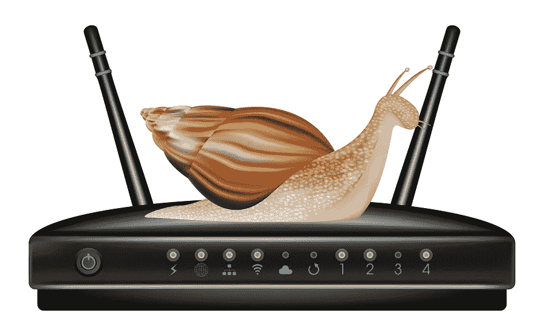
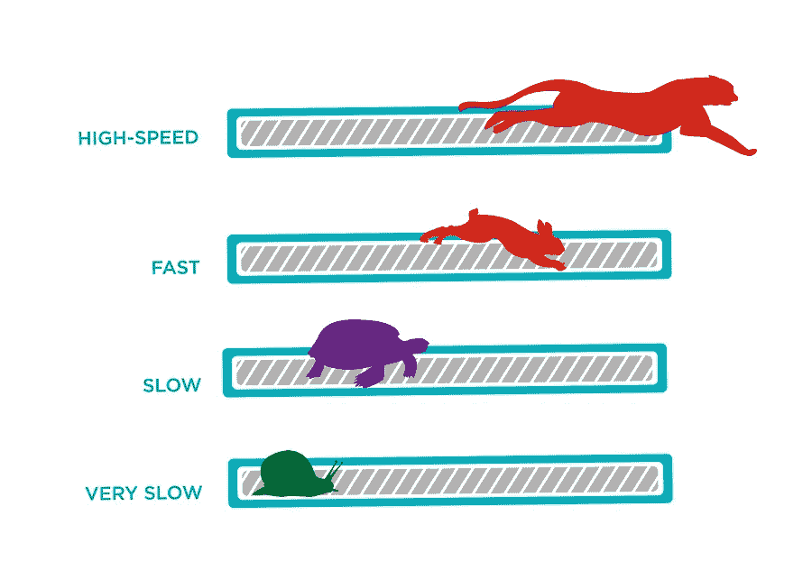
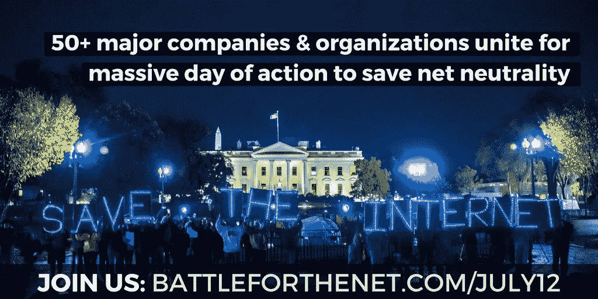

# 不要让你的互联网慢到蜗牛的速度。加入#BattleForTheNet。

> 原文：<https://medium.com/hackernoon/dont-let-your-internet-slow-to-a-snail-s-pace-join-the-battleforthenet-63e5e1537be6>

Slower Internet could be just around the corner if we don’t fight back.

美国联邦通信委员会(FCC)新任主席 Ajit Pai 希望撤销网络中立规则，该规则类似于[互联网第一修正案](https://hackernoon.com/tagged/internet)，确保所有人的平等访问和平等机会。

# 逆转网络中立将威胁我们热爱的互联网和自由社会的基础。

在一个没有网络中立的世界里，像美国电话电报公司、康卡斯特和威瑞森这样的互联网服务提供商可以发号施令。他们可以设置互联网快车道和慢车道，偏袒一些网站，甚至通过拒绝客户访问不符合公司世界观或有利于公司底线的网站来审查网络。

我知道你们有些人在想什么。你可以用一个 [VPN](https://hackernoon.com/tagged/vpn) 来绕过不公平的 ISP 限制。也许吧。也许不是。在一个没有网络中立性的世界里，你的 ISP 可能会屏蔽你的 VPN，降低你的 VPN 速度，或者强迫你使用他们自己的 VPN 产品。他们敢吗？[康卡斯特做了](https://www.freepress.net/sites/default/files/fp-legacy/timwu.pdf)。

我们已经有线索表明网络中立性的倒退会对消费者隐私产生负面影响。还记得美国电话电报公司试图向得克萨斯州的高速用户收取附加费以选择退出跟踪吗？在消费者的抗议和政府监管机构的审查之后，这个想法被彻底抛弃了，但是 T 公司的[已经在梦想着它的复活。](http://www.dslreports.com/shownews/ATT-Says-It-May-Soon-Charge-You-Extra-For-Privacy-139840)

# 你能想到哪个恶霸会喜欢这种力量吗？

FCC 隐私保护已经被禁止。逆转网络中立将使互联网服务提供商自由地追求互联网统治地位，这将对我们造成危害。

联邦通信委员会主席通过吹捧所有可能带来的惊人进步，向消费者兜售“解除管制的互联网”。(当然，进步是以消费者为代价的。)他还试图通过呼吁互联网服务提供商自愿实行网络中立来平息人们的担忧。“自愿”可能在短期内有效，但我们相信有着如此复杂历史的公司是愚蠢的。

毕竟，大的互联网服务提供商已经表明他们愿意通过践踏自愿的“不跟踪”标准来降低道德标准。例如，威瑞森不仅忽略了“不要跟踪”的请求，它还在客户的浏览器中注入了持久的标题(实质上是僵尸 cookies ),使得第三方广告商也能跟踪其客户。威瑞森在被抓住后停止了恶作剧，但据报道，对恢复这种做法持开放态度。[你可以在这里阅读更多相关信息](https://www.eff.org/deeplinks/2015/01/verizon-and-turn-break-browser-privacy-protections)。

毫无疑问，网络中立性的倒退将是 ISP 恢复反消费者行为的完美借口。为什么不呢？[在后网络中立的世界里，还不清楚有没有机构有能力让互联网服务提供商保持诚实。](https://www.theverge.com/2017/4/11/15258230/net-neutrality-privacy-ajit-pai-fcc)

# **让我们保持互联网服务提供商的诚实。**

互联网服务提供商如今表现不那么糟糕的主要原因是，他们目前被视为美国第二类公共运营商，类似于固定电话服务。第二章规定禁止公司任意拒绝向消费者提供服务或歧视某些消费者。

但是如果互联网接入像 Pai 建议的那样被重新归类为第一类信息服务，所有的赌注都将落空。你的互联网可能会变慢，你最喜欢的网站可能会消失。财力雄厚的公司可以为顶级待遇和高速运转支付额外费用，更不用说优先接触客户了。

这种速度和准入歧视可能会关闭创业公司，减少竞争。它也可以作为事实上的审查，让互联网世界的新统治者反感的想法可以被边缘化和遗忘。

# 7 月 12 日，互联网团结起来，阻止这场权力争夺战。

像[网飞](https://www.netflix.com)、[中](/)、[StartPage.com](https://www.startpage.com)、[勇者](https://brave.com/)、[维瓦尔第](https://vivaldi.com/)、 [BestVPN](https://www.bestvpn.com/) 、 [iFixit](https://www.ifixit.com/) 以及[为未来而战](https://www.fightforthefuture.org/)、[要求进步](https://demandprogress.org/)、[自由新闻](https://www.freepress.net)、[现在访问](https://www.accessnow.org/)、[priv](https://privacytoolsio.github.io/privacytools.io/)

我们需要一个公平的互联网竞争环境，让夫妻店和创业公司能够与财富 500 强公司和其他权力掮客竞争。我们支持一个所有声音都可以被我们所有人听到和评判的互联网，而不是寻求压制异议的有线电视公司首席执行官和政治家。

# 人民运动取得了巨大的成功:

*   超过 500 万封电子邮件被发送到国会
*   超过 1000 万人在参与网站上看到了抗议信息
*   #网络中立标签在脸书和推特上都很流行
*   超过 125，000 个网站、个人、艺术家、网络创作者和组织报名参加了最初的抗议号召

知名度被带到了一个新的水平，名人纷纷支持这一努力，包括珍珠果酱，威尔·惠顿，蒂姆·罗宾斯，苏珊·萨拉登，布鲁斯旅行家，史蒂文弗莱，马克·鲁弗洛，劳拉简格雷斯，肯德里克·桑普森，阿曼达·帕尔默，特德利奥，萨曼莎·比，等等。

从网络游戏社区到图书管理员、房地产网站、草根组织到独立音乐人，互联网的每个角落都有广泛的参与。

“为未来而战”指出，参与的数量如此之多，以至于联邦通信委员会不得不将评论“限制”到他们的备审目录中，将它们排队等待在最初的 7 月 17 日截止日期之前提交。对国会议员的评论也是如此，因为数量太多，不得不在几天内完成。

组织者对最初的估计感到兴奋，超过 200 万条评论被发送到 FCC(几乎是 2014 年 9 月“互联网减速”记录的三倍)。但在 8 月 16 日结束的“回复意见期”期间，这一数字急剧上升。迫于公众压力，联邦通信委员会被迫将评论期延长至 8 月 30 日。在撰写本文时，还有一周的时间，已经有 2000 万条*评论被发布。*

# 激进分子加大赌注。

公民们已经明确表示，他们不会将互联网拱手让给企业利益，但 FCC 主席阿吉特·帕伊(Agit Pai)似乎决心无视公众的抗议。作为回应，活动人士已经开始向美国国会议员施加压力，他们在网上张贴[记分卡](https://www.battleforthenet.com/)，让公民了解他们的代表对网络中立的立场，组织[与代表的面对面会议](https://events.battleforthenet.com/)，甚至竖立广告牌羞辱那些支持 Pai 计划撤销网络中立保护的人。

# 接下来是这样的。

FCC 的下一次公开会议定于 9 月 28 日，活动人士认为，该委员会将宣布，他们对网络中立废除的最终投票将在 10 月份的下一次公开会议上进行。

我们希望到最后投票的时候，政治压力会大到让 Pai 和 FCC 不得不让步。但即使他们不这样做，也可以期待活动人士继续抗争，并期待大量诉讼接踵而至。

我们将一起击退窃取我们目前享有的互联网自由和多样性的企图，使它能够继续成为世界上最大的开放市场和世界上最大的城市广场。

注:“这项工作的衍生物已提交给 IEEE 可能的出版。版权可能会在不通知的情况下转让，之后可能无法再访问该版本。”

___________________________________________________________

图片鸣谢:siiixth/BigStock.com，georgepontinojr/BigStock.com， [rogistok/BigStock](https://www.bigstockphoto.com/search/?contributor=rogistok) 。com，为未来而战

> [黑客中午](http://bit.ly/Hackernoon)是黑客如何开始他们的下午。我们是 [@AMI](http://bit.ly/atAMIatAMI) 家庭的一员。我们现在[接受投稿](http://bit.ly/hackernoonsubmission)，并乐意[讨论广告&赞助](mailto:partners@amipublications.com)机会。
> 
> 如果你喜欢这个故事，我们推荐你阅读我们的[最新科技故事](http://bit.ly/hackernoonlatestt)和[趋势科技故事](https://hackernoon.com/trending)。直到下一次，不要把世界的现实想当然！

