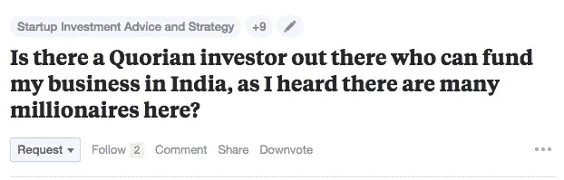

# 不要以错误的理由筹集资金

> 原文：<https://medium.com/hackernoon/dont-raise-money-for-the-wrong-reasons-a79a6693cecb>

## 筹款

## 最近，Quora 上大量关注“快速融资”的问题开始困扰我。

Said no investor, ever.

老实说，如果你发现自己是一个“拿走我的钱”的投资者，我强烈建议你接下来做两件事:

## #1.快跑。奔跑吧，就像没有明天一样。逃命吧

你的投资者最大的损失就是他会给你一些钱。你的职业生涯岌岌可危。你的生活，你的梦想，你的激情。

## #2.停下你正在做的事情，去找一只独角兽

我是认真的。不，我不是指初创企业术语中的独角兽。我是说真正的独角兽。你知道，那些从屁股里射出彩虹的。

This guy. The actual mofo unicorn

你知道在这个宇宙中最不可能发生的三件事是什么吗(按顺序，#3 是最有可能发生的一件事)？

**#3。发现独角兽**——惊讶吗？老实说，这是最容易的。

**#2。找到一个不需要太多就能让你惊叹的投资者——你可能会找到他们，如果你找到了，你知道幸运女神站在你这边。抛弃一切，追求第三。**

**#1。遭到枪击，毫发无伤地逃脱——世界上只有三个人能做到。《低俗小说》里的朱尔斯和文森特，我猜还有克林特·伊斯特伍德。**

This is exactly how it happened for Jules and Vincent (left to right)

# 这是我最近遇到的一个问题。

真的！

这就是我们的结局？

试图找到快速和肮脏的方法来筹集资金，因为— *看起来像是* —任何能让我得到资金的事情。这个人的所作所为似乎没什么价值，不是吗？

这就是为什么它困扰着我。

我回答了这个问题——在考虑了我是否应该回答这个问题之后。问题的第一部分可能有点苛刻，但第二部分是我想关注的。这就是我在那里所做的，也是这篇文章的意图。

# 所以。你是个企业家。那很好

我是真心实意的。当今世界急需企业家、创新者和创造者。我们很幸运，身边有这么多这样伟大的人。想想 Airbnb，优步，iphone，fitbit，特斯拉。如果没有这种坚韧不拔的企业家，这一切都不可能实现。但是今天我们很多人都被误导了。也许是因为媒体的狂热，也许是因为我们中的一些人开始相信这很容易，也许是因为我们中的一些人觉得你需要钱才能成功。我遇到过一些人，他们甚至觉得没有外部资本，你就无法开始。一些人认为连续几轮加注是稳操胜券的标志。我不知道怎么了，但这里肯定有什么东西闻起来很奇怪。

如果你是一名企业家，你需要做无数不同的事情，而且你需要把很多事情做对。你会犯很多错误，但你会从中吸取教训，然后开始做得更好。所以我不会给你一大堆该做和不该做的事情。我建议你记住五件事。

## #1.**解决一个问题。修理需要修理的东西**

或者至少迎合一种需要。

`**You should never start a business for any of these reasons:**`

*   为了创业
*   做自己的老板
*   称自己为企业家
*   要致富；一些你认为在日常工作中做不到的事情。

如果你这样做了，很有可能，你会摔个屁股开花——反复摔，摔得相当用力。省省你的痛苦吧。做一些有意义的事情。我们都想要钱，钱也会随之而来。做一些人们愿意为之付费的事情就好了。记住，没人喜欢付钱。所以你要解决一个问题。大多数白手起家的百万富翁和亿万富翁实际上就是这样赚钱的。

> 理查德·布兰森(Richard Branson)开始了一段全新的旅程，以一项他尚未开始的业务的名义出售一架他并不拥有的飞机的机票，当时他还没有想过做类似的事情。他所看到的是一群人滞留在那里等待搭乘航班回家，他开始在一架收费的租来的包机上为他们提供座位，这样他就不需要承担包机的全部费用。

所以，让我们以世界上一些最成功的人为榜样，开始解决问题。

## **#2。获得一些客户**

企业从事的是赚钱的业务。句号！永远记住这一点。写下来。把它打印出来，装裱好，挂在你能经常看到的地方。任何告诉你不是这样的人都是当着你的面撒谎。

当然，要让你的企业被认为是非凡的，你可能需要达到拥有数万甚至数十万付费客户的阶段。但你永远不会从那里开始。你就是不能。没人能。

总是从最初的几个开始。找出那些你正在解决其问题的人，并向他们推销你的产品。你有了第一批付费客户。

这是确认，然后这些第一批顾客与你的产品的互动也会帮助你:

1.  让你的产品更好
2.  实现产品的市场适应性。

## #3.建立一个伟大的团队

不要仅仅因为你认为这会在你向投资者推销时增加可信度和分量，就把团队从世界各地的名校毕业生和研究生中塞进去。知道你为什么要建立一个团队，并让符合这一愿景的人加入进来。

同时，不要随便雇佣任何人，因为他们对企业来说更“实惠”。把你的公司当成你的车；你不会因为便宜就买不放心的零配件吧？如果你不会拿你的车去冒险，为什么要拿你的生意去冒险呢？你真的不爱吗？

`**Build the team:**`

*   这非常适合您的业务
*   你可以信任
*   谁能把企业带向更高的高度

但是一定要建立一个团队。此外——这一点很重要——确保他们的努力和辛勤工作得到充分补偿。如果不是今天，那么最终。不要欺骗你的团队。别人都不信任你，他们却信任你。永远不要忘记这一点。记住。想走远，一起走。所以是的。建立一个团队。

## #4.多找些顾客

用你从最初几个顾客身上赚到的钱去获得更多。开始识别什么样的营销传播对你的目标受众起作用，什么不起作用。这很关键。

## #5.让我们筹集一些钱&然后下地狱

创业不需要融资。你筹集资金来扩大企业规模——在比你从 x 倍增长到 10 倍更短的时间内，把企业从 10 倍增长到 100 倍和 1000 倍。

你也不需要钱来制造产品，你需要钱来制造“更好”的产品。

> 我做电商创业，没有网站，忘了一个手机 app。因为我第一天就不需要。我需要订单，我有 5 条不同的路线来确保这一点。网站不会帮助我获得订单，但我接触消费者的方式会。所以我专注于创造订单。我们最终处理了 7000 个订单，却连一个登录页面或任何社交媒体都没有。

企业不是建立在产品或移动应用之上的。移动应用程序的存在是为了支持和帮助他们所代表的企业成长。

让我们创造价值。制造人们会喜欢的东西。做出迎合消费者现实生活问题的东西。问题是大是小并不重要。重要的是你如何解决它。让我们创造一个惊人的商业生态系统。:-)

> [黑客中午](http://bit.ly/Hackernoon)是黑客如何开始他们的下午。我们是 [@AMI](http://bit.ly/atAMIatAMI) 家庭的一员。我们现在[接受投稿](http://bit.ly/hackernoonsubmission)并乐意[讨论广告&赞助](mailto:partners@amipublications.com)机会。
> 
> 如果你喜欢这个故事，我们推荐你阅读我们的[最新科技故事](http://bit.ly/hackernoonlatestt)和[趋势科技故事](https://hackernoon.com/trending)。直到下一次，不要把世界的现实想当然！

