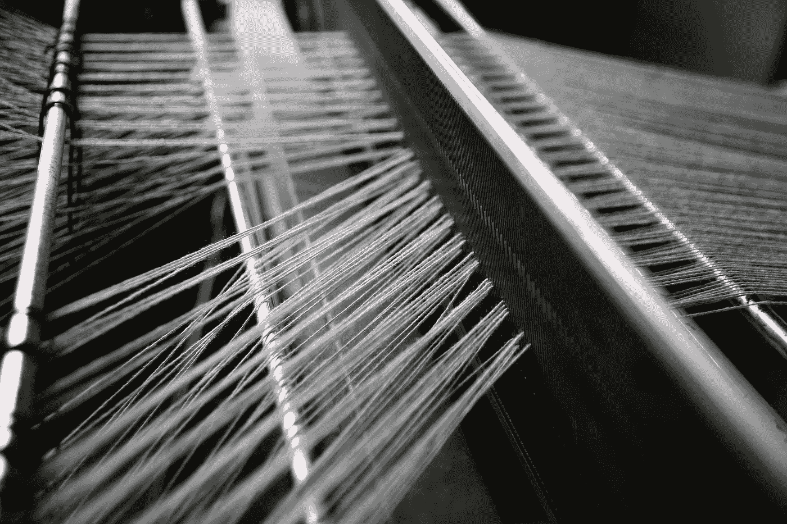

# 不要砸织布机:人工智能没什么可怕的 5 个理由

> 原文：<https://medium.com/hackernoon/dont-smash-the-looms-5-reasons-why-artificial-intelligence-is-nothing-to-fear-346003af4c97>

今年，关于人工智能对就业的威胁的预测非常普遍。我们被警告说，人工智能将学习如何做我们的工作，从而使我们变得多余。我们应该担心吗，或者对人工智能的担心证明了我们没有从历史中吸取教训？

技术影响的历史向我们表明，对 18 世纪和 19 世纪纺织自动化导致失业的担忧是没有根据的。众所周知，卢德分子砸碎了自动织布机，以抗议他们基于手工的技能被淘汰，失业和困难将会由此产生。事实上，自动化编织是工业革命的支柱，仅在英格兰就直接或间接地创造了数十万个工作岗位。这些工作包括纺纱厂本身所做的一切，加上原材料和成品的生产、分配和运输；储存、零售和批发销售，甚至在曼彻斯特建立棉花交易所，让价值链中的人们对冲未来的价格。尽管可以理解，但勒德派的想法是如此不正确，以至于经济学家创造了“勒德派谬误”这个短语。

卢德派认为，技术进步会不可避免地产生结构性失业，因此对宏观经济有害。相反，有人认为，如果一项技术创新导致某一部门必要的劳动力投入减少，那么整个行业的生产成本就会下降。这反过来降低了竞争价格，增加了均衡供给点，从理论上讲，这将需要增加总的劳动力投入(杰罗姆，1934)。

到目前为止，我们这些 21 世纪的人应该有信心任何新技术都不会*而不是*造成大规模失业，事实上，我们应该有信心新技术和技术范例会创造就业机会，促进经济发展。

# 我们不应该害怕人工智能的五个理由:

## **1。AI 不做人*做*的工作；它做人们*不能*做的工作**

人们在辩论人工智能时犯的一个错误是假设它可以完成目前由人类完成的工作。总的来说，事实并非如此。相反，它做的工作是人们根本不能做的，或不能轻易做的，或不能在合理的时间范围内做得足够好的。或者它做的工作已经被机器做了，但它做得比现有的机器好得多。

以前，人们已经使用数字计算器、电子表格和计算机建模技术来做许多他们现在(或未来)可以使用人工智能做得更快更好的事情。这些人现在可以使用人工智能技术，如模式识别，对来自无限多来源的大数据进行元分析。一个机器驱动的过程被更好的(人工智能)机器取代的例子是面向零售客户的机器人咨询投资管理服务。

当前通过在线服务的算法驱动的方法以笨拙和简单著称。人工智能改变了这种服务，其复杂程度远远超过了算法的能力。结果:没有人被取代，但结果是许多快乐的人。人工智能是一项附加技术，它为政府、科学、医学、技术、物流、教育和商业开辟了一个全新的可能性世界。通过自然语言处理、机器学习、深度学习和认知计算的人工智能技术，人们和组织可以更好地自动化流程，获得对数据的非直觉洞察，并制造“更好的东西”。来自数据的非直觉洞察可以产生和验证新的经济、商业和投资策略。在资本和商品市场，通过使用人工智能工具提供的更有效的资本使用可以通过增加投资资本来为经济提供巨大的刺激。

## **2。AI 不破坏工作岗位；它创造了大量的就业机会**

在 18 世纪和 19 世纪，工厂没有造成失业，而是创造了数百万个工作岗位。在 DataArt 最近的年度金融科技活动上，商业未来学家 Rohit Talwar 认为，人工智能“释放了人类的潜力”，可以做得更多、更大、更快、更好。这就是关键所在——人工智能让我们有能力做我们一直想做的事情，还有很多我们还没有考虑到的事情。这就是创造就业机会的方式。人工智能已经创造了比它曾经取代的更多的工作岗位。星座研究公司预测，到 2015 年，人工智能的市场价值将达到 400 亿美元，到 2020 年将达到 1000 亿美元。人工智能创造的许多工作岗位是以前从未存在过的。

## **3。人工智能不仅在其自身发展中创造就业，而且在每个使用它的行业中创造就业**

除了“纯人工智能”角色，在利用人工智能做新事情或更好地做旧事情的行业中，还有更多工作可供选择——在这个过程中，创造了更多的需求和更多的就业机会。一个例子是网络安全。网络安全使用广泛的人工智能方法和技术，包括机器学习、模式识别和模糊逻辑，以保护我们的数据、身份和资金安全。然而，由于存在巨大的技能缺口，公司很难填补空缺职位。ISACA(非盈利信息安全倡导组织)预测，到 2019 年，全球将短缺 200 万网络安全专业人员。在金融服务和资本市场中，人工智能是反洗钱流程和技术以及许多其他形式的风险管理背后的科学，包括“Regtech”，这种基于人工智能的技术用于通过理解多个(通常是冲突或不完整的)数据源来确保合规性。

## **4。AI 不会杀我们。AI 会拯救我们**

我们不应该担心永远不会发生的事情(自主机器人将我们从地球上抹去)，而是应该关注人工智能在医学和外科手术中的应用正在拯救多少生命。或者想想有多少饥饿的人口正被人工智能技术和科技带来的改良农业更廉价地养活；或者它如何保护你的在线身份和我们银行里的数据。Rohit Talwar 将这种对利益的积极关注称为《星际迷航》对《星球大战》的思考。

## **5。我们永远不会准备好**

*我们准备好迎接互联网——第三次工业革命的一部分——以及它带给我们的一切(好的和坏的)了吗？当然不是，因为我们从来没有见过这样的技术，所以我们无法预料这样的技术会促进什么样的新商业模式。*

*在许多组织中，变革管理的讽刺之处在于，它被设计成确保真正的变革永远不会发生，因为真正的变革是无法“管理”的。真正的变化几乎总是对环境中的重大变化做出的反应，包括由新技术支持的新业务模式带来的机遇和威胁。我们当中有谁能真正预测大量新技术同时到来可能产生的一切？*

*纳米技术等技术；原子级精确工程；有意识的技术；高度连接的(因此可以说是有意识的)人类互联网；混合现实生活；合成生物学；人类扩增；大脑上传；万物互联；和 AI 等等。我们中没有人能够完全理解这些技术所创造的所有新的商业模式和机会，但我们可以肯定一件事:它们将在全世界创造大量的就业机会和商业机会。对此我们应该心存感激。请不要砸织布机——但更重要的是，请不要害怕它们。*

**By Cliff Moyce，
全球财务实践负责人，* [*【数据艺术】*](https://dataart.com/)*

**最初发表于*[*www.thecsuite.co.uk*](http://www.thecsuite.co.uk/cfo/information-technology-cfo/dont-smash-the-looms-five-reasons-why-artificial-intelligence-is-nothing-to-fear/)*。**