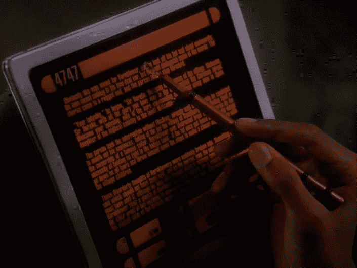

# 个人电脑不是计算的未来，但 iPad 也不是

> 原文：<https://medium.com/hackernoon/dont-think-of-the-future-of-computing-as-the-ipad-or-the-pc-the-future-is-everything-everywhere-a8f274efc50f>

## 关于平板电脑一定会成功或不可避免会衰落的争论是权威人士的绝佳素材，但他们是只见树木不见森林

Commander Sisko needs a hardware keyboard.

我并没有打算用我去年的“ [iPad-only 是新的桌面 Linux](/@chipotlecoyote/ipad-only-is-the-new-desktop-linux-de88b61b6d99#.3ptdrkhvv) ”文章成为 iPad 怀疑论者的守护神。(或者是所有全职桌面 Linux 用户的最新黑幕。抱歉伙计们。我知道你们俩都很生气。)实际上，我经常使用 iPad——自从 9.7 英寸的 Pro 机型问世以来，它是我唯一的便携式电脑，也是我在几次长途旅行中唯一的电脑。我发布了博客条目，做了会议笔记，准备了故事“封面”插图，并使用 Pages 与编辑器来回发送了带有 Word 兼容更改跟踪的故事修订。我甚至在 Github 托管的源代码库上做了一点工作。我不是[费德里科·维蒂奇](https://www.macstories.net/about/)，但按照大多数标准，我是 iOS 的“超级用户”

然而，我也不打算收回对 iOS 的批评。如果说有什么不同的话，那就是我对其缺点的感觉变得更加敏锐了。很难在多个应用程序中使用相同的数据。批处理操作往往是模态的和不一致的。文本编辑的控件仍然很粗糙。这还不包括需要脚本、编译或持久 TCP 连接的任务，也不包括 iOS 有限的通用服务概念。这些问题可以通过软件来解决，但是苹果公司是否认为它们是问题还是个未知数。

所以，如果我想加入最近一直在进行的*iPad*何去何从的对话，那我该怎么办？我的模糊论点是，iPad 有许多令人沮丧的问题*但*所有这些问题都是可以解决的*但*如果不使 iPad 在某些方面更像个人电脑的话，其中一些问题是无法解决的*但*这样做可能没问题。

如果故意不置可否，这都是真的。但我认为有一个隐含的前提需要重新审视。“Mac/PC vs. iPad”的争论将计算的[未来](https://hackernoon.com/tagged/future)视为一场零和游戏。也许不是。

为了我的小说《Kismet 》,我想到了几代之后的电脑会是什么样子。人物使用类似 Siri 的直接语音控制、“视频卡”(智能手机的后代)、“智能纸”，是的，甚至键盘和屏幕。他们的数据总是伴随着他们，以任何有意义的形式呈现，因为无处不在的连接就像电一样是给定的。女主角甚至难以想象数据可以有物理位置。它实际上无处不在，被透明地复制和高度加密。

> iOS 的教训是将数据与位置分离更好。

虽然我肯定视觉不会被证明是准确的(预测永远不会)，但我怀疑它抓住了一个基本事实:没有一种物理形式或输入方法可以统治它们。iOS 的教训不是便携式触摸屏、平铺窗口管理器和隐藏文件系统本质上更好。那就是*将数据与位置解耦更好。*iPad 的教训是，台式机或笔记本电脑并不适合每项任务。转身惊呼“但是 iPad *是*每项任务的理想选择！”完全没有抓住重点。发生的事情是，计算技术已经达到了一个点，一切都不再看起来像钉子。让 iPad 成为 iPad，但让笔记本电脑成为笔记本电脑，台式机也成为台式机。

但是未来的操作系统不会更像 iOS 而不是 macOS 吗？我现在不像以前那样确定了。为什么具有不同 UX 意图的设备应该运行相同的底层操作系统？我们最终关心的是在我们所有的设备上访问相同的*数据*。我怀疑 macOS 将继续借鉴 iOS 的设计线索，iOS 将继续获得 macOS 中已经存在的功能，但没有什么令人信服的理由让它们真正融合。我们在任何时候使用什么应该归结为人类工程学——正确工作的正确工具——和个人偏好的结合。

从这个角度思考这个问题，让我开始重新思考自己的计算需求。对于所有关于 iOS 软件生态系统正在蓬勃发展而 macOS 生态系统正在奄奄一息的谈论，如果我看看我花时间最多的应用程序，要么它们在两个平台上都有(Ulysses、Spark、Slack、OmniFocus、Scrivener、Pages 等等)，要么它们是独立的程序，但仍然透明地共享数据(iOS 上的 Timepage 和 Mac 上的 Fantastical 任何使用 Dropbox 的东西)。哪些*是适合我工作的*工具？

嗯，iPad Pro 在我日常做的一些事情上胜过了 Mac 阅读、网络浏览、时间管理——在许多其他事情上也同样出色。不过，在其他一些方面，Mac 胜过了 iPad。编程就是其中之一。所以，我得出结论，写作也是如此。

*喘息！所有人都说 iPad 非常适合作家！*我知道很多作家都喜欢它。我不是其中之一。我试过了，伙计们，我试过了。但是写作不仅仅是打字，它是*编辑。2017 年，iPad 上的文本编辑几乎和 2010 年一样笨拙。与鼠标或触控板相比，用手指或铅笔进行选择*非常*繁琐，大多数编辑器的搜索和替换功能有限，而且如果你想在两个独立的窗口中查看同一份文件，不要让我开始跳草裙舞。(在 Mac 上的尤利西斯上，如果我想在两个窗口中打开这份文件，我在 iPad 上按⌥⌘N.，我……我想再买一个 iPad？)在一个基本的系统层面上，iOS 就是不把文字当一等公民。在任何人告诉我 iPads 给了我那种甜蜜的不分心的禅聚焦之前，三个字:全屏模式。*

所以我在考虑下一个版本的 MacBook。我不喜欢它的键盘，但如果它从 2016 MBPs 获得第二代键盘，它将是宜居的。它将比配有智能键盘的 12.9 英寸 iPad Pro 更小更轻。(说真的。我查过了。它会比我的 9.7 英寸 iPad 和它的罗技键盘更薄，而不是更重。)而且我也不会因为只有一个港口的前景而烦恼。你知道还有什么只有一个端口吗？iPad。

此外，偶尔我希望能够在外出时做一点编程，也许是跟随我的一本关于[灵丹妙药](http://elixir-lang.org)的书。如果我是正确的，计算设备正在分化而不是融合，我可能永远不会在 iPad 上有一个开发环境，除非是在云中，而 Mac/PC 可能永远是这项工作的最佳工具。

但这并不意味着放弃 iPad！对于它的工作来说，它仍然是一个更好的工具。一刀切的通用计算平台属于过去。计算的未来是无处不在的一切。几年后，可能会出现全新的工具。我可能只是在既不是平板电脑也不是个人电脑的设备上写作。(虽然我没有看到 MAC 电脑运行 iOS，但我可以看到未来的 iOS 设备集成了键盘和触控板。称它为“iBook”)

与此同时，我会在 iPad 上阅读长生不老药。天哪，你认为我会像动物一样在苹果电脑上阅读吗？

来自我们赞助商的附言:我的小说 [Kismet](https://www.amazon.com/dp/B01MY02OXB/?tag=coyotrac20) *并不是关于未来的计算平台，尽管文章暗示了这一点。这是一部关于身份、偏见以及什么让一个地方成为家的硬科幻小说。用一位评论家的话说，这是“一场快速、有趣、紧张、刺激、高风险的太空冒险。”有人把它比作《萤火虫》和《无垠》(不仅仅是我，我保证)，电子书才 6 美元。免费在线阅读前四章***。如果你想支持我偶尔的科技写作，可以考虑* [*捡起来*](https://www.amazon.com/dp/B01MY02OXB/?tag=coyotrac20) *！**

******

> *[黑客中午](http://bit.ly/Hackernoon)是黑客如何开始他们的下午。我们是 T21 家庭的一员。我们现在[接受投稿](http://bit.ly/hackernoonsubmission)并乐意[讨论广告&赞助](mailto:partners@amipublications.com)机会。*
> 
> *如果你喜欢这个故事，我们推荐你阅读我们的[最新科技故事](http://bit.ly/hackernoonlatestt)和[趋势科技故事](https://hackernoon.com/trending)。直到下一次，不要把世界的现实想当然！*

**