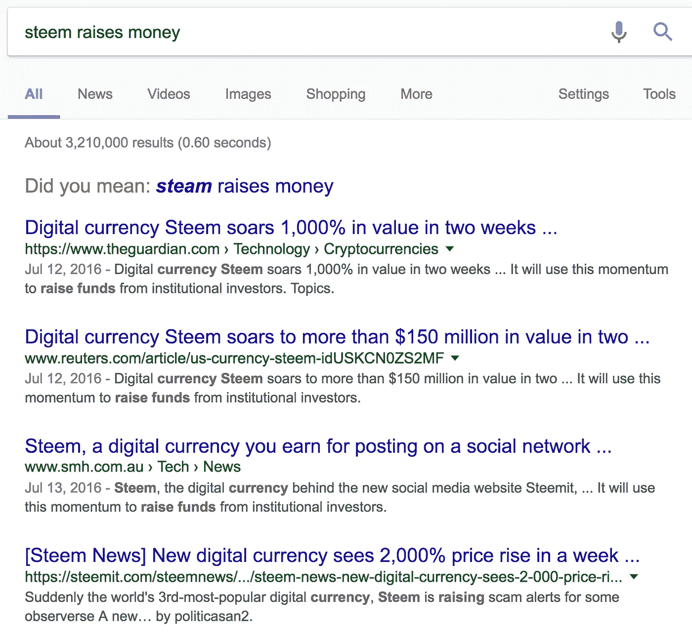
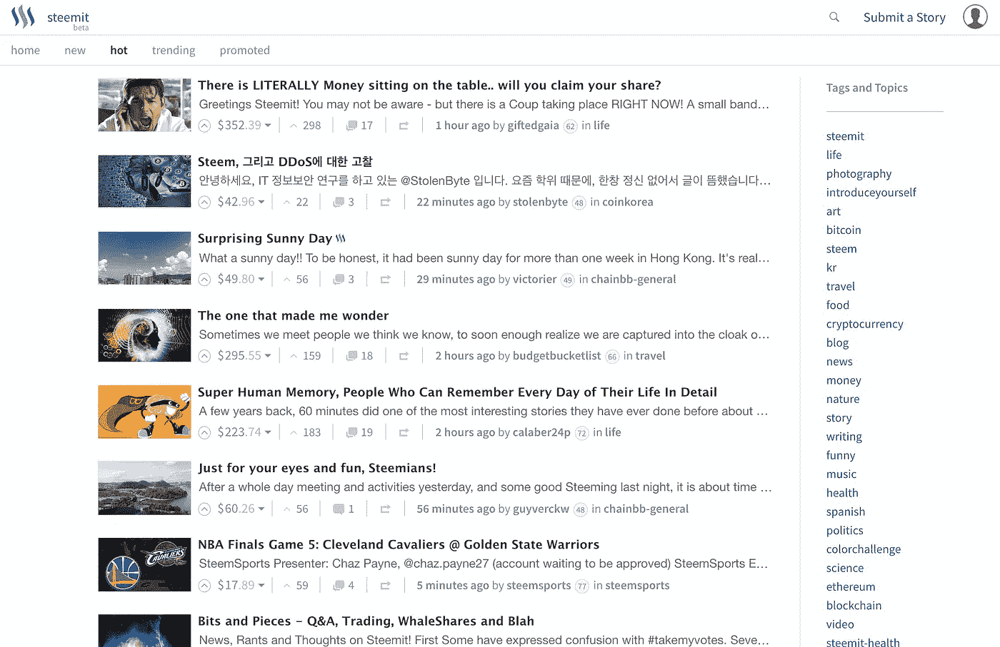
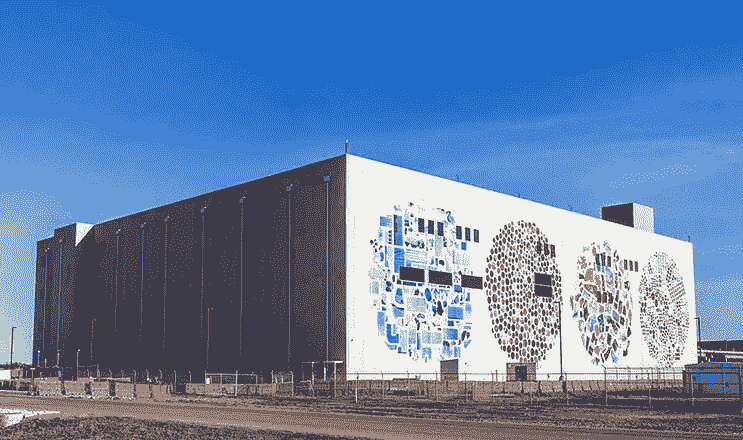
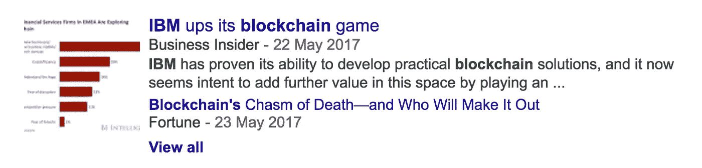
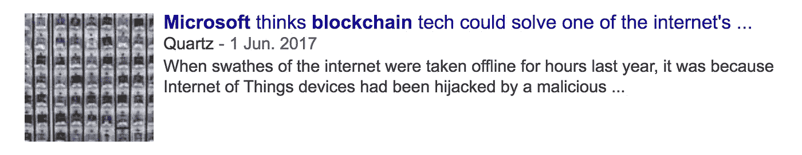
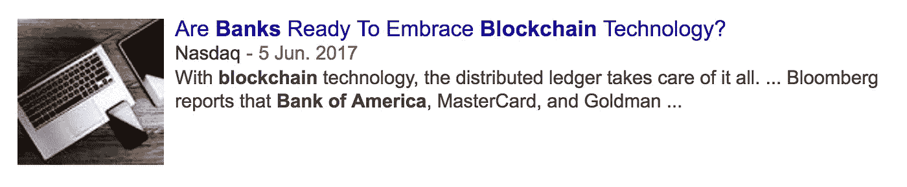

# 除非必要，否则不要使用区块链

> 原文：<https://medium.com/hackernoon/dont-use-a-blockchain-unless-you-need-to-bc063d0f9a80>

发现一家不会提供投资回报的初创公司的一个简单方法是在他们的登陆页面上寻找“[区块链](https://hackernoon.com/tagged/blockchain)”或“分散化”的字眼。

我把它们主要分为两类:

*   [比特币](https://hackernoon.com/tagged/bitcoin)替代品
*   “与区块链一起建造”的人群

先说第一个。

# 贝琪苦涩地咬了一口更好的比特币

2017 年，在任何真实规模下，比特币只有两种使用方式:

1.  帮助人们在政府面前隐藏他们的钱(主要是在中国，这里的各级政府比我们在西方所习惯的任何政府都更加腐败和反复无常)，以及
2.  通过互联网购买毒品。

如果有人能在没有像比特币这样复杂、陌生、有风险的系统的情况下做这些事情*，他们肯定会这么做。很少有好的替代方案(问问曾经亲自买过药或试图逃税的人)。*

现在，比特币并不完美。完成一笔交易需要 20 多分钟，如果你不小心的话，很容易追踪到你给谁汇了钱。

因此，有许多类似比特币的替代货币(altcoins ),但是:

*   更快(例如[破折号](https://en.wikipedia.org/wiki/Dash_(cryptocurrency)))
*   更加匿名(例如 [Zcash](https://z.cash/) )
*   交易费用较低(如[莱特币](https://en.wikipedia.org/wiki/Litecoin)
*   带着达达主义的自命不凡(好吧，这只是给总督的)

他们没有提到的是，与此同时，他们的硬币就像比特币，但没有:

*   网络效应
*   品牌认知
*   多年来被世界上最老练的黑客攻击而失败
*   相对价格稳定性(强调相对)和流动性

购买每月一剂的鸦片和买一杯豆奶拿铁不一样:事实上，你要等 20 分钟才能拿到钱，这并不重要。

洗钱也是类似的交易。当然，默认情况下，比特币本可以变得更加匿名。但你只要谷歌一下“比特币清洗”就没事了。

所以，这免除了人们试图卖给我们一个更完美和美丽的互联网货币。让我们转向另一个类别，一个更大更复杂的类别。

# 你的业务可能不需要分散

让我们以 [Steem](https://steem.io) 和他们的旗舰产品 [Steemit](https://steemit.com) 为例。

这是一个靠近我的心灵的地方:奖励那些创造、发现和分享好东西的人。那些在网上内容的沙砾堆中搜寻宝石的人应该得到比 Reddit 因果积分更好的奖励。很少有人在乎 Reddit 或 HN 因果报应。至少通过转发，他们获得了曝光率和新的关注者，但与来自监管、发现和分享的价值相比，这仍然是微不足道的。

这个想法是，社会奖励人们做有用工作的最好方式是用钱，所以让我们这样做吧。到目前为止一切顺利。

但 Steemit 作为一个产品很糟糕，自一年前推出以来几乎没有改进。他们永远不会以现在的速度从 Reddit 上抢走人们，即使他们用他们的 ICO 筹集了数百万。我试着用它，真的。现在，如果 Steem 是 Poloniex 上可用于保证金交易的硬币之一，我会做空它们。他们的产品建立在脆弱、缓慢(与普通数据库相比)、潜在不安全、潜在与未来无关的区块链平台**之上，没有什么好的理由**。

解决“奖励创造者和发现者”的问题并不需要去中心化。没有人会关闭 Reddit 的一个版本，这个版本奖励第一个发现好东西的人。Steemit 不需要区块链，它需要更好的品牌、设计、文案，最重要的是**快速迭代产品的能力**。他们需要能够在漏斗中抛出特征，并看到什么转换。你知道，在网上做生意。

# 集中化有巨大的优势

再比如，我们来看看 [IPFS](https://ipfs.io/) 和 [Filecoin](https://filecoin.io/) 。我认为他们超级有趣和酷。但我在它们上面建造的东西要么是给激进分子的，要么是给罪犯的。不管《硅谷》第三季告诉我们什么，只有这些人需要一种像那样存储数据的方式。

Richard is actually a lesson in what **not** to do. More like Silly Con Valley amirite

对于绝大多数企业来说，更重要的是安全、廉价地存储您的文件，并能快速到达您的用户手中。目前没有比使用谷歌、亚马逊等公司的未来数据中心和 CDN 技术更好的方法了，等到 Filecoin 准备好了，这些公司将在机器人和人工智能驱动的东西方面走在更前面，他们正在那些大的直角棱镜中做什么。

我完全支持玩有趣的加密技术，但我肯定不会投资于一家面向企业或消费者、计划将其用于主要数据存储的初创公司。

# 预测市场呢？

自从我读了罗宾·汉森关于[未来的著作](http://mason.gmu.edu/~rhanson/futarchy.html)，我就对[预测市场](https://en.wikipedia.org/wiki/Prediction_market)着迷了。

自从竞争者[和](http://augur.net/)[的预言](https://gnosis.pm/)和诞生以来，我一直在关注他们，我对他们的团队能否可靠地完成任务没有太多信心。尤其是奥格从 2014 年就开始了，他们甚至没有 MVP。每个平台在其 ico 中筹集了数千万美元。

很遗憾 [Intrade](https://en.wikipedia.org/wiki/Intrade) 被关闭了。但是与美国政府妥协显然是可能的:看看 PredictIt.org 就知道了。他们在 2016 年大选中进行了一场声势浩大的交易，而占卜团队可能正在阅读以太坊创造者 Vitalik Buterin 的最新白皮书，该白皮书介绍了网络如何在理论上每秒钟进行超过七次交易。(旁注:维塔利克是天才，但[还是人类](https://en.wikipedia.org/wiki/Planning_fallacy)。)

在最坏的情况下，美国政府就是不合作，他们可以试着找到一个合作的地方。事实上，这就是 PredictIt 最初所做的。他们从新西兰开始，在那里他们可以不受阻碍地进行实验，然后再去美国。但是，在政府周围工作？游说？搬家国家？这听起来像是一大堆烦人又无聊的工作。相反，用以太坊来做会更酷更有趣，对吗？就好像他们没有读过 PG 关于[盲症](http://www.paulgraham.com/schlep.html)的文章。

如果我听起来很沮丧，那是因为我希望占卜是一个真实的东西，我现在可以用它来打赌乔治·r·r·马丁的下一本书何时出版，但我不能，原因是创始人认为让它工作的关键是区块链，不幸的是，这是一个不那么性感的问题。从 2014 年开始我就等着把我的钱给他们。他们显然在做错事。

# 所有的公司利益呢？

那些又老又不酷的大公司的营销部门喜欢看起来性感的机会，尤其是当他们只需要一份新闻稿和派一些人去参加会议的时候。让我知道他们什么时候在日常运营中真正使用它。

# 在字母表中，c 在 D 之前

Napster 出现在 BitTorrent 之前。在网络出现之前，CompuServe 和 AOL 的围墙花园就出现了。希尔顿先于 Airbnb。出租车公司出现在优步之前。汇丰银行和政府发行的硬币出现在比特币之前。对于试图寻找产品市场契合点的企业来说，集中化具有优势。

如果你有一个新的商业想法，不需要受到政府的窥探或任意的打击，那么就不要让区块链参与进来。你的午餐将被使用更适合于**解决客户实际问题**的技术的团队吃掉——这个团队只是接受了这样一个事实，即他们可以在任何时候被人关闭，他们是单点故障，并且他们不能在他们的登录页面上放置太多的流行语。

> [黑客中午](http://bit.ly/Hackernoon)是黑客如何开始他们的下午。我们是 [@AMI](http://bit.ly/atAMIatAMI) 家庭的一员。我们现在[接受投稿](http://bit.ly/hackernoonsubmission)并乐意[讨论广告&赞助](mailto:partners@amipublications.com)机会。
> 
> 如果你喜欢这个故事，我们推荐你阅读我们的[最新科技故事](http://bit.ly/hackernoonlatestt)和[趋势科技故事](https://hackernoon.com/trending)。直到下一次，不要把世界的现实想当然！

