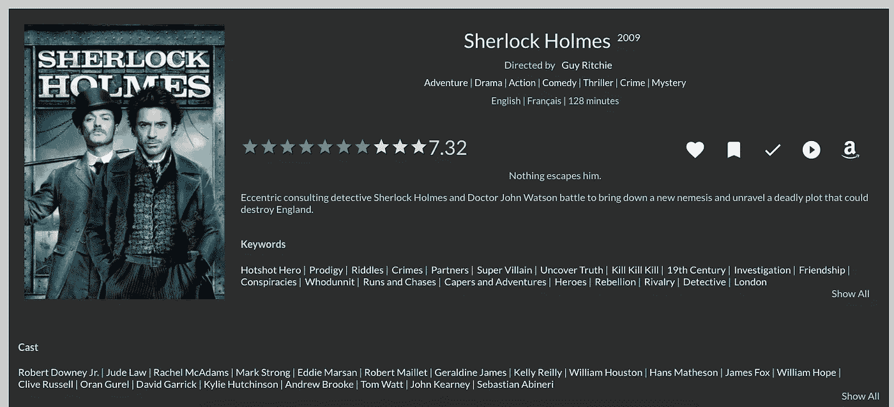
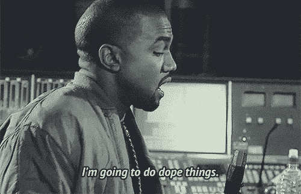
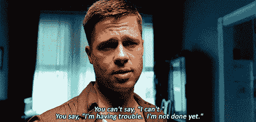

# 不要等着去完善它。先去争取，再去提高。

> 原文：<https://medium.com/hackernoon/dont-wait-to-make-it-perfect-go-for-it-first-and-then-improve-a2fbf101279e>

## 完美的产品是不存在的。完美是一个过程，而不是终点。

A ([img src](https://unsplash.com/search/perfection?photo=VWceV6QdwS8))

大约十年前，我的两个朋友为全世界的电影迷开发了一个令人惊奇的推荐系统。一个可以让 IMDB 的推荐引擎自惭形秽的软件。你可能从未听说过。他们在发射几个月后关闭了它。牵引力不够。

# 哪里出了问题？

## #1.他们认为，如果产品真的如此神奇，他们就不需要大力推广。他们的用户会替他们做。

事情不是这样的。永远不会。大多数情况下，你的用户并不关心你做什么或者你的产品有多好。他们都是自私的——*就像你和我*——他们没有理由关心你的产品有多好。对他们来说，唯一重要的是你的产品是否对他们有价值。如果确实如此，那么他们关心的下一件事就是他们需要这种价值增加到他们生活中的频率，以及是否有任何与获得这种价值相关的成本——*内在的或其他的*。代价可能是时间、努力、金钱——任何东西。

> “建立起来，他们就会来”几乎从未发生过，社交分享也是如此。

你希望你的用户成为你的品牌大使和影响者吗？先回答这两个问题:

1.  他们为什么要关心？
2.  他们为什么要分享？

不是“*会*而是“*应该*”。

不管你对这两个问题的回答是什么，问自己一个常见的后续问题— **所以呢？？**

如果你的推理在第三个'*之后仍然能够站得住脚，那么？'*，你走对了。如果没有，你会知道是时候回到绘图板了。

专业建议:不要等到产品发布的那天才问这些问题。这些问题需要从一开始就根深蒂固。这些问题及其答案*必须成为*你整体产品战略和路线图的一部分。

## #2.有一些关键的 UX 问题

这个系统很好。它可以根据你的偏好和类型向你推荐电影，将你的偏好与平台上的其他用户进行映射，并相应地向你推荐合适的电影。它确实给出了相当准确的建议——当我在它刚刚推出的时候测试它的时候。

不过，UX 也有问题。

1.  没有明确的使用行为——如何导航，一旦进入网站该做什么等等。
2.  一个地方塞满了大量的信息。对任何类型的观众来说都太拥挤了。
3.  它没有吸引力— *为什么我会在网站上花超过 5 分钟的时间？我花了无数的时间在 IMDB 上浏览随机的事实和琐事，看电影预告片，浏览推荐等等。我在这里做什么？*
4.  糟糕的浏览器行为——在该系统的第一个版本中，网站通常在 chrome 标签中打开，这种行为可以被最好地描述为浏览器本身。你点击的每个链接都会打开一个标签。想象一下，在 1 个 chrome 标签中打开 20 个标签。那是一场噩梦。

*他们后来修复了其中的一些问题，但更大的问题仍然存在。看看这个后来版本的截图。*

Forget everything else. Even if you look at the rating part, something seems off at the very first look.

## #3.[最重要的]他们等了两年多才发布了他们产品的第一个版本

我们为此争吵了又争吵。我恳求他们优先推出产品的粗略版本，而他们想做出完美的产品。

追求完美花了他们两年半的时间。虽然他们确实设法制造了一个具有相当健壮的后端架构的产品，但他们在对最终用户很重要的许多事情上犯了错误。

更重要的是，你改进产品的时间越长，你就越有可能成功。

你最终做出的产品是如此之好，以至于你想不出任何可能的方法让它不能工作，更不用说失败了。期望太高了。所以，当产品甚至没有达到你所确信的那种受欢迎的程度时，它就会变得相当快。欣快变成失望，你选择挂靴马刺。这就是发生在他们身上的事——*或多或少** 。

# 这就是关键的要点

产品生命周期很长。发展需要时间。建立一个部落，一个忠诚用户的社区需要更长的时间。不要等到产品准备好了才开始为建立那个部落打下基础。尽早开始打基础。

你是电影推荐系统？只需建立一个备用账户。人们可以将该联系人添加到他们的团队中，并随时请求推荐电影。见鬼，去找一个 facebook messenger 页面的 whatsapp 号码吧。我不在乎账户是否与机器人相关联，而是与你团队中的真实人物相关联。至少你已经启动并运行了系统。至少你会知道你的用户对你试图构建的系统有什么期望。

随着你不断收集数据和用户行为，开始构建产品。不断地使越来越多的过程自动化，逐步淘汰人工代理。

称之为敏捷开发，或者你可以选择的任何名称。我的观点很简单。这个过程是可行的。我们使用术语敏捷开发，但是实际上它既没有有效地使用，也没有高效地使用。从一个非常基础的系统开始(*即使是手动的*)，然后逐渐在它的基础上构建，会在很多方面帮助你。

你知道系统还没有准备好。远非如此。所以你意识到了道路上会有坎坷这一事实。用户不会有最理想的体验。但是你知道你为什么要这么做，同时你也在努力建立正确的系统。所以，没关系。

你还没有完成。

然后是用户反馈部分——无论是请求的还是从他们的行为和当前系统的使用中得到的。

注意用户如何使用你的系统，他们会问什么样的问题，什么最让他们满意，什么让他们厌烦。所有这些都是产品反馈，甚至没有产品。用这个来推动你的产品开发过程。

现在。当你这样做的时候，你就逐渐到达了你想要开始的阶段。真正的产品。

你的用户会成为整个进化的一部分。如果你真的为他们的生活增加了价值，他们会因此而爱你。总而言之，一切都会好的！

# PS:我朋友的创业公司怎么了？

它关闭了，也没有关闭。

正如我提到的后端是相当坚实的。据我所知，他正在向那些希望在网站上整合推荐引擎的公司出售他的算法的许可证。卖给了加拿大、澳大利亚等地的一些公司。

# 今天到此为止。明天见！

> [黑客中午](http://bit.ly/Hackernoon)是黑客如何开始他们的下午。我们是 [@AMI](http://bit.ly/atAMIatAMI) 家庭的一员。我们现在[接受投稿](http://bit.ly/hackernoonsubmission)并乐意[讨论广告&赞助](mailto:partners@amipublications.com)机会。
> 
> 如果你喜欢这个故事，我们推荐你阅读我们的[最新科技故事](http://bit.ly/hackernoonlatestt)和[趋势科技故事](https://hackernoon.com/trending)。直到下一次，不要把世界的现实想当然！

